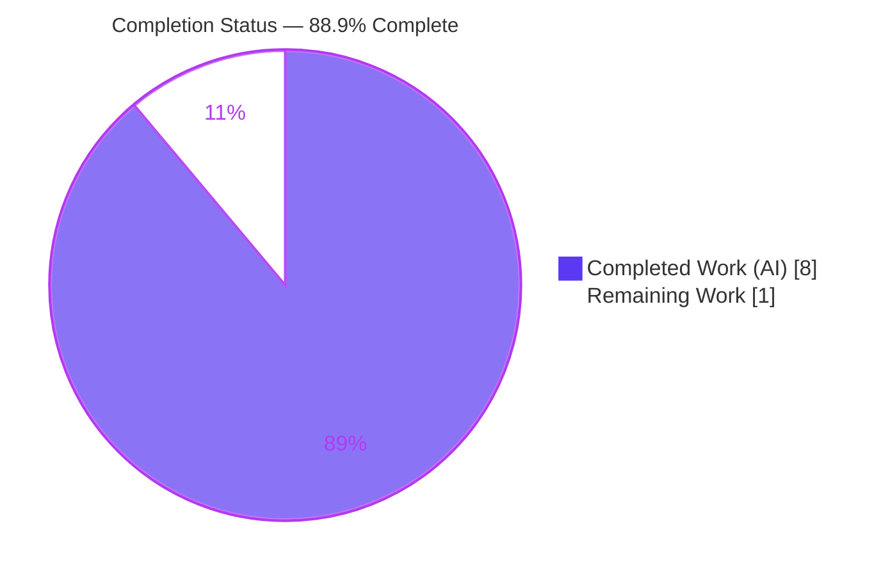
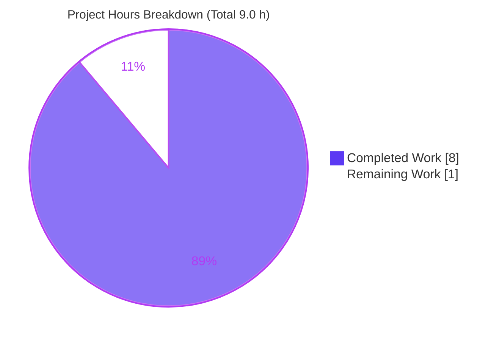
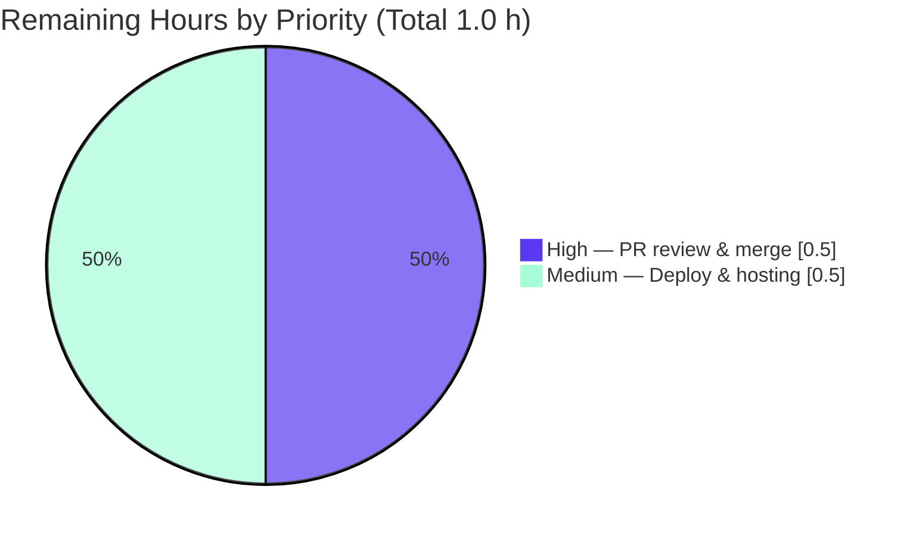

# Blitzy Project Guide — `13july_1` Express.js Server

> **Project:** `13july_1` — Minimal Node.js/Express HTTP server
> **Branch:** `blitzy-6fa05649-3249-4951-8257-c19c403f3629` · **HEAD:** `057fb8a`
> **Status:** Production-ready pending human review & deploy · **Completion:** **88.9%**
>
> **Blitzy Brand Colors** — Completed / AI Work: **Dark Blue `#5B39F3`** · Remaining / Not Completed: **White `#FFFFFF`** · Headings / Accents: **Violet-Black `#B23AF2`** · Highlight: **Mint `#A8FDD9`**

---

## 1. Executive Summary

### 1.1 Project Overview

The `13july_1` project delivers a minimal, runnable Node.js HTTP server built on the **Express.js 5** framework. It exposes two plain-text `GET` endpoints — `GET /` returning `Hello world` and `GET /good-evening` returning `Good evening` — fulfilling a tutorial-style feature-addition request to introduce Express and add a second endpoint alongside the (previously absent) baseline. Target consumers are HTTP clients such as browsers and `curl`. Business impact is educational/demonstrative: a reproducible Express starter. Technical scope covers project scaffolding (`package.json`), the server entry point (`server.js`), a pinned dependency lockfile (`package-lock.json`), version-control hygiene (`.gitignore`), and documentation (`README.md`). The runtime footprint is a single, stateless, single-process server with one runtime dependency (`express ^5.2.1`).

### 1.2 Completion Status



| Metric | Value |
|--------|-------|
| **Total Hours** | **9.0 h** |
| **Completed Hours (AI + Manual)** | **8.0 h** (8.0 AI + 0.0 Manual) |
| **Remaining Hours** | **1.0 h** |
| **Percent Complete** | **88.9%** (8.0 ÷ 9.0) |

> **Legend:** ▮ Dark Blue `#5B39F3` = Completed · ▯ White `#FFFFFF` = Remaining.
> Completion % is computed with the AAP-scoped hours methodology: `Completed ÷ (Completed + Remaining) = 8.0 ÷ 9.0 = 88.9%`. All 15 AAP requirements are COMPLETE; the residual 1.0 h is standard path-to-production human handoff.

### 1.3 Key Accomplishments

- ✅ **Express.js 5 introduced** — `express ^5.2.1` declared and wired as the sole runtime dependency, delivering the framework the user explicitly requested (not raw Node `http`).
- ✅ **Baseline endpoint created** — `GET /` returns the exact string `Hello world` (the AAP-implied baseline did not previously exist and was created).
- ✅ **New endpoint added** — `GET /good-evening` returns the exact string `Good evening`, additively alongside the baseline.
- ✅ **Server is runnable & reproducible** — `npm start` script, `app.listen(process.env.PORT || 3000)` with startup logging, and a committed `package-lock.json` (lockfileVersion 3) pinning the Express 5.2.1 tree.
- ✅ **Reproducible clean install verified** — `npm ci` succeeds ("added 67 packages, audited 68") with **0 vulnerabilities**.
- ✅ **Exact-response fidelity confirmed** — byte-level (`od`) verification of `Hello world` (11 B) and `Good evening` (12 B) with correct casing/spacing and no trailing newline.
- ✅ **Version-control hygiene** — `.gitignore` excludes `node_modules/`; all 5 in-scope files committed at HEAD `057fb8a`.
- ✅ **Documentation delivered** — `README.md` updated with prerequisites, install/run steps, PORT override, and an endpoints table consistent with `server.js`.

### 1.4 Critical Unresolved Issues

| Issue | Impact | Owner | ETA |
|-------|--------|-------|-----|
| _None_ | No blocking or release-critical issues were identified. Autonomous validation required zero fixes; all five production-readiness gates passed. | — | — |

> There are **no critical unresolved issues**. The only remaining items are standard, non-blocking path-to-production activities (see §1.6 and §2.2).

### 1.5 Access Issues

| System/Resource | Type of Access | Issue Description | Resolution Status | Owner |
|-----------------|----------------|-------------------|-------------------|-------|
| _None_ | — | No access issues identified. The npm registry was reachable (`npm ci` succeeded), the Git branch is present and up to date with origin, and no third-party credentials, API keys, or private packages are required by this project. | N/A | — |

> **No access issues identified.**

### 1.6 Recommended Next Steps

1. **[High]** Perform human code review of the branch (5 files, 941 insertions) and merge `blitzy-6fa05649-3249-4951-8257-c19c403f3629` into `main`.
2. **[Medium]** Deploy to the target host: run `npm ci` then `npm start` under a process supervisor (pm2/systemd/container), configure `PORT`/environment, and run a post-deploy smoke check of both endpoints.
3. **[Low]** _(Optional, out of AAP scope)_ Add an explicit `"engines": { "node": ">=18" }` field to `package.json` to make the Node floor self-enforcing at install time.
4. **[Low]** _(Optional, out of AAP scope)_ If the server will be publicly exposed, add hardening middleware (helmet, CORS, rate limiting) and a `/health` endpoint with structured logging.
5. **[Low]** _(Optional, out of AAP scope)_ Add smoke/integration tests (e.g., `supertest` + `node:test`) and a CI workflow to guard against future regressions.

> Steps 1–2 constitute the counted 1.0 h of remaining work. Steps 3–5 are optional future enhancements that lie **outside the AAP scope** and are **not** included in the remaining-hours total or completion percentage.

---

## 2. Project Hours Breakdown

### 2.1 Completed Work Detail

| Component | Hours | Description |
|-----------|:-----:|-------------|
| `server.js` — Express application entry point | 2.0 | Instantiate Express app; register `GET /` → `Hello world` and `GET /good-evening` → `Good evening`; resolve `PORT` (`process.env.PORT \|\| 3000`); bind listener with error propagation and startup log. Includes the refinement commit (`ff01384`) that propagates listen errors and trims comments to minimal tutorial style. |
| Dependency provisioning — `express` 5.2.1 + `package-lock.json` | 1.0 | Install Express via npm; generate/commit `package-lock.json` (lockfileVersion 3) pinning the ~67-package tree for reproducible installs; resolve the intermediate lockfile-sequencing churn (`122763b` defer → `16588fb` re-add). |
| `README.md` — documentation update | 1.0 | Extend the bare `# 13july_1` title with Prerequisites (Node ≥ 18), Installation (`npm install`), Running (`npm start`, PORT override), and an Endpoints reference table consistent with `server.js`. |
| `package.json` — project manifest | 0.5 | Declare project metadata, `main: "server.js"`, `scripts.start: "node server.js"`, and `dependencies.express: "^5.2.1"`. |
| `.gitignore` — version-control hygiene | 0.5 | Exclude `node_modules/` and `npm-debug.log*`; trimmed to minimal Node/npm ignores. |
| Technical research | 0.5 | Verify current Express version (5.2.1) and Node engine floor (≥ 18); confirm the canonical minimal-server pattern (`require`/`app.get`/`res.send`/`app.listen`) and bootstrap flow (AAP §0.2.2). |
| Autonomous validation & QA (5 gates) | 2.5 | Reproducible `npm ci`; `npm audit` (0 vulns); `node --check`; `git diff --check`; runtime endpoint assertions; byte-level (`od`) response-fidelity checks; PORT-override verification; browser/DevTools render verification with saved screenshots. |
| **Total Completed** | **8.0** | Matches Completed Hours in §1.2. |

### 2.2 Remaining Work Detail

| Category | Hours | Priority |
|----------|:-----:|----------|
| Human PR review & merge to `main` | 0.5 | High |
| Production deployment & runtime hosting (run `npm ci`/`npm start` on target host, process supervision, port/env config, post-deploy smoke check) | 0.5 | Medium |
| **Total Remaining** | **1.0** | Matches Remaining Hours in §1.2 and the "Remaining Work" slice in §7. |

> **Out-of-scope enhancements (NOT counted):** optional smoke tests (~2 h), hardening middleware (~2 h), health-check + logging (~2 h), explicit `engines` field (~0.25 h), and CI/Docker (~3 h) are excluded from the totals above because the AAP explicitly places them out of scope (§0.5.2). Including them would violate the AAP-scoped completion methodology.

---

## 3. Test Results

Formal unit/integration testing is **explicitly out of scope** per AAP §0.5.2 (the user did not request tests; adding a test runner would violate scope). Consequently there is **no automated test suite**, and the behavioral contract is instead verified through Blitzy's autonomous **runtime, static, and dependency validation checks**. The following results originate from Blitzy's autonomous validation logs for this project and were independently re-confirmed.

| Test Category | Framework / Tool | Total | Passed | Failed | Coverage % | Notes |
|---------------|------------------|:-----:|:------:|:------:|:----------:|-------|
| Unit | N/A (out of scope) | 0 | 0 | 0 | N/A | Testing explicitly out of scope per AAP §0.5.2. |
| Integration | N/A (out of scope) | 0 | 0 | 0 | N/A | Not requested. |
| Runtime behavioral assertions | `curl` + Node runtime + `od` | 5 | 5 | 0 | N/A | (1) `GET /` → `Hello world` 200; (2) `GET /good-evening` → `Good evening` 200; (3) undefined route → 404; (4) `PORT` override binds & serves; (5) byte-level exact-string fidelity. |
| Static analysis / compilation | `node --check`, `git diff --check` | 2 | 2 | 0 | N/A | Syntax check PASS; 0 whitespace/EOF errors. |
| Dependency integrity & security | `npm ci`, `npm audit` | 2 | 2 | 0 | N/A | Reproducible install ("added 67 packages, audited 68"); **0 vulnerabilities**. |
| **Totals** | — | **9** | **9** | **0** | N/A | 100% of autonomous validation checks passed; 0/0 formal tests satisfied as out-of-scope. |

> **Integrity note:** All rows above are drawn from Blitzy's autonomous validation logs (Gates 1–4). There is no fabricated or externally sourced test data. A coverage percentage is not applicable because no code-coverage instrumentation exists (no test suite is in scope).

---

## 4. Runtime Validation & UI Verification

**Runtime health** (server started via `npm start`; verified on default port 3000 and override port 8080):

- ✅ **Operational** — Server boots and logs `Server listening on port 3000` (or the overridden `PORT`).
- ✅ **Operational** — `GET /` → body exactly `Hello world`, HTTP 200, `Content-Type: text/html; charset=utf-8`, 11 bytes.
- ✅ **Operational** — `GET /good-evening` → body exactly `Good evening`, HTTP 200, 12 bytes.
- ✅ **Operational** — Undefined route (e.g., `GET /nope`) → HTTP 404 via Express default fall-through.
- ✅ **Operational** — `PORT` override (`PORT=8080 npm start`) binds the chosen port and serves both endpoints correctly.
- ✅ **Operational** — Listen-error propagation: `app.listen` callback throws on failure (e.g., `EADDRINUSE`), surfacing bind errors rather than silently continuing.

**API integration:**

- ✅ **Operational** — No external/third-party integrations exist (none in scope); both endpoints are self-contained and return static strings.

**UI verification:**

- ⚠ **Not applicable** — This is a backend HTTP server with **no user interface** (AAP §0.3.3 / §7.1). For completeness, Blitzy's autonomous browser (Chrome DevTools) verification confirmed the rendered responses show `StaticText "Hello world"` and `StaticText "Good evening"`; screenshots were captured (see §10-C). No rendered UI screens, styling, or frontend assets exist or are required.

---

## 5. Compliance & Quality Review

Cross-mapping of AAP deliverables and constraints to Blitzy quality/compliance benchmarks. All items passed autonomous validation; **no fixes were required** during validation.

| # | AAP Deliverable / Constraint | Benchmark | Status | Evidence |
|---|------------------------------|-----------|:------:|----------|
| R1 | Introduce Express.js (`express ^5.2.1`) | Correct framework, current stable version | ✅ Pass | `package.json` dependency; `require('express')`; `express` 5.2.1 in `node_modules`. |
| R2 | `package.json` manifest (CREATE) | Valid manifest with `main` + `start` | ✅ Pass | `main: server.js`, `scripts.start: node server.js`, valid JSON. |
| R3 | `server.js` entry point (CREATE) | Compiles; idiomatic Express | ✅ Pass | `node --check` PASS; single-file app pattern. |
| R4 | `GET /` → `Hello world` | Exact response, HTTP 200 | ✅ Pass | Runtime 200, 11 B; `od` byte-exact. |
| R5 | `GET /good-evening` → `Good evening` | Exact response, HTTP 200 | ✅ Pass | Runtime 200, 12 B; `od` byte-exact. |
| R6 | `package-lock.json` (CREATE) | Reproducible install | ✅ Pass | lockfileVersion 3; `npm ci` reproducible. |
| R7 | `.gitignore` (CREATE) | Excludes `node_modules/` | ✅ Pass | Contains `node_modules/`, `npm-debug.log*`. |
| R8 | `README.md` (UPDATE) | Prereqs/install/run/endpoints | ✅ Pass | All sections present; consistent with `server.js`. |
| R9 | Runnable & reproducible | `npm start` runs; startup log | ✅ Pass | Verified; logs bound port. |
| R10 | `PORT` env-overridable (default 3000) | Env override honored | ✅ Pass | `process.env.PORT \|\| 3000`; tested 8080/3999. |
| R11 | CommonJS module system | No `type: module`; `require` | ✅ Pass | `require('express')` used. |
| R12 | Exact verbatim response strings | Character-for-character fidelity | ✅ Pass | `od` byte-level confirmation, no trailing newline. |
| R13 | Additive behavior (both endpoints) | Baseline preserved | ✅ Pass | Both routes registered. |
| R14 | Cross-file consistency (§0.4.5) | README == server == manifest | ✅ Pass | Endpoints/paths/version aligned. |
| R15 | Version-control hygiene | In-scope files committed; deps ignored | ✅ Pass | 5 files at HEAD; `node_modules` ignored; `blitzy/` intentionally uncommitted. |
| — | Dependency security | 0 known vulnerabilities | ✅ Pass | `npm audit` = 0 vulnerabilities. |
| — | Whitespace/EOF hygiene | Clean diff | ✅ Pass | `git diff --check` = 0 errors. |

**Fixes applied during autonomous validation:** None required — the implementation matched the AAP exactly.
**Outstanding compliance items:** None within AAP scope.

---

## 6. Risk Assessment

Overall risk posture is **LOW** — the project is a small, stateless, fully-validated server with no sensitive data, authentication surface, user-input processing, or external integrations. Genuine, honestly-scoped items are enumerated below.

| Risk | Category | Severity | Probability | Mitigation | Status |
|------|----------|:--------:|:-----------:|------------|--------|
| No automated test suite; behavior verified via runtime assertions only → future regressions may go undetected | Technical | Low | Medium | Optional `supertest`/`node:test` smoke tests (out of current AAP scope) | Accepted (out of scope) |
| Work resides on a feature branch, not yet merged to `main` | Technical | Low | High | Human PR review + merge (counted in §2.2) | Open (path-to-production) |
| `express` declared with caret `^5.2.1` (allows 5.x minor/patch on fresh resolve) | Technical | Low | Low | `package-lock.json` pins 5.2.1; `npm ci` uses the lock; periodic dependency review | Mitigated |
| No hardening middleware (helmet/CORS/rate-limit) | Security | Low | Low | Not needed for a static-string tutorial with no auth/PII/input; add only if publicly exposed (out of scope) | Accepted (out of scope) |
| Future dependency drift introducing vulnerabilities | Security | Low | Low | Currently `npm audit` = 0 vulns; schedule periodic `npm audit` | Mitigated |
| No health-check endpoint / monitoring / structured logging (startup `console.log` only) | Operational | Low | Medium | Add `/health` + logging if promoted beyond tutorial (out of scope) | Accepted (out of scope) |
| No process supervision / restart policy (single process) | Operational | Low | Medium | Run under pm2/systemd/container restart at deploy (addressed by §2.2 deploy task) | Open (deploy task) |
| Port conflict (`EADDRINUSE`) on bind | Operational | Low | Low | `app.listen` error callback throws — errors surface immediately; use `PORT` override or free the port | Mitigated (already handled) |
| No external services/DB/API keys to integrate | Integration | Low | Low | Nothing to integrate | N/A |
| Target host must provide Node ≥ 18; `package.json` has no explicit `engines` field | Integration | Low | Low | Enforced transitively by `express` engines (`>= 18`) and documented in README; optionally add `engines` field | Open (low priority) |

---

## 7. Visual Project Status

**Project hours — completed vs. remaining** (Completed = Dark Blue `#5B39F3`, Remaining = White `#FFFFFF`):



**Remaining work by priority** (from §2.2, total 1.0 h):



> **Integrity check:** The "Remaining Work" value (1.0 h) equals the Remaining Hours in §1.2 and the sum of the §2.2 Hours column. The "Completed Work" value (8.0 h) equals the Completed Hours in §1.2 and the sum of the §2.1 Hours column.

---

## 8. Summary & Recommendations

**Achievements.** The `13july_1` repository has been transformed from a bare skeleton (a single `README.md`) into a complete, runnable Express.js 5 server. All **15 AAP requirements are fully implemented, validated, and committed**. Both endpoints return their exact required strings (`Hello world`, `Good evening`), the dependency tree installs reproducibly with zero vulnerabilities, and the code compiles and runs cleanly. Autonomous validation required **zero fixes**.

**Remaining gaps.** The project is **88.9% complete (8.0 of 9.0 AAP-scoped hours)**. The residual **1.0 h** is entirely standard path-to-production handoff: human PR review & merge (High), and production deployment & runtime hosting (Medium). There are no critical or blocking issues and no access issues.

**Critical path to production.**

1. Human review of the 5-file change set → merge to `main` (0.5 h).
2. Provision a Node ≥ 18 host → `npm ci` → `npm start` under process supervision → smoke-test both endpoints (0.5 h).

**Success metrics** (all currently met in the validation environment): both endpoints return HTTP 200 with byte-exact bodies; `npm ci` reproducible with 0 vulnerabilities; server boots with a clear startup log; `PORT` override works.

**Production readiness assessment.** **Ready for release pending human review and deployment.** The codebase is functionally complete, reproducible, and secure against known vulnerabilities within its defined (intentionally minimal) scope. Optional enhancements (tests, hardening, health checks, CI/Docker) are deliberately out of AAP scope and can be pursued later if the tutorial is promoted to a hardened production service; they are not required to satisfy the stated objective.

| Dimension | Assessment |
|-----------|------------|
| Functional completeness (AAP) | 100% of requirements delivered |
| AAP-scoped completion (incl. path-to-production) | 88.9% (8.0 / 9.0 h) |
| Build/install reproducibility | Verified (`npm ci`, 0 vulns) |
| Runtime correctness | Verified (both endpoints byte-exact, 404 fall-through, PORT override) |
| Blocking issues | None |
| Recommended action | Review → merge → deploy |

---

## 9. Development Guide

All commands are copy-pasteable and were executed and verified during validation. Run them from the repository root: `/tmp/blitzy/13july_1/blitzy-6fa05649-3249-4951-8257-c19c403f3629_839ce3` (or your checkout root).

### 9.1 System Prerequisites

- **Node.js ≥ 18** (required by Express 5). Validation environment used **v22.23.1**.
- **npm** (bundled with Node.js). Validation environment used **11.1.0**.
- **Operating system:** any OS supported by Node.js (Linux/macOS/Windows). Validated on Linux (Ubuntu 25.10).
- **Hardware:** negligible — a single lightweight process; ~5 MB `node_modules`.

Verify your toolchain:

```bash
node --version   # expect >= v18 (validated: v22.23.1)
npm --version    # validated: 11.1.0
```

### 9.2 Environment Setup

No environment variables are **required**. One optional variable is supported:

- `PORT` — the TCP port the server binds to. Defaults to **3000** when unset (`process.env.PORT || 3000`).

```bash
# Optional: choose a non-default port
export PORT=8080
```

No `.env` file, database, cache, or message queue is needed — the server is stateless with no external dependencies.

### 9.3 Dependency Installation

```bash
# Reproducible install from the committed lockfile (recommended)
npm ci
# Expected: "added 67 packages, and audited 68 packages in <time>"
#           "found 0 vulnerabilities"

# Alternative (first-time / non-lock installs)
npm install
```

Optional security audit:

```bash
npm audit
# Expected: "found 0 vulnerabilities"
```

### 9.4 Application Startup

```bash
# Start the server (default port 3000)
npm start
# Equivalent to: node server.js
# Expected log: "Server listening on port 3000"

# Start on a custom port
PORT=8080 npm start
# Expected log: "Server listening on port 8080"
```

To run in the background during scripted verification:

```bash
nohup node server.js > server.log 2>&1 &
```

### 9.5 Verification Steps

With the server running:

```bash
curl http://localhost:3000/
# -> Hello world            (HTTP 200, Content-Type: text/html; charset=utf-8, 11 bytes)

curl http://localhost:3000/good-evening
# -> Good evening           (HTTP 200, 12 bytes)

curl -o /dev/null -w '%{http_code}\n' http://localhost:3000/nope
# -> 404                    (Express default fall-through for undefined routes)
```

Optional syntax check (no build step is required for CommonJS):

```bash
node --check server.js
# -> (no output, exit 0 = syntax OK)
```

### 9.6 Example Usage

```bash
# One-shot: install, start, verify, and stop
npm ci
node server.js > server.log 2>&1 &
SRV=$!
sleep 1
curl -s http://localhost:3000/               # Hello world
curl -s http://localhost:3000/good-evening   # Good evening
kill "$SRV"
```

Browser: visit `http://localhost:3000/` and `http://localhost:3000/good-evening` to see the plain-text responses rendered directly.

### 9.7 Troubleshooting

| Symptom | Cause | Resolution |
|---------|-------|------------|
| `Error: listen EADDRINUSE :::3000` (process throws on start) | Port 3000 already in use | Free the port (`lsof -i :3000`, then stop the holder) **or** start on another port: `PORT=8080 npm start`. |
| `Error: Cannot find module 'express'` | Dependencies not installed | Run `npm ci` (or `npm install`) from the repo root. |
| `npm ci` / Express fails to install or run | Node.js older than 18 | Upgrade to Node ≥ 18 (Express 5 engine requirement). |
| `node_modules` missing after checkout | `node_modules/` is git-ignored by design | Run `npm ci` to restore it from the lockfile. |
| Response has unexpected trailing characters | Client/terminal formatting, not the server | Bodies are byte-exact (`od`-verified). Inspect raw bytes: `curl -s http://localhost:3000/ \| od -c`. |

---

## 10. Appendices

### Appendix A — Command Reference

| Command | Purpose |
|---------|---------|
| `node --version` / `npm --version` | Verify toolchain versions |
| `npm ci` | Reproducible install from `package-lock.json` |
| `npm install` | First-time / non-lock dependency install |
| `npm audit` | Security audit of the dependency tree |
| `npm start` | Start the server (`node server.js`) |
| `node server.js` | Start the server directly |
| `PORT=8080 npm start` | Start on a custom port |
| `node --check server.js` | Syntax/compile check (no build step) |
| `curl http://localhost:3000/` | Verify the `Hello world` endpoint |
| `curl http://localhost:3000/good-evening` | Verify the `Good evening` endpoint |
| `git diff --check` | Whitespace/EOF hygiene check |

### Appendix B — Port Reference

| Port | Service | Configurable | Notes |
|------|---------|:------------:|-------|
| 3000 | Express HTTP server (default) | Yes | Overridable via `PORT` (`process.env.PORT \|\| 3000`). |
| (any) | Express HTTP server (override) | Yes | Set `PORT` to bind an alternate port, e.g. `PORT=8080`. |

### Appendix C — Key File Locations

| Path | Role | Git Status |
|------|------|-----------|
| `server.js` | Express app entry point (routes + listener) | Tracked (CREATE) |
| `package.json` | Manifest: metadata, `start` script, `express` dependency | Tracked (CREATE) |
| `package-lock.json` | Pinned dependency tree (lockfileVersion 3) | Tracked (CREATE) |
| `.gitignore` | Ignores `node_modules/`, npm debug logs | Tracked (CREATE) |
| `README.md` | Prerequisites, install/run, endpoints table | Tracked (UPDATE) |
| `node_modules/` | Installed dependencies (~65 dirs / 67 pkgs) | Ignored (restore via `npm ci`) |
| `blitzy/screenshots/` | Autonomous QA screenshots (10 files) | Untracked (intentionally not committed) |

### Appendix D — Technology Versions

| Component | Version | Source / Constraint |
|-----------|---------|---------------------|
| Node.js | v22.23.1 (validation env) | Requires ≥ 18 (Express 5 engine floor) |
| npm | 11.1.0 (validation env) | Bundled with Node.js |
| express | 5.2.1 (locked) | Declared `^5.2.1`; lockfileVersion 3 |
| Module system | CommonJS | Default (no `type: module`) |
| Total packages | 67 (audited 68) | Resolved by `npm ci`; 0 vulnerabilities |

### Appendix E — Environment Variable Reference

| Variable | Required | Default | Description |
|----------|:--------:|:-------:|-------------|
| `PORT` | No | `3000` | TCP port the HTTP server listens on. Consumed as `process.env.PORT \|\| 3000` in `server.js`. |

> No secrets, credentials, connection strings, or API keys are used by this project.

### Appendix F — Developer Tools Guide

- **Runtime:** Node.js CLI (`node`, `node --check`).
- **Package management:** npm (`npm ci`, `npm install`, `npm audit`, `npm start`).
- **HTTP testing:** `curl` (endpoint verification), `od` (byte-level response inspection).
- **Version control:** Git (branch `blitzy-6fa05649-3249-4951-8257-c19c403f3629`, HEAD `057fb8a`); `git diff --check` for whitespace hygiene.
- **Browser verification (autonomous QA):** Chrome DevTools accessibility snapshots + screenshots confirmed rendered `Hello world` / `Good evening` text.
- **Out of scope (intentionally absent):** TypeScript, ESLint, Prettier, nodemon, test runners, bundlers, Docker, CI workflows (see AAP §0.5.2).

### Appendix G — Glossary

| Term | Definition |
|------|------------|
| **AAP** | Agent Action Plan — the authoritative specification of project scope and deliverables. |
| **Baseline endpoint** | `GET /` → `Hello world`; the pre-existing capability implied by the prompt (created here, as it did not physically exist). |
| **CommonJS** | Node.js module system using `require`/`module.exports`; the default when `package.json` has no `"type": "module"`. |
| **Fall-through 404** | Express's default response for routes with no matching handler. |
| **Greenfield** | A project started from scratch with no pre-existing source code. |
| **lockfileVersion 3** | The `package-lock.json` schema used by npm 7+ for reproducible installs. |
| **Path-to-production** | Standard activities (review, merge, deploy) required to release the AAP deliverables. |
| **Reproducible install** | `npm ci` installing the exact locked dependency tree from `package-lock.json`. |

---

*Prepared by the Blitzy autonomous Project Guide agent. Completion percentage (88.9%) is derived exclusively from AAP-scoped and path-to-production hours: 8.0 completed ÷ 9.0 total. All figures are consistent across Sections 1.2, 2.1, 2.2, and 7.*