# Technical Specification

# 1. Introduction

## 1.1 Executive Summary this is saved as draft 

### 1.1.1 Project Overview

This Technical Specification documents the repository identified as `13july_1`. As of the current head commit (`7ff32240`) on the `main` branch, the repository is in an **uninitialized (skeleton) state**: it contains a single tracked artifact, `README.md`, whose complete content is the one-line Markdown heading `# 13july_1`. No application source code, dependency manifests, configuration, build tooling, test suites, or supplementary documentation are present in the repository or in its git history.

Consequently, this Introduction documents the repository exactly as it exists today — a newly created project placeholder — rather than an implemented system. The statements below deliberately avoid asserting business goals, functional behavior, or technical designs that are not evidenced by repository artifacts.

### 1.1.2 Core Business Problem Being Solved

No requirements documentation, issue-tracker references, design notes, or code comments exist in the repository from which a business problem could be derived. The single `README.md` names the project but does not describe a purpose, domain, or problem statement.

**The core business problem being solved is Not Determinable From Repository.** Establishing it will require inputs (product requirements, stakeholder briefs, or design documentation) that are not currently part of the repository.

### 1.1.3 Key Stakeholders and Users

The repository contains no artifacts (such as ownership files, contributor guides, `CODEOWNERS`, access configuration, or documentation) that identify stakeholders, user personas, or target audiences. The only person-level metadata available is the authorship of the single "Initial commit" recorded in git history.

**Key stakeholders and end users are Not Determinable From Repository** based on the present artifacts.

### 1.1.4 Expected Business Impact and Value Proposition

Because neither a problem statement nor any implemented capability is present, the repository provides no basis on which to quantify or qualify business impact, return on investment, or a value proposition.

**The expected business impact and value proposition are Not Determinable From Repository.** They can be defined only once product scope and requirements are introduced into the project.

### 1.1.5 Verifiable Repository Facts

The following table summarizes the facts that are directly verifiable from the repository at the documented commit.

| Attribute | Verified Value |
| --- | --- |
| Project name | 13july_1 (from README.md heading) |
| Branch documented | main |
| Head commit | 7ff32240 ("Initial commit") |
| Tracked files | 1 (README.md, 10 bytes) |
| README.md content | Single line: # 13july_1 |
| Source code / manifests / config | None present |
| Subfolders | None present |

## 1.2 System Overview

This overview describes the repository as observed at head commit `7ff32240`. Because the project is a skeleton containing only `README.md`, the subsections below report the current, verifiable state and explicitly flag any dimension that cannot be established from repository artifacts.

### 1.2.1 Project Context

**Business context and market positioning.** The repository contains no business documentation, product briefs, marketing material, or domain descriptions. The only descriptor is the project name `13july_1` in `README.md`. Business context and market positioning are therefore **Not Determinable From Repository**.

**Current system limitations (replacement/upgrade context).** There is no evidence in the repository or git history of a predecessor system, migration notes, or legacy code being replaced or upgraded. The single "Initial commit" indicates a **greenfield initialization** rather than an evolution of an existing system. No current-system limitations can be documented from the available artifacts.

**Integration with the existing enterprise landscape.** No integration code, service definitions, API clients, environment configuration, infrastructure manifests, or credentials exist in the repository. There is accordingly **no evidence of any integration** with external systems or an enterprise landscape at this time.

### 1.2.2 High-Level Description

**Primary system capabilities.** No executable code or feature implementation is present; therefore the repository exposes **no system capabilities** as of the documented commit.

**Major system components.** The repository comprises a single documentation artifact and its version-control metadata. The complete current structure is shown below.

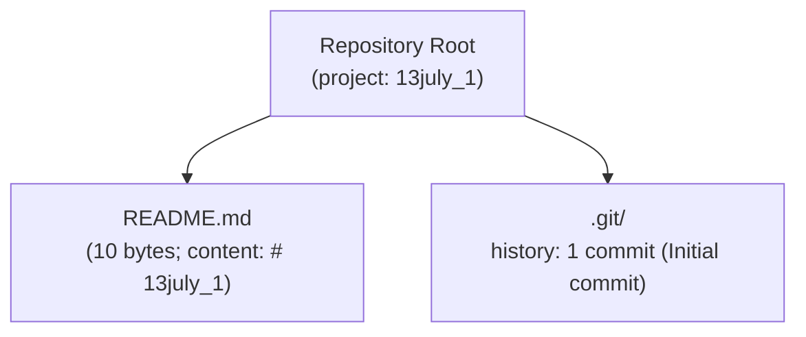

**Core technical approach.** No programming language, framework, runtime, package manager, or build system has been introduced. Because `README.md` is the only file, the **technical approach is undefined** in the repository and cannot be inferred without fabrication.

### 1.2.3 Success Criteria

The repository defines no measurable objectives, acceptance criteria, service-level agreements, or key performance indicators. There are no configuration files, test specifications, monitoring definitions, or documentation that state targets against which success could be measured. To avoid inventing metrics that are not evidenced, each requested dimension is reported as undocumented below.

| Success Dimension | Status in Repository |
| --- | --- |
| Measurable objectives | Not documented in repository |
| Critical success factors | Not documented in repository |
| Key performance indicators (KPIs) | Not documented in repository |

Definition of success criteria is a prerequisite activity that must be supplied through requirements or planning artifacts not currently present in the repository.

## 1.3 Scope

Scope is stated against the repository as it exists at head commit `7ff32240`. Because the repository is a skeleton containing only `README.md`, the in-scope surface is limited to that single documentation artifact, and no application functionality is defined. The tables below map each requested scope dimension to its verifiable status; items marked "None defined" reflect the absence of artifacts rather than an explicit exclusion decision.

### 1.3.1 In-Scope

The only element genuinely present and therefore in scope for this repository today is the project's documentation placeholder:

- `README.md` — a Markdown documentation artifact whose entire content is the project-name heading `# 13july_1`.

**Core Features and Functionalities.** No features, workflows, integrations, or technical requirements are implemented or specified in the repository.

| Requested Element | Status in Repository |
| --- | --- |
| Must-have capabilities | None defined |
| Primary user workflows | None defined |
| Essential integrations | None defined |
| Key technical requirements | None defined |

**Implementation Boundaries.** The current system boundary encloses only the documentation artifact and version-control metadata; no runtime, user population, market, or data domain is established.

| Boundary Dimension | Status in Repository |
| --- | --- |
| System boundaries | Encloses only README.md and git metadata |
| User groups covered | None defined |
| Geographic / market coverage | None defined |
| Data domains included | None defined |

### 1.3.2 Out-of-Scope

Because no functionality has been implemented, no capabilities have been formally excluded in the repository; equally, no capabilities are present. In practical terms, **all application functionality lies outside the current repository contents**. To avoid fabricating a roadmap that the repository does not document, the following items are reported as absent rather than as deliberate future commitments.

| Area | Status in Repository |
| --- | --- |
| Excluded features / capabilities | None enumerated (no feature set defined) |
| Future-phase considerations / roadmap | No roadmap or phase plan documented |
| Integration points | None covered (no integrations present) |
| Unsupported use cases | None enumerated (no use cases defined) |

A definitive in-scope and out-of-scope boundary can only be authored once requirements, a target architecture, and planning artifacts — none of which currently exist in the repository — are introduced.

## 1.4 References

The following repository artifacts were examined and cited as evidence for this Introduction. No external or web sources were required.

**Files**

- `README.md` — Established the project name `13july_1`; verified to be the only tracked file (10 bytes) with the single-line content `# 13july_1`. Confirmed the absence of any descriptive, functional, or configuration content.

**Folders**

- Repository root (\`\` / path `""`) — Confirmed the top-level structure contains only `README.md` with no subfolders and no source, manifest, configuration, or build artifacts.

**Version-control evidence**

- Git history (`main` branch, head commit `7ff32240`) — Confirmed a single "Initial commit" that added `README.md`; verified via `git ls-files` (1 tracked file) and an exhaustive source/manifest/configuration pattern search (zero matches) that no other files exist in the repository or its history.

# 2. Product Requirements

## 2.1 Feature Catalog

The Feature Catalog enumerates the discrete, testable features that constitute the product. In a fully specified system, each feature is documented with metadata (a unique identifier, name, category, priority, and status), a description (overview, business value, user benefits, and technical context), and its dependencies (prerequisite features, system dependencies, external dependencies, and integration requirements).

**No features are cataloged for this repository.** As of the documented head commit `7ff32240` on the `main` branch, the repository `13july_1` is a greenfield skeleton whose only tracked artifact is `README.md` (10 bytes, containing the single line `# 13july_1`). There is no application source code, no dependency manifest, no configuration, no build tooling, and no test suite from which any feature could be identified, described, or verified. This finding is consistent with **Section 1.2 System Overview**, which reports that the repository exposes "no system capabilities," and with **Section 1.3 Scope**, which records "None defined" for must-have capabilities, primary user workflows, and essential integrations.

Because the section prompt requires that only features actually evidenced by the system be documented — and explicitly prohibits inventing features — the catalog below is intentionally empty. Rather than assert features that do not exist, each required catalog dimension is mapped to its verifiable status in the repository. All dimensions marked "None defined" reflect the absence of artifacts, not a deliberate exclusion decision.

### 2.1.1 Current Repository Composition

The complete, verifiable composition of the repository is shown below. No feature-bearing components — modules, services, API endpoints, background jobs, data stores, or user interfaces — are present.

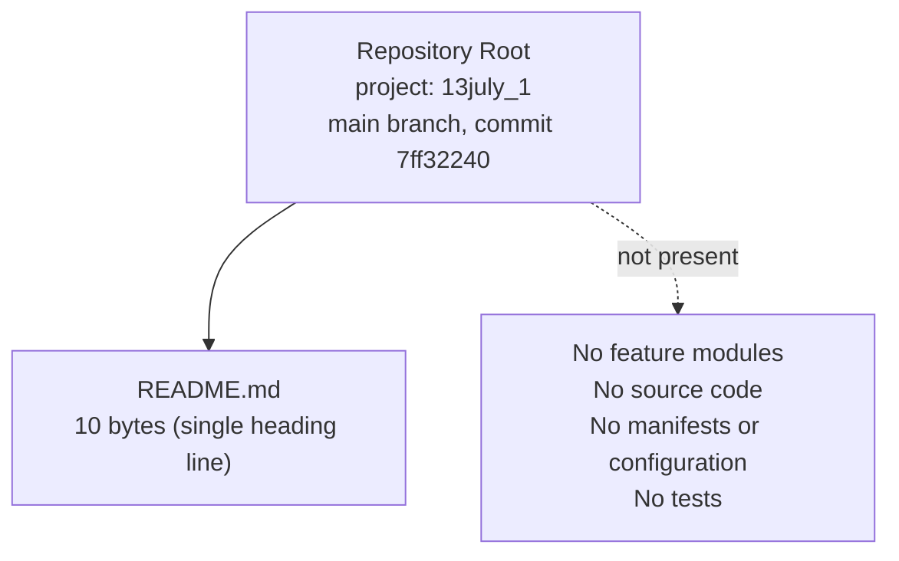

### 2.1.2 Feature Inventory and Metadata

No feature identifiers (format `F-XXX`) have been allocated, because no features are defined or implemented. The identifier scheme is reserved for future use: `F-XXX` will designate a feature and `F-XXX-RQ-YYY` its individual functional requirements (see Section 2.2) once product scope is introduced.

| Feature ID | Feature Name | Category | Status |
|------------|--------------|----------|--------|
| — | No features defined | — | Not Applicable |

The standard feature-metadata dimensions map to the repository as follows:

| Metadata Attribute | Status in Repository |
|--------------------|----------------------|
| Count of features | 0 |
| Allocated feature IDs (`F-XXX`) | None allocated |
| Feature categories | None defined |
| Priority (Critical/High/Medium/Low) | Not applicable — no features to prioritize |
| Status (Proposed/Approved/In Development/Completed) | Not applicable — no features to track |

### 2.1.3 Description and Dependencies

Because no features exist, the descriptive and dependency dimensions that would accompany each feature cannot be populated from repository artifacts. The overview, business value, and user benefits are undocumented for the same reasons the business problem and value proposition are reported as "Not Determinable From Repository" in **Section 1.1 Executive Summary**, and the technical context is undefined because no technology stack has been introduced (**Section 1.2 System Overview**).

| Feature Description Dimension | Status in Repository |
|-------------------------------|----------------------|
| Overview | None defined — no feature to describe |
| Business Value | Not Determinable From Repository (see Section 1.1.4) |
| User Benefits | Not Determinable From Repository — no user population defined (see Section 1.3.1) |
| Technical Context | None — no runtime, framework, or stack established (see Section 1.2.2) |

| Feature Dependency Dimension | Status in Repository |
|------------------------------|----------------------|
| Prerequisite Features | None — no features exist to depend upon |
| System Dependencies | None — no runtime, platform, or services established |
| External Dependencies | None — no dependency manifest present in the repository |
| Integration Requirements | None — no integrations evidenced (see Sections 1.2.1 and 1.3.2) |

Populating this catalog requires inputs — product requirements, stakeholder briefs, or design documentation — that are not currently part of the repository.

## 2.2 Functional Requirements

Functional requirements decompose each cataloged feature into individually testable requirements. Every requirement would normally carry an identifier (format `F-XXX-RQ-YYY`), a description, acceptance criteria, a priority (Must-Have/Should-Have/Could-Have) and a complexity rating (High/Medium/Low), together with technical specifications (input parameters, output/response, performance criteria, and data requirements) and validation rules (business rules, data validation, security requirements, and compliance requirements).

**No functional requirements are defined for this repository.** Functional requirements derive from features, and Section 2.1 establishes that no features exist. With the repository limited to `README.md` at commit `7ff32240`, there is no implemented behavior to specify, no inputs or outputs to define, no performance target to state, and no validation, security, or compliance rule to enforce. Consistent with **Section 1.2.3 Success Criteria**, the repository defines no measurable objectives, acceptance criteria, service-level agreements, or key performance indicators; consequently, no performance or acceptance criteria can be stated here without fabrication.

### 2.2.1 Requirements Inventory

No requirement identifiers (format `F-XXX-RQ-YYY`) have been allocated. The table below shows the standard requirement structure with an empty result set.

| Requirement ID | Description | Acceptance Criteria | Priority |
|----------------|-------------|---------------------|----------|
| — | No functional requirements defined | Not applicable | — |

### 2.2.2 Technical Specification and Validation Dimensions

The technical-specification and validation-rule dimensions that would accompany each requirement map to the repository as follows. Each is "None defined" because there is no feature or behavior to specify.

| Technical Specification Dimension | Status in Repository |
|-----------------------------------|----------------------|
| Input Parameters | None defined — no interface or entry point exists |
| Output / Response | None defined — no behavior produces output |
| Performance Criteria | None defined — no SLAs/KPIs documented (see Section 1.2.3) |
| Data Requirements | None defined — no data domains established (see Section 1.3.1) |

| Validation Rule Dimension | Status in Repository |
|---------------------------|----------------------|
| Business Rules | None defined — no domain logic present |
| Data Validation | None defined — no data model or inputs to validate |
| Security Requirements | None defined — no authentication, authorization, or secrets handling present |
| Compliance Requirements | None defined — no regulatory or policy artifacts present |

Defining functional requirements is a prerequisite activity that depends on requirements and design artifacts not currently present in the repository.

## 2.3 Feature Relationships

Feature relationships describe how features connect to one another and to shared infrastructure: the dependency map between features, integration points, shared components, and common services. The section prompt requires that only relationships clearly evident in the requirements or source code be documented, and that none be imagined.

**No feature relationships exist in this repository.** Relationships presuppose features, and Section 2.1 establishes that none are defined or implemented. With `README.md` as the sole tracked artifact at commit `7ff32240`, there are no modules to depend on one another, no integration points, no shared libraries or components, and no common services. This is consistent with **Section 1.2.1**, which reports no evidence of integration with any external system or enterprise landscape, and **Section 1.3.2**, which records that no integration points are covered.

| Relationship Dimension | Status in Repository |
|------------------------|----------------------|
| Feature dependency map | None — no features exist to relate |
| Integration points | None — no internal or external integrations present (see Section 1.2.1) |
| Shared components | None — no shared libraries, modules, or utilities present |
| Common services | None — no services (e.g., auth, logging, data access) present |

No process flowcharts or feature-interaction diagrams can be derived, because there are no processes or interactions to depict. The only structural diagram available for this repository is the current-composition diagram in Section 2.1.1. Feature relationships can be established only after a feature set and its supporting architecture are introduced into the repository.

## 2.4 Implementation Considerations

Implementation considerations capture the technical constraints, performance requirements, scalability considerations, security implications, and maintenance requirements associated with each feature. These considerations are properties of implemented or specified features and their chosen technology stack.

**No implementation considerations can be documented from repository artifacts.** No features exist (Section 2.1), and no technology stack, runtime, framework, or configuration has been introduced (**Section 1.2.2** reports the technical approach is undefined). Absent code, dependencies, deployment descriptors, or performance/security artifacts, any statement about constraints, scale, or maintenance would be fabricated. Each dimension is therefore reported as not determinable from the current repository.

| Implementation Dimension | Status in Repository |
|--------------------------|----------------------|
| Technical constraints | Not Determinable From Repository — no code, language, or platform selected |
| Performance requirements | None defined — no SLAs/KPIs or benchmarks documented (see Section 1.2.3) |
| Scalability considerations | Not Determinable From Repository — no runtime or architecture defined |
| Security implications | Not Determinable From Repository — no code, data flows, or credentials present |
| Maintenance requirements | Not Determinable From Repository — no build, test, CI/CD, or dependency tooling present |

The only maintenance-relevant fact verifiable today is that the repository is under Git version control on the `main` branch with a single "Initial commit" (`7ff32240`). Implementation considerations become documentable once the project introduces source code, a dependency manifest, and supporting configuration.

## 2.5 Requirements Traceability Matrix

The requirements traceability matrix links each feature to its functional requirements, their acceptance criteria, and the artifacts that verify them, providing end-to-end coverage from need to validation.

**The traceability matrix is empty.** With no features (Section 2.1) and no functional requirements (Section 2.2), there are no items to trace. The matrix structure is shown below with an empty result set to document the intended format for future use.

| Feature ID | Requirement ID | Acceptance Criteria | Verification Artifact |
|------------|----------------|---------------------|-----------------------|
| — | — | No requirements defined | None (no tests present) |

The traceability summary counts are as follows:

| Traceability Metric | Value |
|---------------------|-------|
| Features (`F-XXX`) | 0 |
| Functional requirements (`F-XXX-RQ-YYY`) | 0 |
| Requirements with acceptance criteria | 0 |
| Requirements with verification artifacts (tests) | 0 |

A meaningful traceability matrix can be produced only after features and requirements are defined and corresponding verification artifacts (test suites) are added to the repository.

## 2.6 Assumptions and Constraints

This subsection records the assumptions and constraints that govern the Product Requirements documented above, and establishes the baseline version for the (currently empty) requirement set.

### 2.6.1 Assumptions

- This section documents the repository exactly as it exists at head commit `7ff32240` on the `main` branch; it does not assume any planned, in-progress, or externally specified functionality.
- The absence of features and requirements is treated as the genuine, verified state of the repository — confirmed by `git ls-files` (one tracked file) and an exhaustive source/manifest/configuration pattern search returning zero matches — rather than as an incomplete inspection.
- No user-provided context, attachments, or implementation rules were supplied for this repository; therefore no external requirement sources override the repository evidence.

### 2.6.2 Constraints

- Per the section prompt, only features, requirements, and relationships evidenced by the system may be documented; inventing a feature set, requirements, or relationships is prohibited. The empty catalog is a direct consequence of this constraint applied to a skeleton repository.
- Authoring meaningful product requirements is blocked until requirements inputs (product briefs, stakeholder needs, or design documentation) and initial source code are introduced. This blocker mirrors the observations in **Section 1.3**, which states that a definitive scope can be authored only once such artifacts exist.

### 2.6.3 Requirement Version Baseline

| Version Attribute | Value |
|-------------------|-------|
| Requirements baseline | v0 (empty — no features or requirements defined) |
| Repository commit documented | `7ff32240` (main, "Initial commit") |
| Total features / requirements | 0 / 0 |
| Next revision trigger | Introduction of feature or requirement artifacts into the repository |

## 2.7 References

The following repository artifacts and previously authored specification sections were examined and cited as evidence for this Product Requirements section. No external or web sources were required.

**Files**

- `README.md` — Confirmed to be the only tracked file (10 bytes) with the single-line content `# 13july_1`; established that no feature-bearing source, manifest, configuration, or test artifacts exist from which features or requirements could be derived.

**Folders**

- Repository root (path `""`) — Verified the top-level structure contains only `README.md`, with no subfolders and no source, manifest, configuration, or build artifacts; basis for the current-composition diagram in Section 2.1.1.

**Version-control evidence**

- Git history (`main` branch, head commit `7ff32240`) — Confirmed a single "Initial commit" adding `README.md`. Verified via `git ls-files` (1 tracked file) and an exhaustive source/manifest/configuration pattern search (zero matches) that no other files exist in the repository or its history; basis for the requirement version baseline in Section 2.6.3.

**Cross-referenced specification sections**

- `1.1 Executive Summary` — Basis for reporting business value and user benefits as "Not Determinable From Repository" (Sections 2.1.3).
- `1.2 System Overview` — Established that the repository exposes no system capabilities, no defined technical approach, and no integrations, and defines no measurable objectives/KPIs (Sections 2.1, 2.2.2, 2.3, 2.4).
- `1.3 Scope` — Established "None defined" for must-have capabilities, primary user workflows, and essential integrations, and that no integration points are covered (Sections 2.1, 2.3, 2.6.2).

# 3. Technology Stack

## 3.1 Programming Languages

This section documents the technology stack of the `13july_1` repository as observed at head commit `7ff32240` (branch `main`). The repository is a greenfield skeleton whose only tracked artifact is `README.md`; an exhaustive inspection of the working tree found no source code, dependency manifests, lockfiles, configuration, containerization, infrastructure, or CI/CD definitions. Consequently, **no application technology stack has been selected or implemented at this commit**. Each subsection below reports the verifiable state and, to remain strictly evidence-based, explicitly flags any dimension that cannot be established from repository artifacts. The complete, verified technology footprint is summarized below.

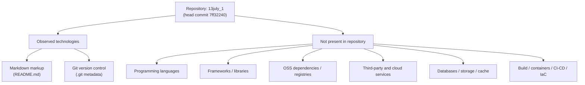

**No programming languages are present in the repository.** A pattern search across the working tree (excluding Git metadata) returned zero source files for any language — there are no `.py`, `.js`, `.ts`/`.tsx`/`.jsx`, `.go`, `.rb`, `.java`, `.kt`, `.swift`, `.m`, `.rs`, `.c`/`.cpp`, `.cs`, or `.php` files. The single tracked file, `README.md` (10 bytes), is authored in **Markdown**, a lightweight markup language used for documentation — it is neither a programming language nor an executable runtime.

**Languages by platform/component.** The table maps each platform/component to its language status as verified at commit `7ff32240`.

| Platform / Component | Language (Version) | Status in Repository |
|---|---|---|
| Documentation | Markdown (no version pinned) | Present — `README.md`, single line `# 13july_1` |
| Backend / services | None selected | Not present — no server-side source files |
| Web frontend | None selected | Not present — no web source files |
| Mobile / cross-platform | None selected | Not present — no mobile source files |
| Native apps (iOS / Android / macOS / desktop) | None selected | Not present — no native source files |

**Selection criteria and justification.** Because no programming language has been introduced, there are no language-selection decisions to document, and articulating a rationale would require fabricating choices the repository does not evidence. The project's Default Technology Stack references Python (backend), TypeScript (web and cross-platform via React/React-Native), and Swift/Kotlin/Objective-C (native apps); none of these languages appear in the repository at this commit. They are recorded here as candidate/not-yet-adopted defaults rather than implemented decisions, consistent with **Section 1.2.2**, which states the technical approach is undefined.

**Constraints and dependencies.** No language runtimes, compilers, interpreters, or toolchains are pinned — no manifests or lockfiles exist — so no version constraints or inter-language dependencies can be stated. The only language-adjacent fact verifiable today is that the repository's sole documentation artifact is authored in Markdown.

## 3.2 Frameworks & Libraries

**No application frameworks or libraries are present in the repository.** The artifacts that would declare frameworks/libraries and pin their versions — a dependency manifest (for example `package.json`, `requirements.txt`, `pyproject.toml`, `go.mod`, `pom.xml`, `Gemfile`, or `Cargo.toml`) and an accompanying lockfile — do not exist at commit `7ff32240`. As a result:

- **Core frameworks:** none. There is no web, backend, UI, styling, desktop, or AI/ML framework in the repository.
- **Supporting libraries:** none declared, imported, or vendored.
- **Compatibility requirements:** not applicable — with no frameworks or language runtimes selected, there are no version-compatibility constraints to reconcile.
- **Justification:** no framework selection exists to justify; documenting one would be fabrication.

Because no manifest or lockfile is present, **no version numbers can be reported** for any framework or library. The frameworks named in the project's Default Technology Stack are recorded below only to make their absence explicit; each is a candidate default that has not been adopted in the repository.

| Framework / Library (Default-stack reference) | Version | Status in Repository |
|---|---|---|
| Flask (backend web framework) | Not pinned | Not present |
| React (web UI) | Not pinned | Not present |
| TailwindCSS (styling) | Not pinned | Not present |
| React-Native (mobile/cross-platform) | Not pinned | Not present |
| ElectronJS (desktop) | Not pinned | Not present |
| LangChain (AI framework) | Not pinned | Not present |

This is consistent with **Section 2.4**, which reports that no technology stack, runtime, framework, or configuration has been introduced.

## 3.3 Open Source Dependencies

**No open-source or third-party code dependencies are declared, vendored, or referenced in the repository.** There is no package manifest and no lockfile at commit `7ff32240`, so the repository has no declared dependency graph. Specifically:

- **No package-registry dependencies.** Nothing is referenced from npm, PyPI, Maven Central, RubyGems, crates.io, the Go module proxy, Packagist, or any other registry — there are no manifest entries or import statements to resolve.
- **No vendored dependencies.** No third-party/vendored directories (for example `node_modules/`, `vendor/`, or `third_party/`) exist in the working tree.
- **No versions to pin or audit.** Because no dependency descriptors exist, there are no version numbers, transitive dependencies, or license/vulnerability exposures to report.

The only third-party software involved in the repository's lifecycle is the **Git** distributed version-control system used to track it (evidenced by the `.git` metadata). Git is external tooling that manages the repository rather than a declared open-source code dependency of the project, and the repository does not pin a Git version. Aside from Git, the repository has a **zero-dependency footprint** as of the documented commit.

## 3.4 Third-Party Services

**No external services or integrations are present in the repository.** There are no API clients, SDK configurations, service definitions, environment files (`.env`), credentials, or infrastructure manifests at commit `7ff32240`. Because the repository contains a single documentation file and no runtime, there are also **no integration requirements between components** to document. Each requested dimension is reported below.

| Service Category | Status in Repository (as of `7ff32240`) |
|---|---|
| External APIs / integrations | None — no API clients, SDKs, or service definitions present |
| Authentication services | None — no Auth0/OAuth/OIDC or identity-provider configuration (Default-stack Auth0 not present) |
| Monitoring / observability | None — no logging, metrics, tracing, APM, or dashboard configuration |
| Cloud services | None — no AWS or other cloud SDK/config or IaC present (Default-stack AWS not present) |

**Security implications.** Because no credentials, secrets, API tokens, connection strings, or environment files are committed, the repository exposes **no third-party service secrets** at this commit, and there is no external attack surface arising from service integrations. This aligns with **Section 2.4**, which reports no data flows or credentials are present. Any future integration will need to introduce secret-management and least-privilege access controls that do not yet exist.

## 3.5 Databases & Storage

**No databases, caches, or external storage services are configured in the repository.** There are no database drivers, ORM/ODM definitions, connection strings, schema or migration files, seed data, or cache configuration at commit `7ff32240`. The requested dimensions are reported below.

- **Primary and secondary databases:** none. No relational or NoSQL database engine is present or configured; the Default-stack MongoDB is not present.
- **Data persistence strategy:** the only persistence mechanism actually present is the **Git object store**, which version-controls the single `README.md` file on the local filesystem. There is no application-level data model or persistence layer.
- **Caching solutions:** none. No in-memory or distributed cache (for example Redis or Memcached) is configured.
- **Storage services:** none. No object/blob storage or managed file-storage service integration exists.

No database or storage component versions can be reported because none are declared. This is consistent with **Section 1.3.1**, which establishes that the system boundary encloses only `README.md` and Git metadata, and with **Section 2.4**, which finds no runtime or architecture defined.

## 3.6 Development & Deployment

The only development or deployment technology evidenced by the repository is **Git**, the distributed version-control system, confirmed by the `.git` metadata and a single "Initial commit" (`7ff32240`) on the `main` branch. No build, containerization, CI/CD, or infrastructure tooling is present.

- **Development tools:** Git version control is the sole development tool present. No editor, linter, formatter, pre-commit hook, or language-toolchain configuration exists in the working tree, and the repository does not pin a Git version.
- **Build system:** none. There is no build tool or task runner (no `Makefile`, npm scripts, Gradle, Maven, Bazel, or equivalent) and nothing to compile, bundle, or package.
- **Containerization:** none. No `Dockerfile`, `docker-compose*.yml`, or other container manifest exists (Default-stack Docker not present).
- **CI/CD:** none. There is no `.github/workflows` directory or any other continuous-integration/continuous-deployment configuration (Default-stack GitHub Actions not present).
- **Infrastructure as Code (IaC):** none. No Terraform (`*.tf`/`*.tfvars`) or other IaC definitions exist (Default-stack Terraform not present).

The table summarizes the development and deployment toolchain status verified at commit `7ff32240`.

| Category | Tool (Default-stack reference) | Status in Repository |
|---|---|---|
| Version control | Git | Present — `.git` metadata, 1 commit on `main` |
| Build system | (none specified) | Not present |
| Containerization | Docker | Not present |
| CI/CD | GitHub Actions | Not present |
| Infrastructure as Code | Terraform | Not present |

**Maintenance and security note.** With no dependencies, runtime, build pipeline, or deployment path, there is currently no build/deploy surface and no third-party dependency-vulnerability exposure. Git version control on the `main` branch is the sole operational safeguard present today — the same maintenance-relevant fact noted in **Section 2.4**. Development and deployment tooling (build system, containerization, CI/CD, and IaC) becomes documentable only once the project introduces source code and supporting configuration.

## 3.7 References

The following repository artifacts and technical-specification sections were examined as evidence for this Technology Stack section, verified at head commit `7ff32240` on the `main` branch.

**Repository files and folders**

- `README.md` — the sole tracked file (10 bytes; content `# 13july_1`); established that the only present artifact is Markdown documentation and confirmed the absence of any source code, manifest, or configuration.
- `/` (repository root) — established the top-level structure: exactly one file (`README.md`) and no subfolders.
- `.git/` (Git version-control metadata) — established Git as the only development tool present and confirmed a single "Initial commit" (`7ff32240`) on `main`; also the basis for the "no CI/CD, no branches beyond `main`" findings.

**Repository-wide inspections**

- Exhaustive working-tree pattern search (dependency manifests, lockfiles, source files, containerization, IaC, and CI/CD artifacts) — returned zero matches, grounding the "not present" status across subsections 3.2–3.6.

**Cross-referenced technical-specification sections**

- `1.2 System Overview` — confirmed no programming language, framework, runtime, package manager, or build system has been introduced (technical approach undefined).
- `1.3 Scope` — confirmed the system boundary encloses only `README.md` and Git metadata; all technical requirements "None defined."
- `2.4 Implementation Considerations` — confirmed no technology stack/runtime/framework/configuration exists; Git version control is the only verifiable maintenance-relevant fact.
- `2.6 Assumptions and Constraints` — confirmed the verified empty state (baseline v0) at commit `7ff32240`.

**Web sources**

- None. No external/web sources were required, because all findings are grounded directly in repository evidence.

# 4. Process Flowchart

## 4.1 System Workflows

As of head commit `7ff32240` on the `main` branch, the repository `13july_1` is a greenfield skeleton whose only tracked artifact is `README.md` (10 bytes, containing the single line `# 13july_1`). It contains no application source code, no dependency manifest, no configuration, no runtime, and no tests. Consequently, **no application-level system workflows or business processes exist to model** at this commit. This finding is consistent with Section 1.3.1, which records "Primary user workflows: None defined," and with Section 2.1, which catalogs no features.

The only processes that can be evidenced from repository artifacts are **repository-lifecycle (version-control) activities**, reconstructed from the single-commit Git history. These are documented below because they are the sole verifiable process flows in the repository; they are explicitly *not* application business processes. Every requested workflow dimension is mapped to its verifiable status rather than fabricated. Entries marked "None defined" reflect the absence of artifacts, not a deliberate exclusion decision — populating them requires requirements, a target architecture, and source code that are not yet present.

### 4.1.1 Core Business Processes

No business processes are implemented or specified. There is no user population, user interface, service entry point, or conditional application logic from which an end-to-end user journey, system interaction, decision point, or error-handling path could be identified. The prompt's required flowchart elements (start/end points, process steps, decision diamonds, system boundaries, user touchpoints, error/recovery paths, timing/SLA) therefore have no application subject matter to describe.

| Requested Workflow Dimension | Status in Repository |
|------------------------------|----------------------|
| End-to-end user journeys | None defined — no users, UI, or entry point present |
| System interactions | None — no runtime components exist to interact |
| Decision points | None — no conditional or business logic present |
| Error-handling paths | None — no executable code or error handlers present |
| Timing / SLA considerations | None documented — no performance targets or SLAs in the repository |

The single verifiable process in the repository is its **initialization (provisioning)**, reconstructed from the Git history (one commit, `7ff32240`, "Initial commit"). The flowchart below depicts this repository-lifecycle process. No build, test, deploy, or runtime steps are defined, so the dashed branch terminates in an explicit "none present" state rather than an application decision diamond.

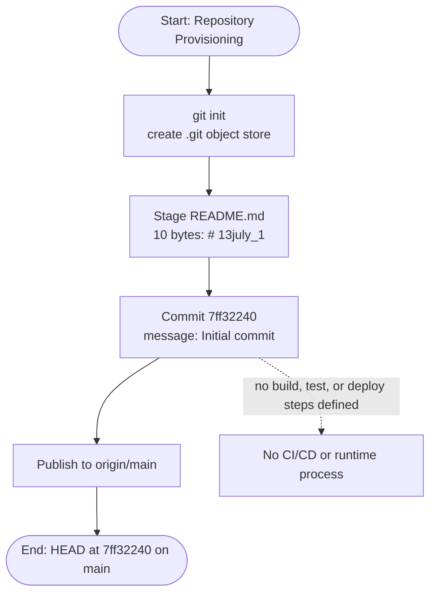

### 4.1.2 Integration Workflows

No integrations exist. Section 1.2.1 establishes there is no integration with any enterprise landscape, and the repository contains no API clients or servers, connectors, message brokers, schedulers, or configuration from which a data flow, API interaction, event flow, or batch sequence could be derived.

| Requested Integration Dimension | Status in Repository |
|----------------------------------|----------------------|
| Data flow between systems | None — no external systems or data stores present |
| API interactions | None — no API endpoints, clients, or contracts present |
| Event processing flows | None — no event bus, queue, or event handlers present |
| Batch processing sequences | None — no scheduled jobs or batch scripts present |
| Timing / SLA considerations | None documented — no throughput or latency targets present |

The current system boundary encloses only `README.md` and the Git object store; there are no outbound or inbound application-integration edges.

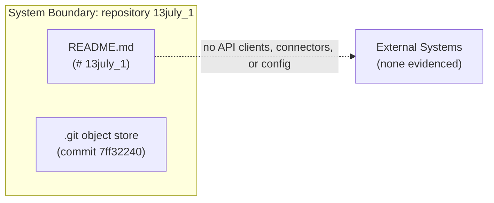

The only inter-system interaction evidenced anywhere in the repository is the **version-control exchange** between the developer's working tree, the local Git object store, and the `origin/main` remote. The sequence diagram below (participants act as swim lanes for each actor/system) captures this exchange. It is a source-control interaction, not an application or third-party integration, and no timing constraints, throughput targets, or SLAs are defined for it in the repository.

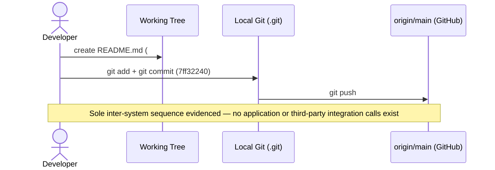

## 4.2 Flowchart Requirements and Validation Rules

This subsection reports the current status of every flowchart element and validation rule required by the section prompt, and states the modeling conventions that will govern process flowcharts once workflows are introduced. Because no application workflows are implemented at commit `7ff32240`, the required elements have no subject matter to depict today; the conventions below are therefore stated as forward-looking standards, and the current status of each element is mapped honestly to the repository.

### 4.2.1 Workflow Element Standards

The prompt requires that each major workflow expose start/end points, process steps, decision diamonds, system boundaries, user touchpoints, error states with recovery paths, and timing/SLA considerations. No such workflow exists in the repository, so the only element with a verifiable instance is the **system boundary**, which currently encloses just `README.md` and the Git object store. The single "high-level system workflow" that can be drawn without fabrication is the repository's verifiable composition, shown below.

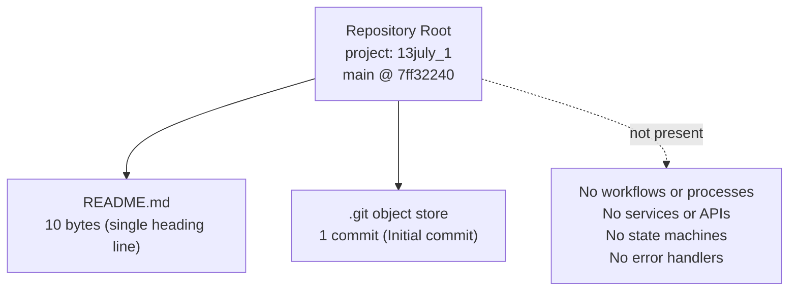

The table maps each required flowchart element to its current status and to the Mermaid notation to apply once workflows are defined. These conventions match those already used in this document (Sections 1.2.2 and 2.1.1 depict repository composition as flowcharts) and in Section 4.1 (subgraphs and sequence-diagram participants serve as swim lanes).

| Required Flowchart Element | Current Status in Repository | Notation to Apply Once Workflows Exist |
|----------------------------|------------------------------|----------------------------------------|
| Start and end points | No workflow to bound | Stadium terminators, e.g. `([Start])` / `([End])` |
| Process steps | None present | Rectangle nodes `["Step"]` |
| Decision diamonds | None present — no conditional logic | Rhombus nodes `{"Decision?"}` |
| System boundaries | Only the repository boundary (README.md + Git) | `subgraph` blocks acting as swim lanes |
| User touchpoints | None — no UI or actors defined | `actor` lanes in `sequenceDiagram` |
| Error states and recovery paths | None — no error handling present | Labeled branches to explicit recovery nodes |
| Timing / SLA considerations | None documented | Edge labels or `Note` annotations |

### 4.2.2 Validation Rules, Authorization Checkpoints, and Compliance Checks

No validation logic, authorization mechanism, or compliance control exists in the repository. There is no input handling, schema, identity provider, access-control code, audit logging, or PII-processing logic at commit `7ff32240`; `README.md` contains static documentation text and accepts no data. Consequently, none of the requested validation dimensions have an implemented instance to document.

| Requested Validation Dimension | Status in Repository |
|--------------------------------|----------------------|
| Business rules at each step | None — no process steps or rule engine present |
| Data validation requirements | None — no input handling, forms, or schema present |
| Authorization checkpoints | None — no authentication, authorization, or identity/access control present |
| Regulatory compliance checks | None — no compliance controls, audit logging, or PII handling present |

The only integrity guarantee actually present is intrinsic to version control: the Git object store is content-addressed, so the committed `README.md` is validated against its object hash under commit `7ff32240`. This is a repository-integrity property, not an application-level validation rule, business rule, authorization checkpoint, or regulatory control. Defining genuine validation and authorization flows requires requirements and source code that, per Sections 1.3 and 2.1, are not present in the repository.

## 4.3 Technical Implementation Flows

This subsection documents the state-management and error-handling flows that underpin the system's processes. Because the repository has no application runtime at commit `7ff32240`, there are no application state transitions, persistence layers, caches, transaction boundaries, retry policies, fallback processes, notification flows, or recovery procedures to model. The only mechanisms that can be evidenced are intrinsic to version control. This is consistent with Section 3.5 (no databases, caches, or storage; the only persistence is the Git object store) and Section 2.4 (no runtime or architecture defined).

### 4.3.1 State Management

No application state model exists — there is no state machine, entity lifecycle, session, database, or cache. The only durable state in the repository is its **version-control history**, and the only persistence mechanism present is the Git object store that version-controls `README.md` (Section 3.5).

| Requested State Dimension | Status in Repository |
|---------------------------|----------------------|
| State transitions | None — no application state machine or entity lifecycle present |
| Data persistence points | Only the Git object store persists `README.md`; no application persistence layer (see Section 3.5) |
| Caching requirements | None — no in-memory or distributed cache configured (see Section 3.5) |
| Transaction boundaries | None — no database or transactional resource present |

The only state model that can be drawn without fabrication is the repository's VCS lifecycle: it currently rests in a single committed state with no subsequent transitions recorded.

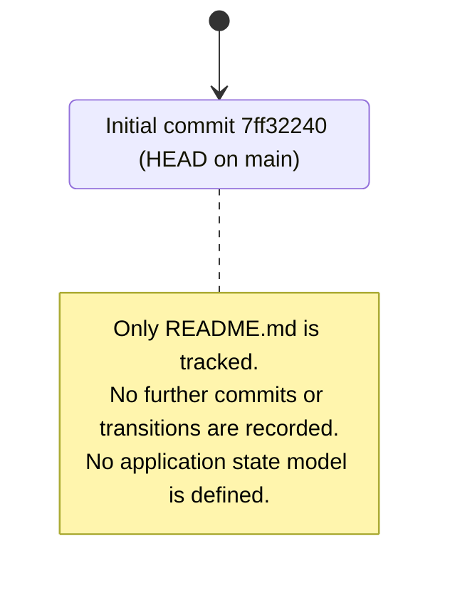

### 4.3.2 Error Handling

No error-handling logic exists in the repository. There is no executable code that performs I/O, network calls, or computation, so there is nothing to fail and no retry, fallback, notification, or recovery flow to invoke. An error-handling flowchart cannot be authored for this commit without inventing behavior that the code does not exhibit.

| Requested Error-Handling Dimension | Status in Repository |
|------------------------------------|----------------------|
| Retry mechanisms | None — no network/I/O operations or retry policy present |
| Fallback processes | None — no degraded-mode or alternate-path logic present |
| Error notification flows | None — no logging, alerting, or notification channel present |
| Recovery procedures | None at application level — the only recovery capability present is Git history itself (e.g. `git revert` / `git reset`), a version-control facility rather than an application error-handling flow |

Genuine state-management and error-handling flows can be documented only once a runtime, a data model, and application source code — none of which exist at commit `7ff32240` — are introduced.

## 4.4 References

The following repository artifacts and technical-specification sections were examined as evidence for this section. All process-flow findings are grounded in the state of the repository at head commit `7ff32240` on the `main` branch.

**Repository files and folders inspected**

- `README.md` — the sole tracked artifact (10 bytes, containing the single line `# 13july_1`); established that no application source code, workflows, or process logic exist.
- `` (repository root) — confirmed the complete composition is `README.md` plus Git metadata, with no source, manifest, configuration, or test folders; semantic file and folder searches returned no application code.
- `.git/` — version-control metadata; established the single-commit history (`7ff32240` "Initial commit"), the `main` branch, and the `origin` remote, which together constitute the only verifiable process (repository initialization) and the only state model (VCS history).

**Technical Specification sections cross-referenced**

- Section 1.2 System Overview (1.2.1, 1.2.2) — greenfield initialization; no system capabilities; no integration with any enterprise landscape.
- Section 1.3 Scope (1.3.1, 1.3.2) — system boundary encloses only `README.md` and Git metadata; "Primary user workflows: None defined."
- Section 2.1 Feature Catalog — no features are cataloged; no feature-bearing components exist.
- Section 2.4 Implementation Considerations — no runtime or architecture defined.
- Section 3.5 Databases & Storage — no databases, caches, or storage services; the Git object store is the only persistence mechanism.

No external (web) sources were required, because every claim in this section is derived directly from repository artifacts.

# 5. System Architecture

## 5.1 High-Level Architecture

This section documents the system architecture of the `13july_1` repository as observed at head commit `7ff32240` on the `main` branch. An exhaustive inspection of the working tree (via `git ls-files` and a recursive file search excluding Git metadata) found a single tracked artifact, `README.md` (10 bytes, containing only the line `# 13july_1`), and no other files. There is consequently **no implemented or specified application architecture** at this commit: no runtime, services, modules, entry points, dependency manifests, configuration, data stores, or integrations exist. This finding is consistent with Section 1.2.2 (which reports the technical approach is undefined), Section 1.3.1 (which establishes the system boundary encloses only `README.md` and Git metadata), and Section 2.4 (which finds no runtime or architecture defined).

To remain strictly evidence-based, each architectural dimension requested by this specification is mapped below to its verifiable status rather than fabricated. Entries marked "None" or "Not Determinable From Repository" reflect the absence of artifacts, not a deliberate architectural exclusion; populating them requires source code, dependency manifests, and configuration that are not yet present.

### 5.1.1 System Overview

**Overall architectural style and rationale.** No architectural style has been selected or implemented. The repository contains no server-side, client-side, mobile, or serverless code, so it cannot be classified as a monolith, layered application, microservices system, event-driven system, or any other style. The only verifiable structural fact is a composition of **one documentation artifact (`README.md`) under Git version control**. Because no design rationale is recorded anywhere in the repository or its single-commit history, articulating a "style rationale" would require inventing decisions the repository does not evidence. The candidate technologies noted in the project's Default Technology Stack (referenced across Sections 3.1–3.6 — Python, TypeScript/React, MongoDB, Docker, GitHub Actions, Terraform, Auth0, AWS) are **not present** and are recorded elsewhere only as not-yet-adopted defaults.

**Key architectural principles and patterns.** None are defined or observable. There is no code, configuration, or dependency graph from which architectural principles (for example separation of concerns, dependency inversion, or CQRS) or patterns (for example MVC, repository, gateway, or pub/sub) could be inferred. The sole engineering practice actually evidenced in the repository is **version control**: the project is managed with Git on the `main` branch with a single "Initial commit" (`7ff32240`).

**System boundaries and major interfaces.** As established in Section 1.3.1, the current system boundary encloses only the documentation artifact (`README.md`) and the Git version-control metadata (`.git`). There are **no major application interfaces** — no HTTP/REST or gRPC endpoints, no message-broker topics, no user interface, and no command-line entry point. The only interface of any kind is the **version-control remote** (`origin`, hosted on GitHub) used to synchronize commits; it is a source-control mechanism, not an application interface. The diagram below depicts the complete verifiable composition and the (empty) external surface at commit `7ff32240`.

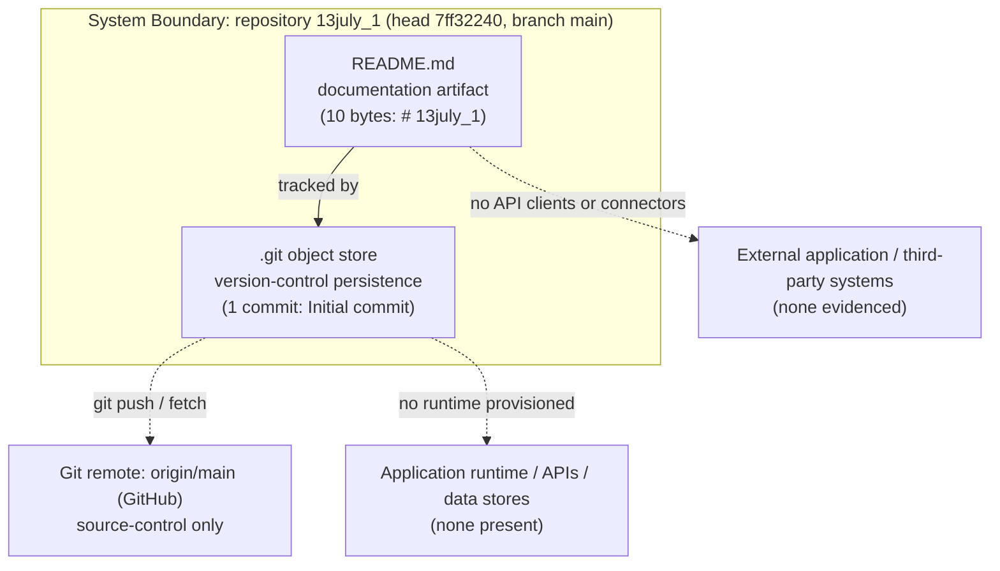

The following table summarizes each high-level architecture dimension against its verifiable status.

| Architecture Dimension | Status in Repository (as of `7ff32240`) |
|---|---|
| Architecture style | None selected — no runtime, services, or modules present |
| Architectural principles / patterns | None defined — no code or configuration to embody patterns |
| System boundary | Encloses only `README.md` and `.git` metadata (per Section 1.3.1) |
| Major interfaces (API / UI / CLI) | None present — no entry points or network interfaces |
| External touchpoint | Git remote `origin` (GitHub) — version control only |

### 5.1.2 Core Components

The repository comprises exactly **two verifiable structural components**: the `README.md` documentation artifact and the `.git` object store that version-controls it. No application components (services, modules, gateways, workers, or data stores) exist. Because this specification requests five component attributes and the document's formatting standard caps tables at four columns, the component view is presented as two complementary tables covering all five attributes.

Component responsibilities and dependencies:

| Component | Primary Responsibility | Key Dependencies |
|---|---|---|
| `README.md` (documentation artifact) | Identifies the project via the heading `# 13july_1`; sole human-readable documentation | None — plain Markdown; no build, runtime, or package dependencies |
| `.git` object store (version control) | Persists file history and enables synchronization with the remote | Git; local filesystem |

Component integration points and critical considerations:

| Component | Integration Points | Critical Considerations |
|---|---|---|
| `README.md` | Tracked by the `.git` object store; contains no code, config, or links to other systems | 10 bytes; a single heading; not executable; defines no schema, API, or interface |
| `.git` object store | `origin/main` remote (GitHub) via `git push`/`git fetch` | Sole persistence mechanism and operational safeguard; holds one commit; contains no application data; no secrets are committed to tracked files (Section 3.4) |

### 5.1.3 Data Flow Description

**Primary data flows between components.** No application data flows exist because there is no runtime to originate or consume them — there are no request/response cycles, no message passing, and no scheduled jobs. The only data movement evidenced in the repository is the **version-control flow**: a developer authors or edits `README.md` in the working tree, stages and commits it into the local `.git` object store, and publishes the commit to the `origin/main` remote. This flow is documented in more detail as a sequence diagram in Section 5.2 and is consistent with the version-control processes recorded in Section 4.1.

**Integration patterns and protocols.** No application integration patterns (for example request/reply, publish/subscribe, or batch/ETL) and no application protocols (for example HTTP/REST, gRPC, or AMQP) are present. The only protocol involved anywhere is **Git's transfer protocol** (over HTTPS) used to exchange commits with the GitHub remote.

**Data transformation points.** None exist. `README.md` is stored and version-controlled verbatim; there is no parsing, serialization/deserialization, validation, enrichment, or ETL logic anywhere in the repository.

**Key data stores and caches.** As documented in Section 3.5, the **only data store present is the Git object store**, which version-controls the single `README.md` file on the local filesystem. There is no relational or NoSQL database (the Default-stack MongoDB is not present), no in-memory or distributed cache (no Redis or Memcached), and no object/blob or managed file-storage service.

### 5.1.4 External Integration Points

No external application or third-party integrations exist in the repository. As documented in Sections 1.2.1 and 3.4, there are no API clients or servers, SDK configurations, service definitions, authentication providers (Auth0/OAuth/OIDC not present), monitoring/observability endpoints, cloud-service integrations (AWS not present), environment files, or credentials. The only external touchpoint of any kind is the **version-control remote** — a source-control mechanism rather than an application integration — and the repository defines no service-level agreements for it.

| External Touchpoint | Data Exchange Pattern | Protocol / Format | SLA Requirements |
|---|---|---|---|
| Git remote `origin` (GitHub) — version control only | Developer-initiated `push`/`fetch` of commits | Git transfer protocol over HTTPS | None defined in repository |
| External application / third-party systems | None — no data exchange present | None | None defined in repository |

## 5.2 Component Details

This specification requests, for each major component, its purpose and responsibilities, technologies and frameworks, key interfaces and APIs, data-persistence requirements, and scaling considerations. Because the repository contains no application components at commit `7ff32240`, **no application-tier component details (services, APIs, data tiers, or workers) are determinable** — documenting them would require fabricating a design the repository does not evidence. The only components that genuinely exist are the repository's two structural artifacts: the `README.md` documentation artifact and the `.git` object store. Each is detailed below against the requested attributes, followed by the required component-interaction, state-transition, and sequence diagrams for the only flow evidenced in the repository (version control).

### 5.2.1 README.md — Documentation Artifact

| Attribute | Detail (as of `7ff32240`) |
|---|---|
| Purpose and responsibilities | Identifies the project via the single heading `# 13july_1`; serves as the sole human-readable documentation. It is not executable and carries no configuration or logic. |
| Technologies and frameworks | Markdown lightweight markup (no version pinned). No framework, library, or runtime is involved. |
| Key interfaces and APIs | None. The file exposes no API, CLI, or UI; it is rendered by Markdown viewers but defines no programmatic interface. |
| Data persistence requirements | Persisted as a 10-byte blob within the Git object store; it has no runtime persistence requirement (no database rows, files, or state to store). |
| Scaling considerations | Not applicable. A static 10-byte document has no load, concurrency, throughput, or horizontal/vertical scaling dimension. |

### 5.2.2 Git Object Store — Version-Control Persistence

| Attribute | Detail (as of `7ff32240`) |
|---|---|
| Purpose and responsibilities | Version-controls the working tree, preserves commit history, and enables synchronization with the `origin/main` remote. It is the only persistence mechanism present (Section 3.5). |
| Technologies and frameworks | Git distributed version-control system (no Git version is pinned in the repository). No application framework is involved. |
| Key interfaces and APIs | The Git command interface (porcelain/plumbing commands such as `add`, `commit`, `push`, `fetch`) and the Git transfer protocol over HTTPS to the remote. There is no application API. |
| Data persistence requirements | A content-addressable object store on the local filesystem; it currently holds a single commit (`7ff32240`) referencing one tracked blob (`README.md`). No application data model exists. |
| Scaling considerations | Git scales with history depth and repository size; here the footprint is trivial (one commit, 10 bytes tracked). No application scaling dimension exists because no runtime is provisioned. |

The candidate application components implied by the project's Default Technology Stack (for example a Python backend, a React/TypeScript frontend, and a MongoDB data tier — referenced in Sections 3.1–3.6) are **not adopted and not present**; their purpose, interfaces, persistence, and scaling profiles are therefore Not Determinable From Repository.

### 5.2.3 Component Interaction Diagram

The only components that interact are the developer's working tree, the `.git` object store, and the `origin/main` remote. No application components (services, gateways, or data stores) exist to interact.

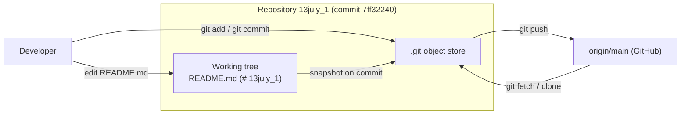

### 5.2.4 State Transition Diagram

The only stateful entity evidenced in the repository is the repository itself, whose lifecycle is reconstructed from the single-commit Git history. The current observed state is "Published" (HEAD at `7ff32240` on `main`, tracked by `origin/main`). No application state machine exists.

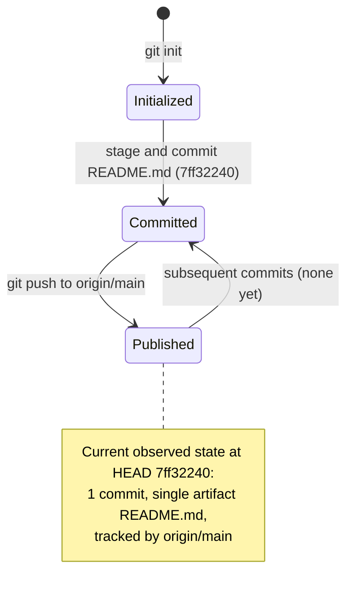

### 5.2.5 Sequence Diagram for the Key Flow

The single key flow evidenced in the repository is the version-control exchange that produced commit `7ff32240`. It is a source-control interaction, not an application or third-party integration, and no timing constraints or SLAs are defined for it.

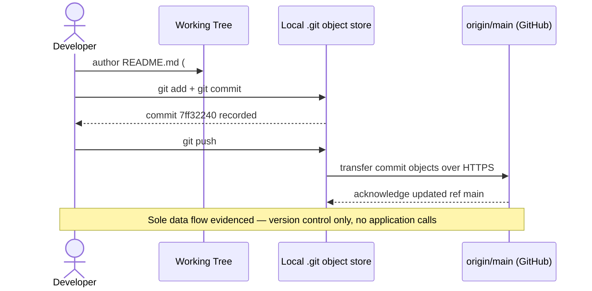

## 5.3 Technical Decisions

This specification requests documentation and justification of architecture-style, communication-pattern, data-storage, caching-strategy, and security-mechanism decisions. At commit `7ff32240` the repository records **only one technical decision** — the adoption of Git for version control — because no application code, configuration, or design artifacts exist. Every other decision area is therefore **deferred**: there is no basis in the repository on which to make (or justify) the choice, and asserting a tradeoff analysis would be fabrication. The status of each requested decision area is mapped below, followed by an Architecture Decision Record for the one accepted decision and a decision tree that shows how the remaining decisions are gated on prerequisites that are not yet present.

### 5.3.1 Status of Key Architectural Decisions

| Decision Area | Decision Status | Basis / Rationale in Repository |
|---|---|---|
| Architecture style | Not decided — deferred | No runtime, services, or requirements exist to inform a monolith vs. microservices (or other) choice |
| Communication pattern | Not decided — deferred | No inter-component, network, or messaging communication is present to pattern |
| Data storage solution | Not decided — deferred | No data model exists; the only persistence present is the Git object store (Section 3.5) |
| Caching strategy | Not decided — deferred | No runtime or data-access path exists to cache; no cache is configured (Section 3.5) |
| Security mechanism | Not decided — deferred | No authentication, secrets, or attack surface exists (Sections 3.4, 2.4) |
| Version control | Decided — Accepted | Git on branch `main` with a GitHub remote, evidenced by `.git` metadata and commit `7ff32240` |

### 5.3.2 Architecture Decision Records (ADRs)

The repository evidences exactly one decision, recorded below as ADR-001. All application-architecture ADRs (style, communication, storage, caching, and security) are **pending** and cannot be authored without inventing choices; they become documentable once requirements and source code are introduced.

| ADR-001 Field | Content |
|---|---|
| Title | Adopt Git for version control |
| Status | Accepted (evidenced at commit `7ff32240`) |
| Context | At initialization the project required a mechanism to persist and track its single documentation artifact and any future changes. |
| Decision | Use the Git distributed version-control system on branch `main`, synchronized to a GitHub remote (`origin/main`). |
| Consequences | Provides commit history and remote synchronization and is the sole operational safeguard present today (Sections 2.4, 3.6); it does **not** decide any build, containerization, CI/CD, IaC, or application-architecture concern, all of which remain open. |

**Deferred ADRs (not yet recorded).** ADR-002 and beyond — covering architecture style, communication pattern, data-storage solution, caching strategy, and security mechanism — are intentionally absent. Each requires inputs (requirements, a target architecture, and source code) that the repository does not yet contain, consistent with Section 2.4 (no runtime or architecture defined) and Section 1.2.2 (technical approach undefined).

### 5.3.3 Decision Tree

The decision tree below reflects the actual decision state: version control has been decided (ADR-001), while all application-architecture decisions branch to a "deferred" terminal because the prerequisite (requirements and source code) is not present at `7ff32240`.

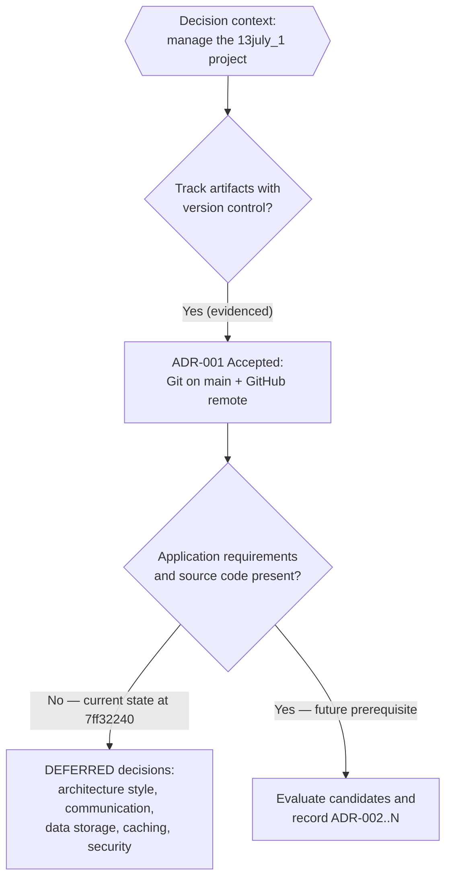

## 5.4 Cross-Cutting Concerns

Cross-cutting concerns are properties of a running system and its supporting infrastructure. Because the repository has no runtime, application code, configuration, or deployment surface at commit `7ff32240`, **none of the requested cross-cutting concerns are implemented**. Each is mapped below to its verifiable status; the only concern with any evidenced substance is disaster recovery, where the Git remote provides a limited redundancy of the repository contents. No performance targets or SLAs are defined anywhere in the repository (Sections 1.2.3 and 2.4).

| Cross-Cutting Concern | Status in Repository (as of `7ff32240`) |
|---|---|
| Monitoring & observability | None — no metrics, health checks, dashboards, or APM (Section 3.4) |
| Logging & tracing | None — no logging framework, log configuration, or distributed tracing |
| Error handling | None at application level — no code or handlers; only Git provides content recovery |
| Authentication & authorization | None — no identity provider, auth code, roles, or policies (Section 3.4) |
| Performance requirements & SLAs | None defined — no targets, benchmarks, or SLAs (Sections 1.2.3, 2.4) |
| Disaster recovery | No formal procedure — the `origin/main` Git remote is the only redundancy present |

### 5.4.1 Monitoring, Observability, Logging, and Tracing

No monitoring or observability approach exists. As documented in Section 3.4, there is no logging, metrics, tracing, APM, or dashboard configuration in the repository, and there is no runtime to emit telemetry. Consequently there is **no logging strategy** (no logging library, log levels, or sinks), **no distributed tracing** (no trace context or spans), and **no observability tooling**. These concerns become documentable only once an application runtime and its instrumentation are introduced.

### 5.4.2 Error Handling

There are **no application error-handling patterns** — no code, exception handlers, retry logic, fallback processes, circuit breakers, or error-notification flows exist, consistent with Section 4.1 (no application workflows). The only fault-recovery capability genuinely present derives from **Git version control**: a lost or erroneously modified working tree can be restored from the local object store or re-cloned from the `origin/main` remote back to the committed state (`7ff32240`). The diagram below distinguishes the (non-existent) application error path from the version-control recovery path that Git provides.

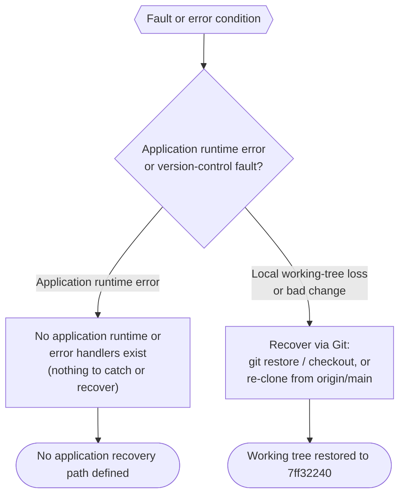

### 5.4.3 Authentication and Authorization

No authentication or authorization framework exists. Section 3.4 confirms the absence of any identity provider or auth configuration (Auth0/OAuth/OIDC not present), and the repository contains no roles, permissions, policies, tokens, or access-control code. Because no credentials or secrets are committed, the repository also exposes no third-party service secrets and presents no application attack surface at this commit. The only access control in effect is that governing the GitHub remote itself, which is a platform/source-control concern external to the repository contents.

### 5.4.4 Performance, SLAs, and Disaster Recovery

**Performance requirements and SLAs.** None are defined. As recorded in Sections 1.2.3 and 2.4, the repository states no measurable objectives, throughput/latency targets, benchmarks, or service-level agreements, so no performance or scalability implications can be documented without fabrication.

**Disaster recovery.** No formal disaster-recovery or business-continuity procedure is documented. The only redundancy actually present is the distributed nature of Git: the commit history exists both locally (`.git`) and on the `origin/main` remote (GitHub), so the repository's single artifact (`README.md`) can be recovered by re-cloning from the remote. There are no backups, recovery-point/recovery-time objectives, failover targets, or runbooks defined; these become relevant only once application state and infrastructure are introduced.

## 5.5 References

The following repository artifacts were inspected as evidence for this section (all observations are as of head commit `7ff32240` on the `main` branch):

- `README.md` — the sole tracked file (10 bytes, content `# 13july_1`); established the project identity and the only human-readable documentation component. Confirmed the absence of any code, configuration, interfaces, or links.
- `.git/` (Git object store) — established the only persistence and version-control mechanism present: a single "Initial commit" (`7ff32240`) on branch `main`, tracked by the `origin/main` remote (GitHub). Confirmed via `git ls-files`, `git log`, and branch/remote inspection.
- Repository root (path `""`) — established the complete top-level structure: only `README.md`, with no subfolders, source code, manifests, configuration, containerization, CI/CD, or infrastructure files (verified via a recursive working-tree search excluding Git metadata).

The following previously authored Technical Specification sections were retrieved via `get_tech_spec_section` and cross-referenced for consistency:

- `1.1 Executive Summary` — confirmed the uninitialized (skeleton) state and verifiable repository facts.
- `1.2 System Overview` — 1.2.1 (no integration with any enterprise landscape), 1.2.2 (technical approach undefined; major components are `README.md` and `.git`), 1.2.3 (no measurable objectives/KPIs).
- `1.3 Scope` — 1.3.1 (system boundary encloses only `README.md` and Git metadata; workflows/integrations/technical requirements "None defined"), 1.3.2 (all application functionality outside the current repository).
- `2.4 Implementation Considerations` — technical constraints, scalability, security, and maintenance "Not Determinable From Repository"; performance "None defined".
- `3.1 Programming Languages` — only Markdown (documentation) and Git (version control) present; Default Technology Stack candidates not adopted.
- `3.4 Third-Party Services` — no external APIs, authentication providers, monitoring/observability, or cloud services; no committed secrets.
- `3.5 Databases & Storage` — no databases, caches, or storage services; the Git object store is the only persistence mechanism.
- `3.6 Development & Deployment` — Git is the only development/deployment tooling; no build system, containerization, CI/CD, or IaC.
- `4.1 System Workflows` — no application workflows; only version-control/repository-lifecycle processes are evidenced.

No web sources were consulted; all findings are grounded directly in repository inspection.

# 6. SYSTEM COMPONENTS DESIGN

## 6.1 Core Services Architecture

### 6.1.1 Applicability Assessment

**Core Services Architecture is not applicable for this system.**

The scope of this section is triggered only when a system is composed of microservices, a distributed architecture, or otherwise distinct, independently operating service components. The `13july_1` repository meets none of these preconditions. Inspected at head commit `7ff32240` on the `main` branch, the entire object history resolves to a single commit, a single tree, and a single blob — the file `README.md` (10 bytes, containing only the line `# 13july_1`). No application runtime, executable code, dependency manifest, service definition, network interface, container image, orchestration manifest, or deployment configuration exists, so there is no service to bound, connect, scale, or protect.

This determination is consistent with the architecture already documented elsewhere in this specification: Section 5.1 records "no implemented or specified application architecture" and establishes that the system cannot be classified as a monolith, microservices, or event-driven system; Section 1.2.2 describes a greenfield initialization with an undefined technical approach; Section 3.6 confirms the absence of any build system, containerization, CI/CD, or Infrastructure-as-Code; and Section 5.4 confirms that no monitoring, logging, error-handling, authentication, or performance/SLA concerns are implemented.

Rather than fabricate a service topology, the remainder of Section 6.1 remains strictly evidence-based: it walks through each area the specification requests — Service Components (Section 6.1.2), Scalability Design (Section 6.1.3), and Resilience Patterns (Section 6.1.4) — and maps every requested dimension to its verifiable status at commit `7ff32240`. Entries marked "Not applicable" or "None present" reflect the absence of artifacts, not a deliberate architectural exclusion; each becomes documentable only once application source code, dependency manifests, and deployment configuration are introduced. The single mechanism with any operational substance is Git version control, whose distributed nature provides a limited redundancy of the repository's one artifact; that mechanism is addressed under Resilience Patterns (Section 6.1.4).

The table below records the threshold criteria evaluated for this determination.

| Applicability Criterion | Evidence Sought | Status at `7ff32240` |
|---|---|---|
| Microservices | Independently deployable service units or manifests | None — only `README.md` is tracked |
| Distributed architecture | Multiple networked processes, nodes, or tiers | None — no runtime or network interface |
| Distinct service components | Modules exposing APIs, workers, schedulers, or gateways | None — no executable code exists |
| Inter-process communication | HTTP/REST, gRPC, message broker, or queue | None — no application interfaces (Section 5.1) |
| Orchestration / deployment surface | Docker, Kubernetes, Compose, or IaC definitions | None — no deployment surface (Section 3.6) |

On the basis of the criteria above, all subsequent subsections document the absence of the requested capabilities and the reason each is not applicable, rather than describing a design that does not exist.

### 6.1.2 Service Components

No application services exist in the repository at commit `7ff32240`; consequently, none of the six service-component dimensions requested by this specification are implemented. The only two verifiable structural elements are the `README.md` documentation artifact and the `.git` object store that version-controls it (Section 5.1.2), and the only interaction of any kind is the developer-initiated synchronization of commits with the `origin/main` Git remote — a source-control mechanism, not an application service interaction. The table below maps each dimension to its verifiable status.

| Service-Component Dimension | Status at `7ff32240` | Basis / Cross-Reference |
|---|---|---|
| Service boundaries and responsibilities | Not applicable — no services | Only `README.md` and `.git` exist (Section 5.1.2) |
| Inter-service communication patterns | None — no HTTP/REST, gRPC, or messaging | No application interfaces (Section 5.1.1) |
| Service discovery mechanisms | Not applicable | No services or registry to resolve |
| Load balancing strategy | Not applicable | No compute instances to balance |
| Circuit breaker patterns | None | No inter-service calls to protect (Section 5.4.2) |
| Retry and fallback mechanisms | None at application level | Only Git restore / re-clone recovery (Section 5.4.2) |

#### 6.1.2.1 Boundaries and Responsibilities

The only boundary present is the system boundary defined in Sections 1.3.1 and 5.1.1, which encloses `README.md` and the `.git` metadata. `README.md` carries a single responsibility — identifying the project via the heading `# 13july_1` — and the `.git` object store carries the responsibility of persisting file history and enabling synchronization with the remote. Neither is a runtime service, neither exposes an interface, and neither can be independently deployed, so there are no service responsibilities to allocate.

#### 6.1.2.2 Communication, Discovery, Load Balancing, and Circuit Breaking

None of these patterns apply. There are no processes to communicate, no endpoints or registry entries to discover, no replicas behind a load balancer, and no downstream calls that a circuit breaker could guard. The candidate technologies noted across Sections 3.1–3.6 that would typically introduce such patterns — for example a Python/Flask backend, MongoDB, Auth0, or AWS services — are recorded there only as not-yet-adopted defaults and are not present in the repository.

#### 6.1.2.3 Retry and Fallback

No application-level retry or fallback logic exists (Section 5.4.2). The only fault-recovery capability genuinely present derives from Git: a lost or erroneously modified working tree can be restored from the local `.git` object store or re-cloned from the `origin/main` remote back to the committed state. This mechanism is elaborated under Resilience Patterns (Section 6.1.4).

The following diagram labels the complete verifiable composition and the single real interaction (version-control synchronization), explicitly showing the absence of any application service or inter-service link.

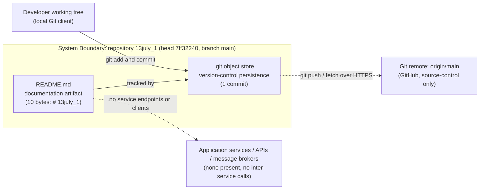

*Diagram 6.1.2-A — Service Interaction Diagram: the verifiable composition at commit `7ff32240`. The only interaction present is version-control synchronization; no application services or inter-service communication exist.*

### 6.1.3 Scalability Design

No runtime, compute instances, or deployment surface exist at commit `7ff32240`, so there is nothing to scale and none of the five scalability dimensions requested by this specification are implemented. Section 3.6 confirms the absence of any build system, containerization, CI/CD, or Infrastructure-as-Code, which means there is no path by which the project could be provisioned onto scalable infrastructure. Sections 1.2.3, 2.4, and 5.4.4 confirm that no performance targets, service-level agreements, or key performance indicators are defined, so no scaling thresholds or capacity models can be derived without fabrication. The table below maps each dimension to its verifiable status.

| Scalability Dimension | Status at `7ff32240` | Basis / Cross-Reference |
|---|---|---|
| Horizontal / vertical scaling approach | Not applicable — no runtime | No deployable compute (Section 3.6) |
| Auto-scaling triggers and rules | None | No orchestrator or metrics to trigger scaling |
| Resource allocation strategy | Not applicable | No CPU / memory / storage requests defined |
| Performance optimization techniques | None | No code paths or workloads to optimize |
| Capacity planning guidelines | None defined | No workload, SLAs, or KPIs (Sections 1.2.3, 2.4, 5.4.4) |

#### 6.1.3.1 Scaling, Auto-Scaling, and Resource Allocation

Horizontal scaling (adding instances) and vertical scaling (enlarging an instance) both presuppose a deployable unit of compute; none exists. There is no container image, process manager, serverless function, or virtual-machine definition, and therefore no auto-scaling controller, no scaling triggers (such as CPU utilization, request rate, or queue depth), and no resource requests or limits to allocate. The Default Technology Stack referenced in Sections 3.1–3.6 (for example Docker and AWS) that would ordinarily host such scaling is recorded there as not-yet-adopted and is not present.

#### 6.1.3.2 Performance Optimization and Capacity Planning

No performance-optimization techniques (caching, connection pooling, query tuning, concurrency control, or content delivery) are present, because there is no executable code or data path to optimize; Section 5.1.3 records no data transformation points and no caches. Capacity planning is likewise undefined: with no workload, throughput/latency targets, or KPIs (Sections 1.2.3 and 2.4), there is no basis for sizing infrastructure. The only inherent scaling-adjacent characteristic present is the distributed nature of Git — every clone of the repository holds a complete copy of its history — which is a source-control replication property rather than application compute scaling, and is discussed further under Resilience Patterns (Section 6.1.4).

The following diagram labels the present distributed version-control plane and the absent application compute tier, making explicit that no scalable compute, load balancer, or auto-scaler exists.

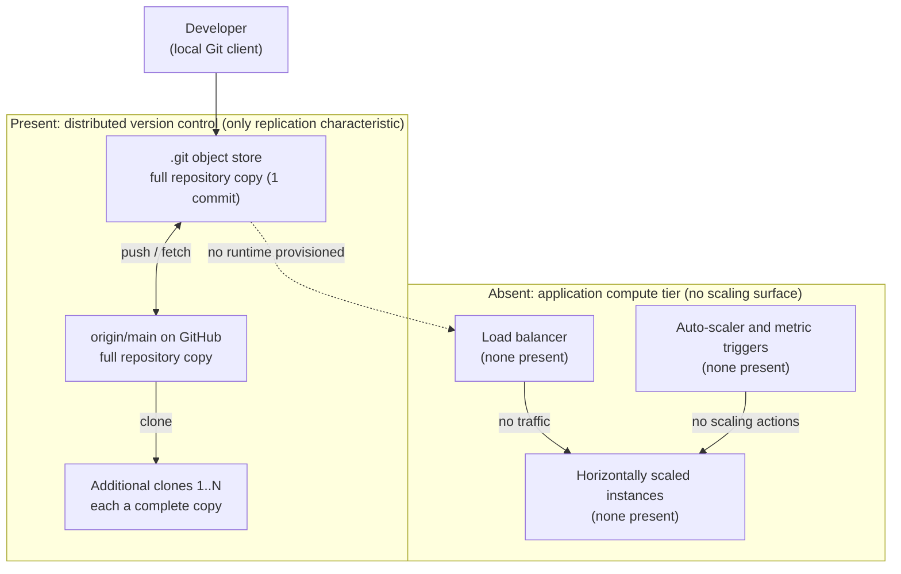

*Diagram 6.1.3-A — Scalability Architecture Diagram: at commit `7ff32240` the only horizontally replicated element is the Git version-control plane (each clone is a full copy); no application compute tier, load balancer, or auto-scaler is provisioned.*

### 6.1.4 Resilience Patterns

Resilience is the one area with any evidenced substance, and even here it is confined to the properties of Git version control rather than an application resilience design. At commit `7ff32240` there is no runtime, so there are no application fault-tolerance mechanisms, failover configurations, or service-degradation policies. The only redundancy and recovery capability present is that of the distributed version-control system, consistent with Sections 5.4.2 and 5.4.4. The table below maps each dimension to its verifiable status.

| Resilience Dimension | Status at `7ff32240` | Basis / Cross-Reference |
|---|---|---|
| Fault tolerance mechanisms | None at application level | No runtime to tolerate faults (Section 5.4.2) |
| Disaster recovery procedures | No formal procedure; Git remote is the only redundancy | No RPO/RTO/runbooks (Section 5.4.4) |
| Data redundancy approach | Git distributed full copies | Local `.git` plus `origin/main` (Section 5.4.4) |
| Failover configurations | None | No redundant runtime to fail over to |
| Service degradation policies | Not applicable | No service to degrade gracefully |

#### 6.1.4.1 Fault Tolerance, Failover, and Service Degradation

None of these apply. Fault tolerance, failover, and graceful degradation all require a running service with redundant instances or a defined reduced-capability mode; the repository has no runtime, no redundant instances, and no feature set, so there is nothing to fail over or degrade (Section 5.4.2). No health checks, readiness probes, or degradation thresholds are defined anywhere in the repository.

#### 6.1.4.2 Disaster Recovery and Data Redundancy

The only redundancy actually present derives from Git's distributed model: the repository's single artifact (`README.md`) and its one-commit history exist as complete copies both in the local `.git` object store and on the `origin/main` remote hosted on GitHub (Sections 5.4.4 and 5.1.4). Recovery of a lost or corrupted working tree is therefore possible by restoring from the local object store (`git restore` / `git checkout`) or by re-cloning from the remote, in either case returning the tree to the committed state `7ff32240`. This is a source-control safeguard, not a formal disaster-recovery program: no backup schedule, recovery-point objective (RPO), recovery-time objective (RTO), failover target, or runbook is defined anywhere in the repository (Section 5.4.4). These become relevant only once application state and infrastructure are introduced.

The following diagram labels the recovery decision and the two redundant Git copies that constitute the system's only resilience mechanism.

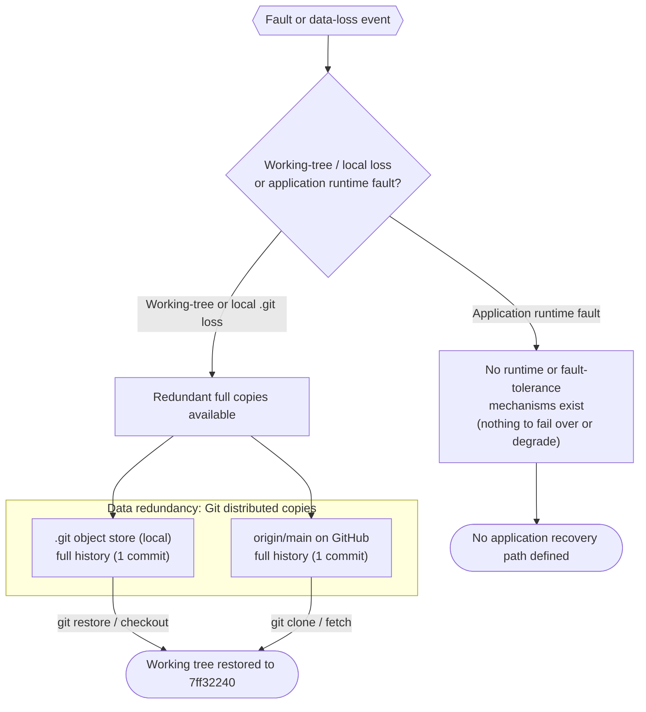

*Diagram 6.1.4-A — Resilience Pattern Diagram: the only resilience mechanism at commit `7ff32240` is Git's distributed redundancy (local `.git` and `origin/main`), enabling recovery of the working tree; no application-level fault tolerance, failover, or degradation path exists.*

### 6.1.5 References

The following repository artifacts were inspected as the evidentiary basis for this section, all at head commit `7ff32240` on branch `main`.

- `README.md` — the sole tracked file (10 bytes, content `# 13july_1`); established that no application code, service definition, network interface, or configuration exists.
- `.git/` (Git object store) — established the complete version history (one commit `7ff32240`, one tree, one blob) and the `origin/main` remote that provides the only data redundancy; confirmed no other branches, tags, or hidden artifacts.
- Repository root directory (`/`) — confirmed via directory listing to contain only `README.md`, with no source folders, dependency manifests, container/orchestration files, CI/CD configuration, or Infrastructure-as-Code.

Repository state was verified with Git inspection commands (`git ls-files`, `git rev-list --all --objects`, `git branch -a`, `git show-ref`, and `git grep`), none of which returned any service, scaling, or resilience artifacts.

The following already-written Technical Specification sections were cross-referenced for consistency:

- Section 1.2 System Overview (1.2.2 High-Level Description; 1.2.3 Success Criteria) — greenfield initialization; undefined technical approach; no KPIs or SLAs.
- Section 1.3 Scope (1.3.1 In-Scope) — system boundary encloses only `README.md` and `.git` metadata.
- Section 2.4 Implementation Considerations — no runtime or architecture defined.
- Section 3.4 Third-Party Services; Section 3.5 Databases & Storage; Section 3.6 Development & Deployment — no external services, no databases or caches, and no build/containerization/CI-CD/IaC; the Default Technology Stack is recorded there as not-yet-adopted.
- Section 5.1 High-Level Architecture (5.1.1–5.1.4) — no implemented architecture; two structural components (`README.md`, `.git`); the Git remote is the only external touchpoint.
- Section 5.4 Cross-Cutting Concerns (5.4.2 Error Handling; 5.4.4 Performance, SLAs, and Disaster Recovery) — no application error handling; the `origin/main` Git remote is the only redundancy; no RPO/RTO, failover, or runbooks.

No external or web sources were required or consulted for this section; all findings derive directly from repository inspection and the cross-referenced sections listed above.

## 6.2 Database Design

### 6.2.1 Applicability Assessment

**Database Design is not applicable to this system.**

The `13july_1` repository, inspected at head commit `7ff32240` on the `main` branch, contains no database of any kind and no persistent-storage interactions beyond version control. An exhaustive inspection of the complete Git object graph — one commit (`7ff32240`), one tree, and one blob — resolves to a single tracked file, `README.md` (10 bytes, containing only the line `# 13july_1`). No database engine, driver, ORM/ODM mapping, connection string, schema definition, migration script, seed dataset, or cache configuration exists anywhere in the working tree or in Git history. A keyword sweep across all tracked content for database, ORM, and persistence terms (for example `database`, `postgres`, `mysql`, `mongo`, `sqlite`, `redis`, `schema`, `migration`, `orm`, `prisma`, `sqlalchemy`, `jdbc`, `datasource`) returned no matches.

This determination is consistent with the persistence findings already recorded elsewhere in this specification. Section 3.5 confirms that no relational or NoSQL database engine, cache, or storage service is configured, and that the only persistence mechanism present is the Git object store that version-controls `README.md`. Section 5.1.3 records no application data stores, no caches, and no data-transformation points. Section 1.3.1 establishes that the system boundary encloses only `README.md` and Git metadata, with no data domains defined.

The only mechanism with any persistence substance is Git version control, whose object store durably records the single documentation artifact and whose distributed model provides a limited redundancy of that artifact. Git is a source-control mechanism, not an application database; it defines no entities, tables, collections, indexes, constraints, or query surface. It is nonetheless the sole persistence layer present and is therefore referenced throughout this section wherever the requested database dimensions would otherwise be addressed.

The remainder of Section 6.2 does not fabricate a schema, storage engine, or data-management program that the repository does not contain. Instead, each area requested by this specification — Schema Design (Section 6.2.2), Data Management (Section 6.2.3), Compliance Considerations (Section 6.2.4), and Performance Optimization (Section 6.2.5) — is mapped to its verifiable status at commit `7ff32240`. Entries marked "Not applicable" or "None present" reflect the absence of database artifacts rather than a deliberate design exclusion; each becomes documentable only once a data model, a database engine, and its configuration are introduced. The table below records the threshold criteria evaluated for this determination.

| Applicability Criterion | Evidence Sought | Status at `7ff32240` |
|---|---|---|
| Relational database | Engine config, DDL, connection string, or SQL driver | None — no engine or driver present |
| NoSQL / document store | ODM models, collection definitions, or client config | None — MongoDB (default stack) not present |
| ORM / data-access layer | Entity mappings, repositories, or query builders | None — no application code exists |
| Schema & migrations | `.sql`, migration, or seed files | None — no schema or migration artifacts |
| Cache / in-memory store | Redis/Memcached client or cache configuration | None — no cache configured |
| Object / blob storage | S3/bucket clients or file-storage configuration | None — no storage service integration |

On the basis of these criteria, all subsequent subsections document the absence of the requested database capabilities and the reason each is not applicable, rather than describing a design that does not exist.

### 6.2.2 Schema Design

No database schema exists at commit `7ff32240` because no database, data model, or application code is present. The repository persists exactly one object — the `README.md` blob — through the Git object store, which is a version-control mechanism rather than a database. Consequently, none of the six schema-design dimensions requested by this specification (entity relationships, data models and structures, indexing strategy, partitioning approach, replication configuration, and backup architecture) is implemented as a database concern. The table below maps each dimension to its verifiable status; the subsections that follow elaborate the entity/data-model view, the indexing/constraint/partitioning view, and the replication/backup view, and depict the only real persistence structure — Git's object model — rather than a fabricated schema.

| Schema Design Dimension | Status at `7ff32240` | Basis / Cross-Reference |
|---|---|---|
| Entity relationships | Not applicable — no entities defined | No data model or application code (Section 5.1.3) |
| Data models and structures | None — only an opaque 10-byte text blob | `README.md` is unstructured Markdown (Section 5.1.2) |
| Indexing strategy | Not applicable — no tables or collections to index | No database engine present (Section 3.5) |
| Partitioning approach | Not applicable — no dataset to partition | No data store present (Section 3.5) |
| Replication configuration | Git distributed copies only (not DB replication) | Local `.git` plus `origin/main` (Section 6.1.4) |
| Backup architecture | No formal backup; Git remote is the only redundancy | No RPO/RTO or backup schedule (Section 5.4.4) |

#### 6.2.2.1 Entity Relationships and Data Models

No application entities, tables, documents, or collections are defined anywhere in the repository, so there are no entity relationships (one-to-one, one-to-many, or many-to-many) to describe. The sole persisted structure is Git's internal object model, in which a single commit references a single root tree, and that tree contains a single blob — the `README.md` file. `README.md` itself is unstructured Markdown (a 10-byte text blob whose entire content is the heading `# 13july_1`); it defines no fields, records, keys, or typed columns, so it carries no data model that could be normalized or mapped to an application ERD.

To satisfy the specification's request for an entity-relationship diagram while remaining strictly evidence-based, the diagram below models the only persisted data structure that actually exists — the Git object graph at commit `7ff32240`. It is not an application database schema; it is the version-control object model, presented in ERD form to make explicit that the system's entire persisted "data model" is one commit, one tree, and one blob, with no application entities or relationships.

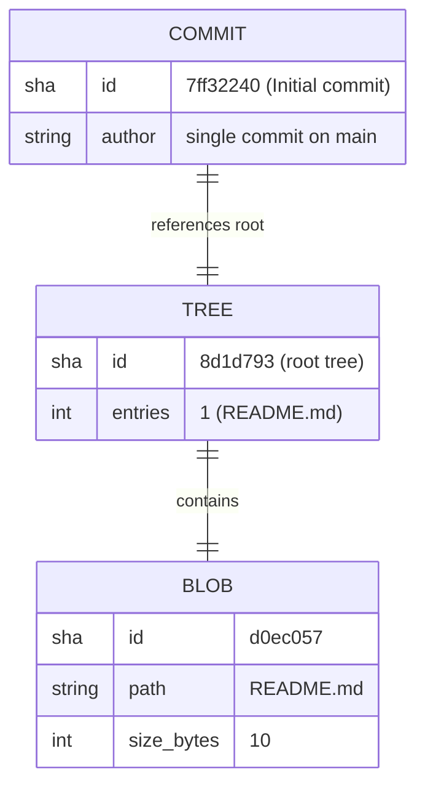

*Diagram 6.2.2-A — Entity-Relationship Diagram of the only persisted data structure at commit `7ff32240`: Git's internal object model (one commit references one tree, which contains one blob). No application database entities, tables, collections, or relationships exist.*

#### 6.2.2.2 Indexing, Constraints, and Partitioning

Because there is no database and no tabular or document data, there are no indexes, no integrity constraints, and no partitioning scheme to document. The specification's requirement to document all indexes and constraints is satisfied by recording their complete absence: the enumerable set of indexes and constraints is empty at commit `7ff32240`. The table below records this explicitly.

| Schema Object | Count at `7ff32240` | Notes |
|---|---|---|
| Tables / collections | 0 | No database engine or data store present |
| Primary keys | 0 | No entities defined |
| Foreign keys / referential constraints | 0 | No relationships between entities |
| Unique / check / not-null constraints | 0 | No columns or fields defined |
| Secondary indexes | 0 | Nothing to index |
| Partitions / shards | 0 | No dataset to partition or shard |

The nearest analogue to an index present in the system is Git's own content-addressable storage, in which every object is keyed by its SHA-1 hash (for example the `README.md` blob `d0ec057`); this is an internal version-control mechanism, not a database index, and it exposes no query surface, secondary index, or constraint model. Partitioning and sharding are likewise not applicable: there is a single 10-byte artifact and no dataset whose volume, key range, or access pattern would justify horizontal or vertical partitioning.

#### 6.2.2.3 Replication Configuration and Backup Architecture

No database replication is configured because no database exists: there is no primary/replica topology, no write-ahead-log or oplog streaming, no synchronous or asynchronous replica set, and no failover cluster (consistent with Section 6.1.4). The only replication actually present is the distributed nature of Git itself: the complete repository — its single commit, tree, and blob — exists as a full copy in the local `.git` object store and as a full copy on the `origin/main` remote hosted on GitHub, and every additional clone is likewise a complete copy (Sections 5.1.4 and 6.1.4).

Backup architecture is correspondingly informal. No backup engine, snapshot schedule, recovery-point objective (RPO), or recovery-time objective (RTO) is defined anywhere in the repository (Section 5.4.4). The only redundancy and recovery capability derives from Git: a lost or corrupted working tree can be restored from the local object store (`git restore` / `git checkout`) or re-cloned from the `origin/main` remote, in either case returning the tree to the committed state `7ff32240`. This is a source-control safeguard rather than a database backup program, and it becomes a database concern only once application state and a storage engine are introduced.

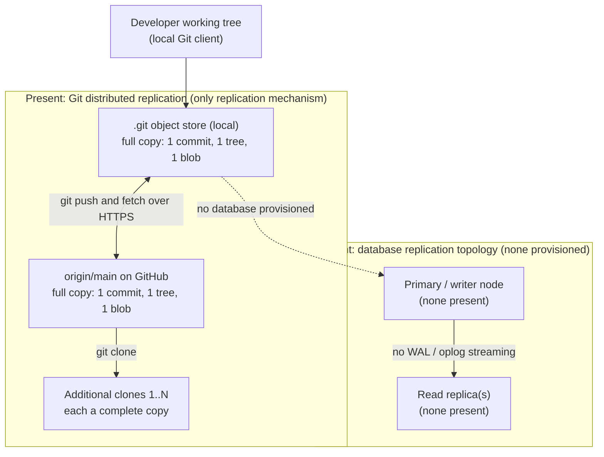

*Diagram 6.2.2-B — Replication Architecture at commit `7ff32240`: the only replication mechanism is Git's distributed model (local `.git` and `origin/main`, plus additional full-copy clones). No database primary/replica topology, WAL/oplog streaming, or failover cluster is provisioned.*

### 6.2.3 Data Management

Data management concerns the movement, versioning, and lifecycle of persisted data. Because the repository contains no database and no application-managed data, the only data under management is the single `README.md` artifact, and the only management mechanism is Git version control. None of the five data-management dimensions requested by this specification is implemented as a database or application concern at commit `7ff32240`; each is mapped below to its verifiable status, with the version-control storage-and-retrieval flow — the only real data movement in the system — elaborated and diagrammed in Section 6.2.3.2.

| Data Management Dimension | Status at `7ff32240` | Basis / Cross-Reference |
|---|---|---|
| Migration procedures | Not applicable — no schema to migrate | No database or migration files (Section 3.5) |
| Versioning strategy | Git commit history versions the one file | Single commit `7ff32240` on `main` |
| Archival policies | None defined — no data lifecycle or archival tier | No dataset or retention policy present |
| Data storage and retrieval | Git object store read/write via Git commands only | Only persistence mechanism (Section 5.1.3) |
| Caching policies | None — no in-memory or distributed cache | No cache configured (Sections 3.5, 5.1.3) |

#### 6.2.3.1 Migration, Versioning, and Archival

**Migration procedures.** No database migration procedures exist. There is no schema, no migration framework or tool (for example Flyway, Liquibase, Alembic, Prisma Migrate, or Rails migrations), and no migration, seed, or rollback scripts anywhere in the repository. Because there is no schema and no data, there is nothing to migrate, and no forward or backward migration path can be documented without fabrication.

**Versioning strategy.** The only versioning present is Git source-control versioning of the repository's files. The complete history consists of a single commit (`7ff32240`, "Initial commit") on the `main` branch, which introduced `README.md`; there are no additional commits, tags, or release versions. This is file and version-control versioning, not database schema versioning or data-record versioning — no schema-version table, migration ledger, or row-level version columns exist.

**Archival policies.** No archival or data-lifecycle policy is defined. There is no cold/warm/hot tiering, no time-to-live (TTL) or expiration rule, no archival storage target, and no purge or compaction job. The repository retains its single artifact indefinitely within Git history; there is no dataset whose age or volume would trigger archival.

#### 6.2.3.2 Data Storage and Retrieval Mechanisms

The only storage-and-retrieval mechanism in the system is Git. Data is stored when a developer stages and commits a change to `README.md` into the local `.git` object store, and it is retrieved when the working tree is checked out or restored from that object store, or when the repository is cloned or fetched from the `origin/main` remote. There is no application read/write path, no query language or API, no connection to a database, and no data-transformation, serialization, or validation step (consistent with Section 5.1.3); the `README.md` blob is stored and retrieved verbatim.

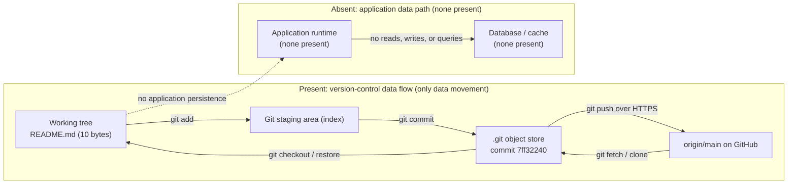

*Diagram 6.2.3-A — Data Flow Diagram at commit `7ff32240`: the only data movement is the version-control flow (working tree to staging to `.git` object store to `origin/main`, and back via checkout, fetch, or clone). No application data path, database, or cache participates.*

#### 6.2.3.3 Caching Policies

No caching policy exists. There is no in-memory cache (for example an application-level LRU cache), no distributed cache (for example Redis or Memcached), and no HTTP/CDN or query-result cache configured anywhere in the repository (consistent with Sections 3.5 and 5.1.3). No cache invalidation, eviction, or time-to-live policy is defined because there is no cache and no data-access workload to accelerate. Caching becomes a documentable concern only once a runtime, a data store, and an access pattern are introduced.

### 6.2.4 Compliance Considerations

Compliance considerations are properties of a system that stores or processes regulated data. The repository stores no application data — only a 10-byte project-name heading in `README.md` — and defines no runtime, so none of the compliance dimensions requested by this specification is implemented as a database or application control at commit `7ff32240`. The absence of personal, financial, or otherwise regulated data means no data-protection regime (for example GDPR, HIPAA, PCI-DSS, or SOC 2) is triggered by the repository contents. Each dimension is mapped below to its verifiable status, followed by three subsections detailing retention/backup, privacy/audit, and access-control posture.

| Compliance Dimension | Status at `7ff32240` | Basis / Cross-Reference |
|---|---|---|
| Data retention rules | None defined — no data or retention policy | No dataset; no data domains (Section 1.3.1) |
| Backup and fault tolerance | Git remote redundancy only; no formal backup | Local `.git` plus `origin/main` (Sections 5.4.4, 6.1.4) |
| Privacy controls | Not applicable — no personal or sensitive data | Only a 10-byte project heading is stored |
| Audit mechanisms | Git commit history only; no application audit log | Single commit `7ff32240` (Section 5.4.1) |
| Access controls | None at data layer; GitHub platform governs the remote | No auth code or roles (Section 5.4.3) |

#### 6.2.4.1 Data Retention and Backup/Fault Tolerance

**Data retention rules.** No data-retention rules are defined. There is no dataset subject to retention, no regulatory retention period, no deletion or right-to-erasure workflow, and no retention schedule anywhere in the repository. The only artifact retained is `README.md`, which persists indefinitely in Git history; no legal or business retention obligation is documented (Section 1.3.1 establishes that no data domains are defined).

**Backup and fault-tolerance policies.** No formal backup or fault-tolerance policy exists. As documented in Sections 5.4.4 and 6.1.4, the only redundancy present is the distributed nature of Git: the repository's single commit exists as a full copy locally in `.git` and remotely on `origin/main` (GitHub). There is no backup engine, snapshot schedule, recovery-point objective (RPO), recovery-time objective (RTO), replica set, or failover target. Fault tolerance at the data layer is therefore limited to restoring or re-cloning the repository from the Git remote back to the committed state `7ff32240`.

#### 6.2.4.2 Privacy Controls and Audit Mechanisms

**Privacy controls.** No privacy controls are implemented, and none are required by the repository contents. The only stored content is the Markdown heading `# 13july_1`, which contains no personal data, credentials, secrets, or sensitive information (Section 5.4.3 confirms no credentials or secrets are committed). There is consequently no encryption-at-rest configuration, no field-level masking or tokenization, no data-classification scheme, and no consent-management mechanism — because there is no personal or sensitive data to protect.

**Audit mechanisms.** No application-level audit mechanism exists. There is no audit log, change-data-capture stream, or access-audit trail at a data layer, because there is no database or runtime to instrument (consistent with Section 5.4.1, which records no logging or observability). The only audit-relevant record present is Git's own commit history, which attributes the single change (`7ff32240`, "Initial commit") to its author and timestamp. This is a source-control audit trail of file changes, not an application or data-access audit facility.

#### 6.2.4.3 Access Controls

No data-layer or application access controls exist. There is no authentication or authorization framework, no role-based or attribute-based access-control model, no database users, grants, or row-level security, and no policy engine anywhere in the repository (consistent with Section 5.4.3, which confirms the absence of any identity provider, roles, permissions, or tokens). The only access control genuinely in effect is that governing the GitHub remote itself — the platform-level permissions that determine who may push to or pull from `origin/main` — which is a source-control and platform concern external to the repository contents rather than a database access-control design. Because no secrets or credentials are committed to the repository, no data-store credentials are exposed (Section 5.4.3).

### 6.2.5 Performance Optimization

Performance optimization applies to a running system with a data-access workload. Because there is no database, no runtime, and no defined performance targets, benchmarks, or service-level agreements at commit `7ff32240` (Sections 1.2.3, 2.4, and 5.4.4), none of the five performance-optimization dimensions requested by this specification is implemented, and no throughput, latency, or concurrency behavior can be measured or tuned without fabrication. Each dimension is mapped below to its verifiable status; the subsections that follow explain the query/caching, connection-management, and batch-processing posture.

| Performance Dimension | Status at `7ff32240` | Basis / Cross-Reference |
|---|---|---|
| Query optimization patterns | Not applicable — no query engine or queries | No database or code paths (Section 6.1.3) |
| Caching strategy | None — no cache layer configured | No cache present (Sections 3.5, 5.1.3) |
| Connection pooling | Not applicable — no database connections | No datasource or driver (Section 3.5) |
| Read/write splitting | Not applicable — no primary/replica topology | No replicas provisioned (Section 6.2.2.3) |
| Batch processing approach | None — no jobs, ETL, or bulk operations | No runtime or workflows (Section 4.1) |

#### 6.2.5.1 Query Optimization and Caching Strategy

No query optimization is performed because there is no query engine and no queries. There is no SQL or NoSQL query surface, no query planner or execution statistics, no index-usage tuning (there are no indexes — Section 6.2.2.2), and no materialized views or denormalization strategy. Section 6.1.3 confirms that no code paths or workloads exist to optimize.

No caching strategy is defined. As established in Sections 3.5 and 5.1.3 and reiterated in Section 6.2.3.3, there is no in-memory, distributed, or query-result cache; consequently there is no cache-aside, read-through, write-through, or write-behind pattern, and no cache-warming or invalidation policy. Caching becomes relevant only once a data store and an access pattern are introduced.

#### 6.2.5.2 Connection Pooling and Read/Write Splitting

No connection pooling exists. There is no database, datasource, or driver to connect to (Section 3.5), and therefore no connection pool, no pool-size or timeout configuration, and no connection-lifecycle management (for example a HikariCP, PgBouncer, or driver-native pool).

No read/write splitting is configured. Read/write splitting presupposes a primary/replica topology that routes writes to a primary and reads to replicas; as documented in Section 6.2.2.3, no such topology is provisioned — there is only Git's distributed copy model, which is source-control replication rather than a queryable database with a writer and read replicas. There is consequently no read-routing layer, no load-based read distribution, and no replica-lag handling.

#### 6.2.5.3 Batch Processing Approach

No batch-processing approach is defined. There are no scheduled jobs, cron tasks, ETL/ELT pipelines, bulk-load or bulk-export routines, message-queue consumers, or stream processors anywhere in the repository (consistent with Section 4.1, which records no application workflows and only version-control processes). No batch window, chunk size, checkpointing, or backpressure policy exists because there is no runtime to execute batch work and no dataset to process. The only bulk operation of any kind is Git's own transfer of the repository's objects during `push`, `fetch`, and `clone`, which is a version-control operation rather than an application batch-processing design.

### 6.2.6 References

The following repository artifacts were inspected as the evidentiary basis for this section, all at head commit `7ff32240` on branch `main`.

- `README.md` — the sole tracked file (10 bytes, content `# 13july_1`); established that no data model, schema, database engine, ORM/ODM mapping, connection string, or migration artifact exists.
- `.git/` (Git object store) — established the complete persistence and version history (one commit `7ff32240`, one tree `8d1d793`, one blob `d0ec057`) and the `origin/main` remote that provides the only data redundancy; confirmed the content-addressable object model depicted in Diagram 6.2.2-A and the distributed replication depicted in Diagram 6.2.2-B.
- Repository root directory (`/`) — confirmed via directory listing to contain only `README.md`, with no `.sql`/migration/seed files, no ORM or datasource configuration, no cache configuration, no dependency manifests, and no container/orchestration files.

Repository state was verified with Git inspection commands (`git ls-files`, `git rev-list --all --objects`, `git branch -a`, `git show-ref`, and `git grep`), and with a filesystem keyword sweep for database, ORM, cache, and persistence terms; none returned any database, schema, index, constraint, cache, or storage artifact.

The following already-written Technical Specification sections were cross-referenced for consistency:

- Section 1.2 System Overview (1.2.3 Success Criteria) — no measurable objectives, KPIs, or SLAs defined.
- Section 1.3 Scope (1.3.1 In-Scope) — system boundary encloses only `README.md` and Git metadata; no data domains defined.
- Section 2.4 Implementation Considerations — no runtime or architecture defined.
- Section 3.5 Databases & Storage — no relational/NoSQL database, cache, or storage service; the only persistence mechanism is the Git object store version-controlling `README.md`; MongoDB (default stack) not present.
- Section 4.1 System Workflows — no application workflows; only version-control processes are evidenced.
- Section 5.1 High-Level Architecture (5.1.2 Core Components; 5.1.3 Data Flow Description; 5.1.4 External Integration Points) — two structural components (`README.md`, `.git`); version-control-only data flow; no data stores, caches, or data-transformation points.
- Section 5.4 Cross-Cutting Concerns (5.4.1 Monitoring/Logging; 5.4.3 Authentication and Authorization; 5.4.4 Performance, SLAs, and Disaster Recovery) — no logging/observability or auth; disaster recovery limited to the `origin/main` Git remote; no RPO/RTO, backups, or runbooks.
- Section 6.1 Core Services Architecture (6.1.3 Scalability Design; 6.1.4 Resilience Patterns) — no runtime or compute to optimize; Git distributed copies (local `.git` plus `origin/main`) are the only redundancy, recoverable via `git restore` or re-clone.

No external or web sources were required or consulted for this section; all findings derive directly from repository inspection and the cross-referenced sections listed above.

## 6.3 Integration Architecture

### 6.3.1 Applicability Assessment

**Integration Architecture is not applicable for this system.**

The repository `13july_1`, evaluated at head commit `7ff32240` (full SHA `7ff32240fe702efdcc5d7d68cb242d49274964a9`, sole commit "Initial commit" on branch `main`), is a greenfield skeleton. Its entire tracked payload is a single 10-byte documentation file, `README.md`, whose content is the single line `# 13july_1`. The Git object graph contains exactly three objects — the commit `7ff32240`, its root tree `8d1d793`, and the blob `d0ec057` (the README) — with no other blobs, trees, branches, tags, or stashes.

Because there is no application code of any kind, the system exposes no programmable surface and consumes no external service. Consequently, none of the concerns that an Integration Architecture would document — API design, message processing, or external-system connectivity — has any implementation, configuration, or contract to describe. This determination is grounded in direct inspection of the repository rather than assumption:

- A full-text keyword sweep of all tracked content for integration-related terms (including `api`, `rest`, `graphql`, `grpc`, `http`, `endpoint`, `route`, `gateway`, `oauth`, `auth0`, `oidc`, `jwt`, `token`, `kafka`, `rabbitmq`, `sqs`, `sns`, `queue`, `topic`, `broker`, `stream`, `kinesis`, `webhook`, `swagger`, `openapi`, `proxy`, `soap`, `ftp`, and `integration`) returned zero matches.
- The repository contains no dependency manifest (for example `package.json`, `requirements.txt`, `pom.xml`, or `go.mod`), no configuration or environment file, no interface-definition file (`.proto` / `.graphql`), no container image definition, and no infrastructure-as-code artifact that could declare or configure an integration.
- There is no route/handler/controller code, no authentication or authorization middleware, no outbound HTTP or SDK client, no message-broker producer or consumer, and no API-gateway or reverse-proxy definition.

The only inter-system interaction evidenced by the repository is the version-control exchange between the local `.git` object store and the remote `origin/main` (hosted on GitHub), performed with the Git transfer protocol over HTTPS at developer discretion. This is a source-control operation performed on the repository itself, not a runtime integration of the system with an external service; it is documented as the sole external touchpoint in Section 5.1.4 and as the only integration-style sequence in Section 4.1.2.

This finding is consistent across the specification. Section 3.2 confirms no application frameworks or libraries are present (so there is no web/API framework to specify a protocol). Section 3.4 confirms no external services or integrations, no API clients or SDKs, and no third-party credentials. Section 5.1 confirms there is no implemented application architecture and no HTTP/REST, gRPC, or message-broker surface. Section 5.4.3 confirms no identity provider, tokens, or authorization policies exist. Sections 6.1 and 6.2 independently record that Core Services Architecture and Database Design are likewise not applicable, with no inter-process communication, message-queue consumers, stream processors, or batch/ETL pipelines.

#### Threshold Criteria for Integration Architecture

The table below enumerates the criteria that would make an Integration Architecture applicable, the concrete evidence sought in the repository for each, and the observed status at commit `7ff32240`.

| Applicability Criterion | Evidence Sought in Repository | Status at `7ff32240` |
|---|---|---|
| Externally exposed API (REST / GraphQL / gRPC / SOAP) | Route, handler, or controller definitions; OpenAPI / `.proto` / GraphQL schema | None present |
| Outbound integration with a third-party service | HTTP or SDK client code; service credentials; connection strings | None present |
| Message-oriented middleware | Broker configuration; producer/consumer code; topic or queue declarations | None present |
| Stream or batch processing pipeline | Stream processors; scheduled/ETL jobs; pipeline definitions | None present |
| API gateway or reverse proxy | Gateway routes; proxy configuration; ingress definitions | None present |
| Authentication / authorization for integration | Identity-provider configuration; tokens or keys; auth middleware | None present |
| Dependency manifest declaring integration libraries | `package.json`, `requirements.txt`, `pom.xml`, `go.mod`, or equivalent | None present |
| Any runtime inter-system interaction | A runtime connection to an external system | Version control to `origin/main` (GitHub) only |

No criterion for an application-level integration is satisfied. The single populated row reflects a build-time / source-control operation on the repository, not a runtime system integration, and therefore does not by itself establish an Integration Architecture.

#### Current-State Integration Flow

The following diagram depicts the complete set of interactions evidenced by the repository at commit `7ff32240`. The only realized edge crosses the system boundary to the version-control remote; every application-integration pathway (APIs, messaging, and external systems) is shown as absent.

```mermaid
flowchart TD
    subgraph Boundary["System Boundary: repository 13july_1 (head 7ff32240, branch main)"]
        Readme["README.md<br/>documentation artifact<br/>(10 bytes: # 13july_1)"]
        GitStore[".git object store<br/>version-control persistence<br/>(1 commit)"]
        Readme -->|"tracked by"| GitStore
    end
    Remote["Git remote: origin/main (GitHub)<br/>source-control only"]
    NoApi["Application APIs / endpoints / clients<br/>(none present)"]
    NoMsg["Message brokers / queues / streams<br/>(none present)"]
    NoExt["Third-party / legacy systems<br/>(none evidenced)"]
    GitStore -. "git push / fetch over HTTPS" .-> Remote
    Readme -. "no API clients or connectors" .-> NoApi
    Readme -. "no producers or consumers" .-> NoMsg
    Readme -. "no external integrations" .-> NoExt
```

The remaining sub-sections (6.3.2 API Design, 6.3.3 Message Processing, and 6.3.4 External Systems) document each requested integration concern for completeness, confirming in every case that no implementation exists at commit `7ff32240`. Each dimension should be re-evaluated once application code, dependency manifests, or service configuration are introduced into the repository.

### 6.3.2 API Design

No API is designed, implemented, or exposed by this system. At commit `7ff32240` the repository contains no route, handler, or controller code; no web/API framework (Section 3.2 confirms no frameworks or libraries are present); no interface-definition or schema file; and no HTTP/REST, GraphQL, or gRPC surface (Section 5.1). The subsections below document each requested API-design dimension for completeness and record its observed status, so that the specification remains a complete reference even though every dimension is currently unrealized.

#### API Design Dimensions Status

Each API-design dimension required by the section prompt is mapped below to its observed status at commit `7ff32240` and the repository evidence or cross-reference that establishes it.

| API Design Dimension | Status at `7ff32240` | Basis / Cross-Reference |
|---|---|---|
| Protocol specification (REST / GraphQL / gRPC / SOAP / WebSocket) | None defined | No endpoint or handler code and no web framework (Sections 3.2, 5.1) |
| Authentication method (API key / OAuth 2.0 / JWT / mTLS) | None defined | No identity provider, tokens, or auth middleware (Section 5.4.3) |
| Authorization framework (RBAC / ABAC / scopes / policies) | None defined | No roles, permissions, or policy code (Section 5.4.3) |
| Rate limiting strategy (throttling / quotas / backoff) | None defined | No gateway, proxy, or middleware present (Section 5.1) |
| Versioning approach (URI / header / media-type versioning) | None defined | No API surface exists to version (Section 5.1) |
| Documentation standard (OpenAPI / Swagger / AsyncAPI) | None defined | No schema or specification file in the repository (Sections 3.4, 5.1) |

#### API Architecture View

The diagram contrasts the absent application API architecture (the layered gateway, authentication, rate-limiting, and endpoint tiers that a future implementation would introduce) with the only interface actually present at commit `7ff32240` — the version-control channel between the local `.git` object store and `origin/main`. No client-to-endpoint request path exists.

```mermaid
flowchart TD
    Client["API consumers / clients<br/>(none present)"]
    subgraph Absent["Absent: application API architecture (no surface at 7ff32240)"]
        Gateway["API gateway / reverse proxy<br/>(none present)"]
        AuthN["Authentication and authorization layer<br/>(none present)"]
        Throttle["Rate limiting / throttling<br/>(none present)"]
        Endpoints["REST / GraphQL / gRPC endpoints<br/>(none present)"]
        Gateway --> AuthN
        AuthN --> Throttle
        Throttle --> Endpoints
    end
    subgraph Present["Present: version-control interface only"]
        GitStore[".git object store<br/>(commit 7ff32240)"]
        Remote["origin/main (GitHub)<br/>Git transfer over HTTPS"]
        GitStore <--> Remote
    end
    Client -. "no API requests" .-> Gateway
```

#### 6.3.2.1 Protocol, Authentication, and Authorization

**Protocol specifications.** No application-layer API protocol is specified. Because the repository declares no dependency manifest and no server or client framework (Section 3.2), there is no runtime capable of serving REST, GraphQL, gRPC, SOAP, or WebSocket traffic. The only wire protocol exercised anywhere in the repository's lifecycle is the Git transfer protocol used to synchronize with `origin/main` over HTTPS, which operates on the repository as a source artifact rather than on a running system (Section 5.1.4).

**Authentication methods.** No authentication scheme is defined. There are no API keys, OAuth 2.0 clients, JWT issuance or validation routines, session mechanisms, or mutual-TLS configurations anywhere in the tracked content, and no identity provider is configured (Section 5.4.3). The sole credential-bearing interaction in the system's lifecycle is developer authentication to GitHub for `git push` / `git fetch`; that credential is managed by the Git client and the GitHub platform and is not part of the repository, and no secret is committed to version control (Sections 3.4, 5.4.3).

**Authorization framework.** No authorization model exists. There are no roles, permissions, scopes, access-control lists, or policy definitions, and no middleware that would evaluate them (Section 5.4.3). The only access control relevant to the repository is GitHub's platform-level governance of who may read from or write to `origin/main`, which is an external source-control concern rather than an application authorization framework.

#### 6.3.2.2 Rate Limiting, Versioning, and Documentation

**Rate limiting strategy.** No rate limiting, throttling, quota enforcement, or backoff policy is implemented. Such controls would normally reside at an API gateway, reverse proxy, or request-handling middleware layer, none of which is present (Section 5.1). Any request-rate behavior against `origin/main` is governed entirely by GitHub's own service limits, external to this repository.

**Versioning approach.** No API versioning approach is defined, because no API surface exists to version. There is no URI-prefix scheme (for example `/v1`), no header- or media-type-based version negotiation, and no version metadata of any kind. The repository's own state is versioned only through Git history, which presently comprises the single commit `7ff32240`; this is source-artifact version control, not API contract versioning.

**Documentation standards.** No API documentation standard is adopted. The repository contains no OpenAPI/Swagger definition, no AsyncAPI document, no GraphQL SDL, and no `.proto` file, and its only documentation artifact is `README.md`, which holds the project name heading `# 13july_1` and no interface documentation. When an API is eventually introduced, a machine-readable contract (for example an OpenAPI or AsyncAPI specification) and the corresponding authentication, authorization, rate-limiting, and versioning decisions should be added and this subsection updated accordingly.

### 6.3.3 Message Processing

No message processing is implemented in this system. At commit `7ff32240` the repository contains no message broker, queue, topic, or stream declaration; no event producer or consumer code; no scheduled, batch, or ETL job; and no dependency manifest that could introduce a messaging client. Section 4.1.2 records that no integration workflows exist — specifically no event-processing flows and no batch-processing sequences — and Section 6.2 records that no message-queue consumers, stream processors, or batch/ETL pipelines are present. The subsections below document each requested message-processing dimension for completeness.

#### Message Processing Dimensions Status

Each message-processing dimension required by the section prompt is mapped below to its observed status at commit `7ff32240` and the supporting evidence or cross-reference.

| Message Processing Dimension | Status at `7ff32240` | Basis / Cross-Reference |
|---|---|---|
| Event processing patterns (pub/sub, event sourcing, CQRS) | None present | No event producers, consumers, or handlers (Sections 4.1.2, 6.1) |
| Message queue architecture (brokers, topics, queues) | None present | No broker configuration or client dependency; no queue/topic declarations (Sections 3.4, 6.1) |
| Stream processing design (stream processors, windowing) | None present | No stream processors of any kind (Section 6.2) |
| Batch processing flows (scheduled / ETL jobs, pipelines) | None present | No scheduled, batch, or ETL jobs (Section 6.2) |
| Error handling strategy (retries, dead-letter queues, idempotency) | None present | No messaging layer exists to which error handling would apply (Sections 4.1.2, 6.1) |

#### Message Flow View

The diagram contrasts the absent message-processing pipeline (producers, broker, stream processors, consumers, batch jobs, and a dead-letter/retry path) with the only message-like artifact the repository actually produces: a Git commit object written to the local `.git` object store. No event is emitted from that store into any processing pipeline.

```mermaid
flowchart LR
    subgraph Absent["Absent: message processing pipeline (none present at 7ff32240)"]
        Producer["Event producers<br/>(none present)"]
        Broker["Message queue / broker<br/>(none present)"]
        Stream["Stream processors<br/>(none present)"]
        Consumer["Consumers / subscribers<br/>(none present)"]
        Batch["Batch / ETL jobs<br/>(none present)"]
        DLQ["Dead-letter queue / retry<br/>(none present)"]
        Producer --> Broker
        Broker --> Stream
        Stream --> Consumer
        Broker --> DLQ
        Batch -.-> Consumer
    end
    Dev["Developer working tree"]
    GitStore[".git object store<br/>commit 7ff32240"]
    Dev -->|"git commit (a commit object is the only message)"| GitStore
    GitStore -. "no events emitted" .-> Producer
```

#### 6.3.3.1 Event, Queue, and Stream Processing

**Event processing patterns.** No event-driven pattern is implemented. There is no publish/subscribe wiring, no event bus, no event-sourcing log, and no command/query responsibility segregation. No component emits or consumes domain events, and the keyword sweep across all tracked content returned no occurrences of event, broker, queue, topic, or stream terminology.

**Message queue architecture.** No message-oriented middleware is present. The repository declares no broker (for example Kafka, RabbitMQ, Amazon SQS/SNS, or Redis streams), no connection configuration, and no client library in any manifest — indeed no manifest exists at all (Section 3.4). Accordingly there are no queues, topics, exchanges, partitions, consumer groups, or delivery-guarantee settings to document.

**Stream processing design.** No stream processing is designed or implemented. There are no stream processors, no windowing or aggregation logic, no checkpointing, and no state stores (Section 6.2). No continuous or unbounded data source is defined anywhere in the repository.

#### 6.3.3.2 Batch Processing and Error Handling

**Batch processing flows.** No batch processing exists. There are no scheduled jobs, cron definitions, workflow-orchestrator DAGs, or ETL pipelines, and no data source or sink for a batch job to read from or write to (Section 6.2). The only bulk data transfer in the repository's lifecycle is the Git `push` / `fetch` / `clone` exchange with `origin/main`, which moves version-control objects rather than executing an application batch flow (Section 6.2).

**Error handling strategy.** No message-processing error-handling strategy is defined, because there is no messaging layer to which it could apply. There are no retry policies, no dead-letter queues, no idempotency keys, no poison-message handling, and no backoff configuration. When a messaging capability is eventually introduced, the corresponding delivery guarantees, retry/dead-letter design, and idempotency approach should be defined and this subsection updated accordingly.

### 6.3.4 External Systems

This system integrates with no external application systems. At commit `7ff32240` the repository contains no third-party API client or SDK, no legacy-system adapter, no API-gateway or proxy configuration, and no external service contract or schema. Section 3.4 confirms no external services or integrations and no service credentials, and Section 5.1 confirms no implemented application architecture. The single external touchpoint of any kind is the version-control remote `origin/main` (hosted on GitHub), which stores and distributes the repository's source objects rather than serving the system at runtime, and which is documented as the sole external integration point in Section 5.1.4.

#### External Systems Dimensions Status

Each external-systems dimension required by the section prompt is mapped below to its observed status at commit `7ff32240` and the supporting evidence or cross-reference.

| External Systems Dimension | Status at `7ff32240` | Basis / Cross-Reference |
|---|---|---|
| Third-party integration patterns (adapters, clients, webhooks) | None present | No API clients, SDKs, or service credentials (Section 3.4) |
| Legacy system interfaces (file/FTP, DB links, RPC bridges) | None present | No adapters, connectors, or legacy-protocol code (Sections 4.1.2, 5.1) |
| API gateway configuration (routes, ingress, proxy) | None present | No gateway, proxy, or ingress definitions (Section 5.1) |
| External service contracts (SLAs, schemas, interface agreements) | Version-control remote only; no application contracts | Sole touchpoint is `origin/main` (GitHub), no SLA (Section 5.1.4) |

#### External Dependencies

The repository has exactly one external dependency, and it is a source-control relationship rather than a runtime service integration. It is documented below for completeness.

| External Dependency | Type / Protocol | Purpose | Contract / SLA |
|---|---|---|---|
| `origin/main` (GitHub) | Git transfer protocol over HTTPS | Source-control hosting, distribution, and backup of the repository | None defined in the repository; developer-initiated `push` / `fetch` |

No application-level runtime dependency (database, cache, third-party API, identity provider, message broker, or object store) is declared anywhere in the repository. In particular, none of the technologies that a default stack might otherwise imply — for example a managed identity provider, a cloud object store, or a hosted database — is present or configured (Sections 3.4, 5.1).

#### External Systems Integration Flow

The diagram places the repository's system boundary alongside the categories of external systems that are absent (third-party APIs, legacy interfaces, an API gateway, and external service contracts) and shows the single realized edge to `origin/main`.

```mermaid
flowchart TD
    subgraph SystemBoundary["System Boundary: repository 13july_1 (head 7ff32240)"]
        Readme["README.md<br/>(10 bytes: # 13july_1)"]
        GitStore[".git object store"]
        Readme -->|"tracked by"| GitStore
    end
    subgraph AbsentExt["Absent: external system integrations (none evidenced)"]
        ThirdParty["Third-party APIs / SaaS<br/>(none present)"]
        Legacy["Legacy system interfaces<br/>(none present)"]
        Gateway["API gateway<br/>(none present)"]
        Contracts["External service contracts / SLAs<br/>(none defined)"]
    end
    Remote["origin/main (GitHub)<br/>version control only"]
    GitStore -->|"git push / fetch over HTTPS"| Remote
    Readme -. "no connectors or clients" .-> ThirdParty
    Readme -. "no adapters" .-> Legacy
    Readme -. "no gateway routes" .-> Gateway
    Readme -. "no contracts" .-> Contracts
```

#### 6.3.4.1 Third-Party, Legacy, and Gateway Interfaces

**Third-party integration patterns.** No third-party integration is present. There are no outbound HTTP or SDK clients, no webhook receivers or senders, no service credentials or connection strings, and no anti-corruption or adapter layer (Section 3.4). No SaaS or partner API is referenced anywhere in the tracked content.

**Legacy system interfaces.** No legacy-system interface exists. There is no file- or FTP-based exchange, no database link or shared-database integration, no RPC or messaging bridge, and no format-translation code. The repository is a greenfield initialization with no predecessor system to interface with (Sections 4.1.2, 5.1).

**API gateway configuration.** No API gateway or reverse proxy is configured. There are no route tables, upstream/backend definitions, ingress manifests, or proxy configuration files. Because no backend service exists (Section 5.1), there is nothing for a gateway to front, and none is declared.

#### 6.3.4.2 External Service Contracts and the Version-Control Dependency

**External service contracts.** No external service contract is defined at the application level. There is no OpenAPI/AsyncAPI contract, no consumer-driven contract test, no interface agreement, and no service-level agreement (SLA), latency, or availability target committed to the repository. The only external relationship — synchronization with `origin/main` — is governed by GitHub's platform terms and the Git protocol rather than by any contract artifact stored in the repository, and Section 5.1.4 records that no SLA is associated with it.

**Version-control dependency and its key flow.** The system's single external interaction is the developer-initiated version-control exchange with `origin/main`. The sequence below traces this sole inter-system flow, from authoring `README.md` in the working tree through committing it locally (commit `7ff32240`) to pushing it to, and fetching it from, the remote. It is the only such sequence evidenced by the repository; no application API, message, or third-party integration call occurs.

```mermaid
sequenceDiagram
    actor Dev as Developer
    participant WT as Working Tree
    participant Git as Local Git (.git)
    participant Origin as origin/main (GitHub)
    Dev->>WT: author or edit README.md (# 13july_1)
    Dev->>Git: git add and git commit (7ff32240)
    Git->>Origin: git push over HTTPS
    Origin-->>Git: git fetch or clone (retrieve commit)
    Note over Dev,Origin: Sole inter-system flow evidenced — no application API, message, or third-party integration calls exist
```

This version-control dependency is a build-time and source-management concern rather than a runtime integration. It imposes no application coupling and no external contract on the system itself. When the repository gains application code that connects to real external services, this subsection and the tables above should be expanded to enumerate each dependency together with its protocol, purpose, and contract or SLA.

### 6.3.5 References

The following repository artifacts and specification sections were examined as evidence for this Integration Architecture assessment. All findings are anchored to head commit `7ff32240` (`7ff32240fe702efdcc5d7d68cb242d49274964a9`).

**Repository artifacts inspected:**

- `README.md` — The sole tracked file (10 bytes; content `# 13july_1`). Established that the repository contains no application code, API definitions, messaging configuration, or integration logic.
- `.git/` — The version-control object store. Established the complete Git object graph (commit `7ff32240`, root tree `8d1d793`, blob `d0ec057` = `README.md`), the single "Initial commit" on branch `main`, and the `origin/main` (GitHub) remote as the only external touchpoint.
- Repository root — Confirmed the checkout contains only `README.md` and `.git/`, with no dependency manifest, configuration file, environment file, interface-definition file (`.proto` / `.graphql`), container image definition, or infrastructure-as-code artifact. A keyword sweep of tracked content for integration-related terms returned zero matches.

**Technical Specification sections cross-referenced:**

- `1.2 System Overview` — Established the greenfield-skeleton characterization of the repository at commit `7ff32240`.
- `3.2 Frameworks & Libraries` — Confirmed no application frameworks or libraries are present, so no web/API framework exists to specify a protocol.
- `3.4 Third-Party Services` — Confirmed no external services or integrations, API clients, SDKs, or service credentials.
- `4.1 System Workflows` (Section 4.1.2 Integration Workflows) — Confirmed no integration workflows exist, including no event-processing flows and no batch-processing sequences.
- `5.1 High-Level Architecture` (Section 5.1.4 External Integration Points) — Confirmed no implemented application architecture and no HTTP/REST, gRPC, or message-broker surface, and identified `origin/main` (GitHub) as the sole external touchpoint with no SLA.
- `5.4 Cross-Cutting Concerns` (Section 5.4.3 Authentication & Authorization) — Confirmed no identity provider, tokens, roles, permissions, or authorization policies, and that no secret is committed.
- `6.1 Core Services Architecture` — Confirmed no inter-process communication (HTTP/REST, gRPC, broker, or queue).
- `6.2 Database Design` — Confirmed no message-queue consumers, stream processors, or batch/ETL pipelines.

**Web sources:** None. No external web research was required; all conclusions derive from direct repository inspection and the cross-referenced specification sections.

## 6.4 Security Architecture

### 6.4.1 Applicability Assessment

**Detailed Security Architecture is not applicable for this system.**

A Security Architecture is triggered when a system authenticates identities, authorizes access to protected resources, or protects data in transit or at rest. The `13july_1` repository, inspected at head commit `7ff32240` on branch `main`, satisfies none of these preconditions. Its entire object history resolves to a single commit, a single tree, and a single blob — the file `README.md` (10 bytes, containing only the line `# 13july_1`). There is no application runtime, executable code, dependency manifest, identity provider, session or token handling, cryptographic routine, access-control rule, secret, or configuration file, so there is no identity to authenticate, no resource to authorize, and no application data to protect.

This determination is consistent with the rest of the specification: Section 5.4.3 records that "No authentication or authorization framework exists"; Section 3.4 confirms no authentication services (Auth0/OAuth/OIDC) and no secrets or credentials are committed; Section 1.2 describes a greenfield initialization with an undefined technical approach; and Section 6.1 establishes that there is no service to bound, connect, scale, or protect.

Rather than close the topic outright, the remainder of Section 6.4 remains strictly evidence-based and mirrors the structure used in Sections 6.1–6.3: it walks through each area the specification requests — the Authentication Framework (Section 6.4.2), the Authorization System (Section 6.4.3), and Data Protection (Section 6.4.4) — mapping every requested control to its verifiable status at commit `7ff32240`, and then consolidates the findings into a security control matrix and compliance posture (Section 6.4.5). Entries marked "None present" or "Not applicable" reflect the absence of artifacts, not a deliberate security exclusion; each becomes documentable only once application code, dependencies, and deployment configuration are introduced.

The table below records the trigger criteria evaluated for this determination.

| Security Capability Trigger | Evidence Sought | Status at `7ff32240` |
|---|---|---|
| Identity authentication | Login code, identity provider, credential store | None — no code or IdP present |
| Resource authorization | Roles, permissions, policies, access checks | None — no authorization logic |
| Session / token handling | Session store, JWT/OAuth tokens, cookies | None — no runtime to issue sessions |
| Data protection (cryptography) | Encryption routines, key material, TLS config | None — no crypto or config present |
| Secret management | `.env`, vault config, committed credentials | None — no secrets committed |
| Audit logging | Logging framework, audit trail, SIEM config | None — no logging present |

#### 6.4.1.1 Standard Security Practices In Force

Because no application exists, the only security controls actually in force are those inherent to the tools that hold the single artifact. These are standard, provider-managed practices external to the repository's content:

- **Source-control access control** — Push and fetch access to the `origin/main` remote is governed by the GitHub platform's account authentication and repository permissions, a source-control concern external to the repository contents (Section 5.4.3).
- **Encrypted transport** — Git synchronization with the remote occurs over HTTPS (TLS), providing confidentiality and integrity for the source-control channel.
- **Secret hygiene** — No credentials, tokens, connection strings, or `.env` files are committed, so the repository exposes no secrets and presents no application attack surface at this commit (Sections 3.4 and 5.4.3).
- **Local filesystem controls** — The working tree and the local `.git` object store are protected only by the developer workstation's operating-system file permissions.

The controls that a system of this kind would ordinarily adopt — centralized identity or single sign-on, least-privilege authorization, TLS termination for application endpoints, encryption at rest, secret management, dependency and vulnerability scanning, and audit logging — are not yet applicable because there is no code, runtime, data, or deployment surface to secure. As Section 3.4 states, any future integration "will need to introduce secret-management and least-privilege access controls that do not yet exist." These forward-looking controls are catalogued in Section 6.4.5 for planning purposes and are explicitly flagged as not-yet-adopted.

#### 6.4.1.2 Security Zones

The only trust zones that exist at commit `7ff32240` are the developer's local workstation (which holds the working tree and the local `.git` object store) and the GitHub platform that hosts the `origin/main` remote, connected by a TLS-encrypted Git transport channel. No application security zones — public edge/DMZ, application tier, or data tier — exist, because there is no runtime to deploy. The diagram below labels the present zones and the absent application zones.

```mermaid
flowchart LR
    Dev["Developer<br/>(authenticated GitHub identity)"]
    subgraph LocalZone["Zone A - Local Workstation (trusted, developer-controlled)"]
        WT["Working tree<br/>README.md (10 bytes)"]
        LocalGit[".git object store<br/>1 commit (7ff32240)"]
        WT -->|"git add / commit"| LocalGit
    end
    subgraph PlatformZone["Zone B - GitHub Platform (provider-managed)"]
        PlatAuth{{"Platform authN + repo authZ<br/>(GitHub account / permissions)"}}
        Remote["origin/main<br/>(source control only)"]
        PlatAuth -->|"grants"| Remote
    end
    subgraph AbsentZone["Application Security Zones - none present at 7ff32240"]
        NoEdge["No public edge / DMZ / WAF"]
        NoApp["No application / API tier"]
        NoData["No data tier or datastore"]
    end
    Dev --> WT
    LocalGit ==>|"git push / fetch over HTTPS (TLS)"| PlatAuth
    LocalGit -.->|"no runtime provisioned"| NoApp
```

*Diagram 6.4.1-A — Security Zone Diagram: at commit `7ff32240` the only trust zones are the local developer workstation (Zone A) and the provider-managed GitHub platform (Zone B), bridged by a TLS-encrypted Git channel; no application security zones (public edge/DMZ, application tier, or data tier) are provisioned.*

### 6.4.2 Authentication Framework

No authentication framework exists in the repository at commit `7ff32240`. Consistent with Section 5.4.3 ("No authentication or authorization framework exists") and Section 3.4 (no authentication services and no committed credentials), there is no identity provider, login code, session store, token issuer, or credential store to document. Each requested dimension is mapped below to its verifiable status.

| Authentication Dimension | Status at `7ff32240` | Basis / Cross-Reference |
|---|---|---|
| Identity management | None — no user store, IdP, or directory | No code or config (Section 5.4.3) |
| Multi-factor authentication | None at application level | No authenticator to enforce MFA |
| Session management | None — no sessions, cookies, or stores | No runtime to establish sessions |
| Token handling | None — no JWT/OAuth/API tokens issued | No auth code (Sections 3.4, 5.4.3) |
| Password policies | None — no credentials or password store | No secrets committed (Section 3.4) |

#### 6.4.2.1 Identity, MFA, Session, Token, and Password Controls

None of the five authentication controls are implemented, because there is no runtime to perform authentication:

- **Identity management** — There is no user registry, identity provider, or directory integration. The Default Technology Stack referenced across Section 3 lists Auth0 as a candidate identity provider, but Section 3.4 records it as not present ("Default-stack Auth0 not present"); it is a not-yet-adopted default, not an implemented control.
- **Multi-factor authentication** — No application authenticator exists, so there is no second factor (TOTP, WebAuthn, SMS, or push) to enforce. Any MFA that applies today does so only at the GitHub platform level for the developer account and is external to the repository contents.
- **Session management** — No sessions, cookies, session stores, timeouts, or fixation/rotation controls exist because no runtime establishes a session.
- **Token handling** — No tokens of any kind (JWT, OAuth access/refresh, API keys) are issued, validated, signed, or stored by the repository. No signing keys or token-verification code are present.
- **Password policies** — No password store, hashing routine (for example bcrypt or Argon2), complexity rule, rotation policy, or lockout threshold exists, because no credentials are committed (Section 3.4). Password and MFA policy for the developer's source-control access is governed entirely by the GitHub platform.

The only authentication surface with any substance is source-control access: the GitHub platform authenticates the developer account before permitting a Git push or fetch against the `origin/main` remote (Section 5.4.3). This is a provider-managed, source-control concern external to the repository's content, not an application authentication framework.

#### 6.4.2.2 Authentication Flow

The diagram below distinguishes the (non-existent) application authentication path from the source-control authentication that the GitHub platform performs for Git operations.

```mermaid
flowchart TD
    Start{{"Authentication request"}}
    Start --> Kind{"Application login<br/>or source-control operation?"}
    Kind -->|"Application login"| NoApp["No application authenticator exists<br/>(no IdP, login code, session, or token)<br/>nothing to authenticate"]
    Kind -->|"git push / fetch"| GitHubAuth["GitHub platform authenticates<br/>the developer account (external)"]
    GitHubAuth --> Perm{"Repository permission<br/>granted?"}
    Perm -->|"Yes"| Allow(["Source-control operation proceeds<br/>over HTTPS / TLS"])
    Perm -->|"No"| Deny(["Operation rejected by platform"])
    NoApp --> NoPath(["No application authentication path defined"])
```

*Diagram 6.4.2-A — Authentication Flow Diagram: at commit `7ff32240` no application authentication path exists; the only authentication performed is the GitHub platform's account authentication that gates source-control operations against `origin/main` over HTTPS/TLS.*

### 6.4.3 Authorization System

No authorization system exists in the repository at commit `7ff32240`. There are no roles, permissions, policies, access-control checks, or enforcement middleware, consistent with Section 5.4.3 (no roles, permissions, policies, or access-control code) and Section 6.1 (no service, endpoint, or request pipeline to guard). Each requested dimension is mapped below to its verifiable status.

| Authorization Dimension | Status at `7ff32240` | Basis / Cross-Reference |
|---|---|---|
| Role-based access control (RBAC) | None — no roles or role assignments | No auth code (Section 5.4.3) |
| Permission management | None — no permissions or grants defined | No policy store present |
| Resource authorization | None — no protected resources or checks | No runtime or endpoints (Section 6.1) |
| Policy enforcement points (PEP) | None — no middleware, guards, or filters | No request pipeline exists |
| Audit logging | None at application level | No logging framework (Section 5.4.1) |

#### 6.4.3.1 Access-Control Model, Permissions, and Policy Enforcement

None of the application authorization controls are implemented, because there are no protected resources and no request pipeline:

- **Role-based access control** — No roles, groups, or role-to-permission mappings are defined anywhere in the repository.
- **Permission management** — No permission catalog, grant/revoke logic, access-control list, or capability model exists.
- **Resource authorization** — No protected resource, endpoint, object, or record exists to authorize against; Section 6.1 confirms there is no service or API to expose such resources.
- **Policy enforcement points** — No enforcement middleware, route guard, filter, decorator, or policy engine (for example an interceptor or a policy-as-code evaluator) is present, because no request pipeline exists to host one.

The only authorization actually in effect governs source control, not the application. Access to the `origin/main` remote is decided by GitHub repository permissions (who may read, push, or administer the repository), which the platform evaluates externally to the repository contents (Section 5.4.3). Locally, the working tree and the `.git` object store are protected only by the developer workstation's operating-system file permissions. Both are platform/OS-level controls rather than an application authorization framework.

#### 6.4.3.2 Audit Logging

No application audit logging exists: there is no logging framework, structured audit trail, tamper-evident log, or SIEM integration, consistent with Section 5.4.1 (no logging, metrics, tracing, or APM). The only change-traceability record genuinely present is the Git commit history itself — an append-only log of changes to the repository (at commit `7ff32240`, a single "Initial commit" carrying author, timestamp, and message metadata). This provides integrity and traceability for source changes but is not application audit logging. Any platform-level access logs (for example records of pushes and clones) are maintained by GitHub and are external to the repository contents.

#### 6.4.3.3 Authorization Flow

The diagram below distinguishes the (non-existent) application authorization path from the source-control and filesystem authorization that actually govern access at this commit.

```mermaid
flowchart TD
    Req{{"Access / action request"}}
    Req --> Scope{"Target of the request?"}
    Scope -->|"Application resource"| NoAppz["No application authorization exists<br/>(no roles, permissions, policies, or PEP)<br/>nothing to authorize"]
    Scope -->|"Repository on origin/main"| RepoPerm["GitHub repository permissions<br/>evaluated by platform (external)"]
    Scope -->|"Local working tree / .git"| FsPerm["OS filesystem permissions<br/>on developer workstation"]
    RepoPerm --> Decide{"Role allows<br/>read or write?"}
    Decide -->|"Write allowed"| Push(["Push accepted to origin/main"])
    Decide -->|"Read only"| Fetch(["Fetch / clone permitted; push denied"])
    FsPerm --> Local(["Local read / write per file mode"])
    NoAppz --> NoPath(["No application authorization path defined"])
```

*Diagram 6.4.3-A — Authorization Flow Diagram: at commit `7ff32240` no application authorization path exists; access is governed only by GitHub repository permissions for the `origin/main` remote and by operating-system file permissions on the local working tree and `.git` object store.*

### 6.4.4 Data Protection

No application data protection controls exist in the repository at commit `7ff32240`, because there is no application data to protect and no cryptographic code or configuration. The single tracked artifact is `README.md` (10 bytes, non-sensitive project name), and Section 6.2 confirms there is no database or persistent datastore. The only encrypted channel present is the HTTPS/TLS transport used for Git synchronization with the `origin/main` remote. Each requested dimension is mapped below to its verifiable status.

| Data Protection Dimension | Status at `7ff32240` | Basis / Cross-Reference |
|---|---|---|
| Encryption standards | None defined — no cryptography in repo | No code or config (Section 5.4) |
| Key management | None — no keys, KMS, HSM, or secrets | No secrets committed (Section 3.4) |
| Data masking rules | Not applicable — no application data | No datastore (Section 6.2) |
| Secure communication | Git over HTTPS/TLS to `origin/main` only | Source-control transport (Section 5.1) |
| Compliance controls | None defined | Consolidated in Section 6.4.5 |

#### 6.4.4.1 Encryption, Key Management, and Data Masking

- **Encryption standards** — No encryption algorithm, cipher suite, hashing scheme, or cryptographic library is defined or invoked anywhere in the repository, and no encryption-at-rest mechanism is specified. The single 10-byte artifact rests on the developer's local disk and on GitHub's managed storage; any at-rest protection of those media is provider- or OS-managed and external to the repository contents.
- **Key management** — No cryptographic keys, key-management service, hardware security module, secret vault, or committed key material exists. Section 3.4 confirms no credentials, tokens, connection strings, or `.env` files are committed, so there is no key lifecycle (generation, rotation, revocation, escrow) to document.
- **Data masking rules** — Not applicable. There is no application data, no personally identifiable information (PII), and no datastore (Section 6.2), so there are no fields to mask, tokenize, redact, or pseudonymize. The only content — the project name in `README.md` — is non-sensitive.

#### 6.4.4.2 Secure Communication

The only communication channel present is source control: Git push and fetch operations against the `origin/main` remote occur over HTTPS, which secures the channel with TLS to provide confidentiality and integrity in transit (Section 5.1). There is no application network communication, so there is no application TLS termination, no certificate management, no mutual TLS (mTLS), and no service-to-service encryption to configure. This transport boundary is depicted in Diagram 6.4.1-A (Section 6.4.1.2), which shows the TLS-encrypted Git channel bridging the local workstation zone and the GitHub platform zone.

#### 6.4.4.3 Compliance Controls

No data-protection compliance controls are defined, because the repository holds no regulated data. Because there is no PII, protected health information, or cardholder data — and no datastore to hold any (Section 6.2) — no data-handling obligation under regimes such as GDPR, HIPAA, or PCI-DSS is triggered by the current contents. The broader compliance posture, including the absence of any framework mappings and the forward-looking controls that a future implementation would introduce, is consolidated in Section 6.4.5.

### 6.4.5 Security Control Matrix and Compliance Posture

This subsection consolidates the per-area findings of Sections 6.4.2–6.4.4 into a single security control matrix, documents the compliance posture, and records the forward-looking standard controls that a future implementation would introduce. All entries are evidence-based at commit `7ff32240`.

#### 6.4.5.1 Security Control Matrix

The matrix below maps each common security control family to its verifiable status. "Not implemented" denotes the absence of any application-level artifact; where a control exists only at the source-control platform or operating-system level, that scope is stated explicitly.

| Security Control Family | Status at `7ff32240` | Basis / Cross-Reference |
|---|---|---|
| Identity & authentication | Not implemented | No IdP or login code (Section 6.4.2) |
| Authorization & access control | Not implemented (app); source-control only | GitHub repo permissions (Section 6.4.3) |
| Audit & accountability | Not implemented; Git history only | No logging framework (Section 6.4.3.2) |
| Cryptography & data protection | Not implemented | No crypto or data (Section 6.4.4) |
| Secure communication (transport) | TLS for Git transport only | HTTPS to `origin/main` (Section 6.4.4.2) |
| Secret management | No secrets committed (clean baseline) | No credentials in repo (Section 3.4) |
| Configuration & hardening | Not applicable — no runtime or config | No configuration present (Section 3.6) |
| Dependency & vulnerability management | Not applicable — no dependencies | No manifests or lockfiles (Section 3.3) |
| Monitoring & incident response | Not implemented | No monitoring or APM (Section 5.4.1) |

The single control with a positive posture is secret hygiene: no credentials, tokens, connection strings, or environment files are committed, so the repository exposes no secrets and presents no application attack surface at this commit (Sections 3.4 and 5.4.3).

#### 6.4.5.2 Compliance Requirements

No compliance controls or regulatory framework mappings are defined in the repository. Because the only tracked content is a 10-byte project-name file and there is no datastore (Section 6.2), the repository holds no personally identifiable information (PII), protected health information (PHI), or cardholder data, and therefore triggers no data-protection obligations under regimes such as GDPR, HIPAA, or PCI-DSS. The table below records the compliance dimensions evaluated.

| Compliance Dimension | Status at `7ff32240` |
|---|---|
| Regulated data present (PII / PHI / PCI) | None — no application data |
| Framework mapping (SOC 2, ISO 27001, etc.) | None defined in repository |
| Data retention & privacy controls | None — no data to retain (Section 6.2) |
| Compliance audit trail | None at application level; Git history only |

These dimensions become documentable only once requirements, application code, and a datastore that handles regulated data are introduced; until then, documenting specific compliance controls would require fabrication.

#### 6.4.5.3 Forward-Looking Standard Controls

The section prompt asks which standard security practices would be followed in lieu of a detailed security architecture. Because no code, runtime, data, or deployment surface exists, the controls below are a recommended baseline for a future implementation and are explicitly **not yet adopted** at commit `7ff32240`. They are consistent with Section 3.4, which notes that any future integration "will need to introduce secret-management and least-privilege access controls that do not yet exist."

| Control Domain | Standard Practice to Introduce | Status |
|---|---|---|
| Secret management | Externalize secrets; keep them out of version control | Not yet adopted |
| Authentication | IdP-based authentication with MFA (Default-stack Auth0 is a candidate) | Not yet adopted |
| Authorization | Least-privilege RBAC enforced at a policy enforcement point | Not yet adopted |
| Cryptography | TLS in transit; encryption at rest for any datastore | Not yet adopted |
| Auditability | Structured audit logging with monitoring and alerting | Not yet adopted |
| Supply chain | Dependency and vulnerability scanning in CI | Not yet adopted |

Until such artifacts are introduced, the effective security posture remains that of a source-controlled documentation skeleton: provider-managed GitHub authentication and repository permissions govern access to `origin/main`, TLS protects the Git transport, and the absence of committed secrets keeps the attack surface at zero (Sections 6.4.1–6.4.4).

### 6.4.6 References

The following repository artifacts were inspected as the evidentiary basis for this section, all at head commit `7ff32240` on branch `main`.

- `README.md` — the sole tracked file (10 bytes, content `# 13july_1`); established that no application code, identity provider, session/token handling, cryptography, access-control logic, or secrets exist.
- `.git/` (Git object store) — established the complete version history (one commit `7ff32240`, one tree, one blob) and the `origin/main` remote (GitHub) that constitutes the only source-control security surface; confirmed that no secret, authentication, key, token, or configuration files are tracked.
- Repository root directory — confirmed via directory listing to contain only `README.md`, with no source folders, dependency manifests, `.env`/configuration files, CI/CD workflows, or Infrastructure-as-Code.

Repository state was verified with Git inspection commands (`git ls-files`, `git rev-parse HEAD`, `git branch -a`, `git log --oneline`, and a pattern search of the tracked file list for `.env`/secret/credential/key/token/auth/config artifacts), none of which returned any authentication, authorization, or data-protection artifact. The `origin` remote is referenced only as the `origin/main` GitHub remote; no embedded credentials from the local Git configuration are reproduced here.

The following already-written Technical Specification sections were cross-referenced for consistency:

- Section 1.2 System Overview — greenfield initialization; undefined technical approach; no KPIs or SLAs.
- Section 3.3 Open Source Dependencies — no dependency manifests or lockfiles, hence no dependency/vulnerability-management surface.
- Section 3.4 Third-Party Services — no authentication services (Auth0/OAuth/OIDC not present); no secrets or credentials committed; forward-looking note on future secret-management and least-privilege controls.
- Section 3.6 Development & Deployment — no build system, containerization, CI/CD, or IaC, hence no configuration/hardening surface.
- Section 5.1 High-Level Architecture — the only external touchpoint is the Git remote `origin/main` (GitHub); Git transport occurs over HTTPS.
- Section 5.4 Cross-Cutting Concerns (5.4.1 Monitoring/Logging; 5.4.3 Authentication and Authorization) — no monitoring or logging; no authentication/authorization framework; the only access control is that governing the GitHub remote.
- Section 6.1 Core Services Architecture — no service to protect; the "not applicable" determination and evidence-based structure mirrored here.
- Section 6.2 Database Design — no database or persistent datastore, hence no data masking, retention, or at-rest-encryption surface.

No external or web sources were required or consulted for this section; all findings derive directly from repository inspection and the cross-referenced sections listed above.

## 6.5 Monitoring and Observability

### 6.5.1 Applicability Assessment

**Detailed Monitoring Architecture is not applicable for this system.**

Monitoring and observability are properties of a *running* system that emits telemetry — metrics, logs, traces, and health signals — from executable code deployed onto infrastructure. The `13july_1` repository, inspected at head commit `7ff32240` on branch `main`, satisfies none of these preconditions. Its entire object history resolves to a single commit, a single tree, and a single blob — the file `README.md` (10 bytes, containing only the line `# 13july_1`). There is no application runtime, executable code, service, network endpoint, dependency manifest, configuration file, instrumentation library, logging framework, health-check endpoint, alerting rule, dashboard, or deployment surface. With nothing executing, there is no telemetry to collect, no signal to alert on, and no operational incident to respond to.

This determination is consistent with the rest of the specification: Section 5.4.1 records that "No monitoring or observability approach exists" — no logging, metrics, tracing, APM, or dashboard configuration, and no runtime to emit telemetry; Section 5.4.4 confirms that no performance targets, benchmarks, or service-level agreements are defined; Section 3.6 confirms there is no build system, containerization, CI/CD, or Infrastructure-as-Code that could host a monitoring stack; Section 1.2.3 records no measurable objectives or KPIs; and Section 6.4.5.1 lists "Monitoring & incident response" as "Not implemented."

In keeping with the section prompt, the basic monitoring practices that *do* apply in the absence of a monitoring architecture are documented in Section 6.5.1.1, and the remaining subsections walk through each capability the specification requests — Monitoring Infrastructure (Section 6.5.2), Observability Patterns (Section 6.5.3), and Incident Response (Section 6.5.4) — mapping every requested dimension to its verifiable status at commit `7ff32240`. Section 6.5.5 records a forward-looking, explicitly not-yet-adopted baseline (including a candidate alert-threshold matrix, SLA requirements, and a reference dashboard layout) that becomes relevant only once application code, instrumentation, and a deployment surface are introduced. Entries marked "None" or "Not applicable" reflect the absence of artifacts, not a deliberate operational exclusion.

The table below records the trigger criteria evaluated for this determination.

| Monitoring Capability Trigger | Evidence Sought | Status at `7ff32240` |
|---|---|---|
| Application runtime emitting telemetry | Running process, service, or metrics endpoint | None — no executable code |
| Metrics instrumentation | Prometheus / StatsD / OpenTelemetry counters or gauges | None — no instrumentation library |
| Log output | Logging framework, log configuration, or sinks | None — no logging present |
| Health / readiness endpoints | `/health`, `/ready`, or liveness probes | None (Section 6.1.4.1) |
| Alerting configuration | Alert rules, PagerDuty / Opsgenie, notification channels | None — no alerting config |
| Dashboards | Grafana / Kibana / CloudWatch dashboard definitions | None — no dashboards |

On the basis of the criteria above, all subsequent subsections document the absence of the requested capabilities and the reason each is not applicable, rather than describing a monitoring design that does not exist.

#### 6.5.1.1 Basic Monitoring Practices In Force

Because no application exists, the only observability actually in force is that inherent to the tools that hold the single artifact. These are standard, provider- and tooling-level practices external to the repository's content:

- **Change observability via Git history** — The Git commit log is an append-only record of every change to the repository. At commit `7ff32240` it contains a single "Initial commit" carrying author, timestamp, and message metadata, providing full traceability of what changed, when, and by whom.
- **Local state inspection** — A developer can observe working-tree and repository state at any time with standard Git commands (`git status`, `git log`, `git diff`), which is the only "health check" meaningful for a documentation-only repository.
- **Provider-side source-control telemetry** — The GitHub platform maintains its own records of pushes, clones, and fetches against the `origin/main` remote. These are provider-managed and external to the repository contents.
- **Manual review** — Because the repository is a single 10-byte file, correctness is verified by direct human inspection rather than by automated monitoring.

The minimum baseline that a running system would ordinarily adopt — a health-check endpoint polled by an uptime monitor — is not applicable here because there is no runtime to expose or poll such an endpoint (Section 6.1.4.1). The forward-looking practices a future implementation would introduce are catalogued, and explicitly flagged as not-yet-adopted, in Section 6.5.5.

#### 6.5.1.2 Monitoring Topology at Commit `7ff32240`

The only components present at commit `7ff32240` are the developer's local working tree and `.git` object store and the GitHub-hosted `origin/main` remote, connected by a TLS-encrypted Git transport. No telemetry pipeline — metrics collection, log aggregation, distributed tracing, alerting, or dashboards — exists between them, because no runtime produces telemetry. The diagram below labels the present version-control plane and the absent monitoring and observability stack.

```mermaid
flowchart LR
    Dev["Developer<br/>(local Git client)"]
    subgraph Present["Present at 7ff32240: version-control plane only"]
        WT["Working tree<br/>README.md (10 bytes)"]
        LocalGit[".git object store<br/>1 commit (7ff32240)"]
        WT -->|"git add / commit"| LocalGit
    end
    subgraph Platform["Provider-managed: GitHub"]
        Remote["origin/main<br/>(source control only)"]
    end
    subgraph Absent["Absent: monitoring and observability stack (none present)"]
        Metrics["Metrics collector<br/>(no Prometheus / StatsD)"]
        Logs["Log aggregator<br/>(no ELK / Loki / CloudWatch)"]
        Traces["Tracing backend<br/>(no OpenTelemetry / Jaeger)"]
        Alerts["Alert manager<br/>(none)"]
        Dash["Dashboards<br/>(no Grafana / Kibana)"]
    end
    Dev --> WT
    LocalGit ==>|"git push / fetch over HTTPS (TLS)"| Remote
    LocalGit -.->|"no runtime emits telemetry"| Metrics
    LocalGit -.->|"no application logs"| Logs
    LocalGit -.->|"no trace spans"| Traces
    Metrics -.-> Alerts
    Logs -.-> Dash
    Traces -.-> Dash
```

*Diagram 6.5.1-A — Monitoring Architecture: at commit `7ff32240` the only present plane is version control (working tree, local `.git`, and the `origin/main` remote over TLS); the entire metrics-collection, log-aggregation, distributed-tracing, alerting, and dashboard stack is absent because no runtime emits telemetry.*

### 6.5.2 Monitoring Infrastructure

No monitoring infrastructure exists at commit `7ff32240`; there is no runtime to instrument and no deployment surface on which a monitoring stack could run (Section 3.6). Each of the five infrastructure capabilities requested by this specification maps to "None," as recorded below.

| Infrastructure Capability | Status at `7ff32240` | Basis / Cross-Reference |
|---|---|---|
| Metrics collection | None — no metrics or collector | Section 5.4.1 |
| Log aggregation | None — no logs or aggregator | Section 5.4.1 |
| Distributed tracing | None — no traces or backend | Section 5.4.1 |
| Alert management | None — no alert rules or manager | Section 6.4.5.1 |
| Dashboard design | None — no dashboards | Section 5.4.1 |

#### 6.5.2.1 Metrics Collection and Log Aggregation

No metrics collection is implemented. There is no instrumentation library (for example a Prometheus client, StatsD, or the OpenTelemetry SDK), no counters, gauges, or histograms, no `/metrics` scrape endpoint, and no collector or time-series database (Prometheus, InfluxDB, Graphite, or a hosted equivalent) configured to receive them. Metrics presuppose a running process to emit them; none exists (Section 5.4.1).

No log aggregation is implemented. There is no logging framework, no log-level configuration, no structured (JSON) log formatting, and no log shippers (for example Fluent Bit or Fluentd), nor any aggregation backend such as the ELK/OpenSearch stack, Grafana Loki, or a cloud log service. The only append-only "log" genuinely present is the Git commit history, which records changes to the repository's source rather than the behaviour of a runtime, and is external to any application logging concern (Section 5.4.1).

#### 6.5.2.2 Distributed Tracing

No distributed tracing is implemented. There is no tracing SDK, no trace-context propagation (for example W3C `traceparent` headers), no span creation or exporter, no sampling policy, and no tracing backend (Jaeger, Zipkin, Tempo, or a hosted APM). Distributed tracing exists to follow a request across multiple instrumented services; Section 6.1 establishes that there are no services and no inter-service communication, so there is no request path to trace.

#### 6.5.2.3 Alert Management and Dashboard Design

No alert management is implemented. There is no alerting engine or rule set (for example Prometheus Alertmanager rules), no on-call or notification integration (PagerDuty, Opsgenie, Slack, or email), and no severity taxonomy. With no metrics, logs, or traces to evaluate, there is no signal against which an alert condition could fire.

No dashboards are designed. There is no dashboard tool or dashboards-as-code definition (for example Grafana JSON models, Kibana saved objects, or CloudWatch dashboards) in the repository. A recommended reference dashboard layout that a future implementation could adopt is provided — explicitly as a not-yet-adopted illustration — in Section 6.5.5.

### 6.5.3 Observability Patterns

Observability patterns describe how a running system's health and behaviour are made visible. Because no runtime, workload, or feature set exists at commit `7ff32240`, none of the five patterns requested by this specification are implemented. Each maps to its verifiable status below.

| Observability Pattern | Status at `7ff32240` | Basis / Cross-Reference |
|---|---|---|
| Health checks | None — no probes or endpoints | Section 6.1.4.1 |
| Performance metrics | None — no workload to measure | Section 5.4.4 |
| Business metrics | None — no features or KPIs | Sections 1.2.3, 2.1 |
| SLA monitoring | None — no SLAs / SLOs defined | Sections 1.2.3, 5.4.4 |
| Capacity tracking | None — no compute to track | Section 6.1.3 |

#### 6.5.3.1 Health Checks

No health checks exist. There are no liveness, readiness, or startup probes, no `/health` or `/healthz` endpoint, and no synthetic or uptime monitoring configured against the repository. This is consistent with Section 6.1.4.1, which records that "No health checks, readiness probes, or degradation thresholds are defined anywhere in the repository." The only state verification meaningful for a documentation-only repository is manual Git inspection (Section 6.5.1.1).

#### 6.5.3.2 Performance and Business Metrics

No performance metrics are captured. There is no measurement of request rate, latency (for example p95/p99), error rate, throughput, or resource saturation — the "RED" (Rate, Errors, Duration) and "USE" (Utilization, Saturation, Errors) signal families — because there is no workload, code path, or runtime to measure (Section 5.4.4).

No business metrics are captured. There are no domain events, funnels, conversion counters, or product KPIs, because the repository implements no features (Section 2.1) and defines no key performance indicators (Section 1.2.3). Defining business metrics is a prerequisite activity dependent on requirements artifacts that are not present in the repository.

#### 6.5.3.3 SLA Monitoring and Capacity Tracking

No SLA monitoring is implemented, because no service-level agreements, objectives (SLOs), indicators (SLIs), or error budgets are defined anywhere in the repository (Sections 1.2.3 and 5.4.4). There is therefore no target against which availability, latency, or correctness could be measured, and no reporting or error-budget-burn tracking. Documenting specific SLAs would require inventing targets the repository does not contain. The table below records the SLA dimensions evaluated and their status; every dimension is undefined at commit `7ff32240`.

| SLA Dimension | Requirement at `7ff32240` |
|---|---|
| Availability / uptime target | None defined |
| Latency / response-time target | None defined |
| Error-rate / success-rate target | None defined |
| Throughput / capacity target | None defined |
| Recovery objectives (RPO / RTO) | None defined (Section 5.4.4) |

No capacity tracking is implemented. There is no measurement of CPU, memory, storage, or connection utilization, no capacity model, and no forecasting, because there is no deployable compute to consume or track (Section 6.1.3). The only quantity with a verifiable value is the repository's own size — a single 10-byte artifact under one commit — which is a source-control fact, not a capacity metric.

### 6.5.4 Incident Response

Incident response presupposes signals to detect, alerts to route, and operational procedures to execute. At commit `7ff32240` there is no runtime to fault, no telemetry to detect it, and no operational tooling, so none of the five incident-response capabilities requested by this specification are implemented. Each maps to its verifiable status below.

| Incident-Response Capability | Status at `7ff32240` | Basis / Cross-Reference |
|---|---|---|
| Alert routing | None — no alerts or channels | Section 6.4.5.1 |
| Escalation procedures | None — no on-call or tiers | Section 5.4.4 |
| Runbooks | None — no operational runbooks | Section 5.4.4 |
| Post-mortem processes | None — no incident-review process | Section 5.4.4 |
| Improvement tracking | Git commit history only | Section 6.4.3.2 |

The diagram below labels the (non-existent) automated alert pipeline and the only path with any substance — manual developer observation and Git-based recovery.

```mermaid
flowchart TD
    Signal{{"Condition of interest<br/>(fault, regression, anomaly)"}}
    Signal --> Origin{"Originates from an<br/>application runtime?"}
    Origin -->|"Application runtime signal"| NoRT["No runtime exists to emit signals<br/>(no metrics, logs, traces, or health probes)"]
    Origin -->|"Repository / source-control event"| Manual["Manual developer observation<br/>via Git and GitHub UI"]
    NoRT --> NoPipe["No automated detection,<br/>routing, or alerting pipeline"]
    Manual --> Route{"Automated alert<br/>routing configured?"}
    Route -->|"No — none defined"| Human["Developer inspects locally<br/>(git status / log / diff)"]
    Human --> Recover["Recover via git restore /<br/>re-clone from origin/main"]
    Recover --> Done(["Working tree restored to 7ff32240"])
    NoPipe --> Done2(["No alert dispatched — nothing to notify"])
```

*Diagram 6.5.4-A — Alert Flow: at commit `7ff32240` no automated detection, routing, or alerting pipeline exists; an application-runtime signal has no emitter, and the only actionable path is manual developer observation followed by Git recovery (restore or re-clone from `origin/main`).*

#### 6.5.4.1 Alert Routing and Escalation Procedures

No alert routing exists. There is no alerting engine, no notification channel (PagerDuty, Opsgenie, Slack, email, or webhook), no routing rules keyed on severity or service, and no deduplication or silencing configuration. Because Section 6.5.2.3 establishes that no alerts can fire, there is nothing to route.

No escalation procedures exist. There is no on-call schedule or rotation, no severity classification (for example SEV1–SEV3), no time-based escalation tiers, and no defined responder or owner. An escalation policy presupposes both an alerting system and an operational team structure, neither of which is defined in the repository (Section 5.4.4).

#### 6.5.4.2 Runbooks, Post-Mortem Processes, and Improvement Tracking

No runbooks or operational playbooks exist. Section 5.4.4 confirms that no runbooks, recovery-point/recovery-time objectives, or failover targets are defined. The only recovery procedure with any substance is the Git-based restore-or-re-clone path documented in Section 5.4.2, which recovers the repository's source content rather than a running service.

No post-mortem or incident-review process exists. There are no incident templates, blameless-post-mortem documents, timelines, or corrective-action registers in the repository, because no incident can occur against a system with no runtime.

Improvement tracking is limited to the Git commit history. The append-only commit log is the only mechanism present for recording and reviewing changes over time (at commit `7ff32240`, a single "Initial commit"); it provides source-change traceability (Section 6.4.3.2) rather than operational-improvement or action-item tracking. Any issue tracker or project board that may exist at the GitHub platform level is external to the repository contents and is not evidenced by any tracked artifact.

### 6.5.5 Forward-Looking Monitoring Baseline

The section prompt asks which monitoring practices would be followed in lieu of a detailed monitoring architecture, and requests an alert-threshold matrix, documented SLA requirements, and a dashboard layout. Because no code, runtime, telemetry, or deployment surface exists at commit `7ff32240`, everything in this subsection is a recommended baseline for a future implementation and is explicitly **not yet adopted**. Consistent with the evidence-based approach used throughout this specification (and mirroring Section 6.4.5.3), no concrete numeric targets are asserted, because the repository defines none (Sections 1.2.3 and 5.4.4); numeric thresholds and SLAs must be established from requirements and planning artifacts that are not present.

#### 6.5.5.1 Recommended Observability Baseline

The table records the standard observability practices a future implementation would introduce once an application runtime and deployment surface exist. All are not yet adopted at commit `7ff32240`.

| Observability Domain | Standard Practice to Introduce | Status |
|---|---|---|
| Health checks | Liveness/readiness endpoints polled by an uptime monitor | Not yet adopted |
| Metrics | RED/USE metrics via a Prometheus/OpenTelemetry client | Not yet adopted |
| Logging | Structured logs shipped to a central aggregator | Not yet adopted |
| Tracing | Distributed tracing with context propagation | Not yet adopted |
| Alerting | Threshold-based alerts with routing and escalation | Not yet adopted |
| Dashboards | Dashboards-as-code for health, performance, business views | Not yet adopted |
| SLAs | Defined SLOs/SLIs with error budgets | Not yet adopted |
| Incident response | Runbooks plus blameless post-mortems | Not yet adopted |

#### 6.5.5.2 Candidate Alert-Threshold Matrix and SLA Requirements

The matrix below enumerates the candidate signals a future implementation would most likely alert on, the condition each would gate, and the threshold currently defined. Every threshold is undefined at commit `7ff32240`: the repository specifies no numeric targets, and asserting any would be fabrication. Thresholds become definable only once metrics exist and SLOs are agreed.

| Candidate Signal | Condition It Would Gate | Threshold at `7ff32240` |
|---|---|---|
| Health-check failure | Service availability / liveness | None defined — no runtime |
| Error rate | Request success ratio | None defined |
| Latency (p95 / p99) | Responsiveness | None defined |
| Resource saturation (CPU / memory) | Capacity headroom | None defined |
| Log error-volume surge | Fault or regression onset | None defined |

SLA requirements remain as documented in Section 6.5.3.3: no availability, latency, error-rate, throughput, or recovery (RPO/RTO) target is defined at commit `7ff32240`. Establishing these is a prerequisite activity that depends on requirements and planning artifacts not present in the repository (Section 1.2.3); until they exist, the candidate signals above have no thresholds to enforce and no SLA to protect.

#### 6.5.5.3 Reference Dashboard Layout

The diagram below is an illustrative, not-yet-adopted reference layout showing how monitoring panels would typically be organized once telemetry exists. It defines no real dashboard — none exists at commit `7ff32240` (Section 6.5.2.3) — and prescribes no thresholds; it is included solely to satisfy the dashboard-layout requirement with a generic, evidence-neutral template.

```mermaid
flowchart TD
    subgraph Dashboard["Illustrative Operations Dashboard (forward-looking; not adopted at 7ff32240)"]
        subgraph Row1["Row 1 — Service Health"]
            H1["Health-check status<br/>(up / down)"]
            H2["Uptime / availability"]
        end
        subgraph Row2["Row 2 — Performance (RED / USE)"]
            P1["Request rate and latency"]
            P2["Error rate"]
            P3["Resource saturation<br/>(CPU / memory)"]
        end
        subgraph Row3["Row 3 — Logs and Traces"]
            L1["Recent error logs"]
            L2["Trace latency breakdown"]
        end
        subgraph Row4["Row 4 — Business and Capacity"]
            B1["Business KPIs<br/>(to be defined)"]
            B2["Capacity headroom"]
        end
    end
```

*Diagram 6.5.5-A — Reference Dashboard Layout (forward-looking; not adopted at `7ff32240`): an illustrative panel organization grouping service-health, performance, log/trace, and business/capacity views. Every panel requires an application runtime and instrumentation that do not exist in the repository.*

### 6.5.6 References

The following repository artifacts were inspected as the evidentiary basis for this section, all at head commit `7ff32240` on branch `main`.

- `README.md` — the sole tracked file (10 bytes, content `# 13july_1`); established that no application runtime, instrumentation, logging, health-check endpoint, alerting rule, dashboard, or configuration exists to monitor.
- `.git/` (Git object store) — established the complete version history (one commit `7ff32240`, one tree, one blob) and the `origin/main` remote (GitHub) that constitutes the only observable operational surface (Git commit history and provider-side source-control events); confirmed that no monitoring, logging, tracing, alerting, or dashboard artifacts are tracked.
- Repository root directory — confirmed via directory listing to contain only `README.md`, with no source folders, dependency manifests, configuration files, CI/CD workflows, or Infrastructure-as-Code that could define or host a monitoring stack.

Repository state was verified with Git inspection commands (`git rev-parse HEAD`, `git rev-list --count HEAD`, `git ls-files`, `git branch -a`, and `git log --oneline`), none of which returned any metrics, logging, tracing, alerting, dashboard, health-check, or SLA artifact. The `origin` remote is referenced only as `origin/main` (GitHub); no credentials from the local Git configuration are reproduced here.

The following already-written Technical Specification sections were cross-referenced for consistency:

- Section 1.2 System Overview (1.2.3 Success Criteria) — greenfield initialization; no measurable objectives, KPIs, or monitoring definitions.
- Section 2.1 Feature Catalog — no features implemented, hence no business metrics to observe.
- Section 3.6 Development & Deployment — no build system, containerization, CI/CD, or IaC on which a monitoring stack could run.
- Section 5.4 Cross-Cutting Concerns (5.4.1 Monitoring/Observability/Logging/Tracing; 5.4.2 Error Handling; 5.4.4 Performance, SLAs, and Disaster Recovery) — no monitoring or observability approach; only Git-based recovery; no performance targets, SLAs, RPO/RTO, or runbooks.
- Section 6.1 Core Services Architecture (6.1.3 Scalability Design; 6.1.4 Resilience Patterns) — no compute to track for capacity; no health checks, readiness probes, or degradation thresholds.
- Section 6.4 Security Architecture (6.4.3.2 Audit Logging; 6.4.5 Security Control Matrix and Compliance Posture) — Git history is the only change-traceability record; "Monitoring & incident response" recorded as not implemented; forward-looking not-yet-adopted control pattern mirrored here.

No external or web sources were required or consulted for this section; all findings derive directly from repository inspection and the cross-referenced sections listed above.

## 6.6 Testing Strategy

### 6.6.1 Applicability Assessment

**Detailed Testing Strategy is not applicable for this system.**

The `13july_1` repository is a greenfield skeleton at head commit `7ff32240` on branch `main`. Direct inspection of the Git object graph confirms the entire tracked content is a single 10-byte file, `README.md` (blob `d0ec057a`), reachable through one tree (`8d1d793a`) and one commit (`7ff32240`). There is no application source code, no programming language beyond Markdown, no test files, no test framework, no package manifest or lockfile, no build tooling, and no continuous-integration configuration anywhere in the repository.

A comprehensive testing strategy exists to specify how executable behavior is exercised, asserted, and measured. Because this repository contains **no code under test and no executable behavior of any kind**, there is nothing that a unit, integration, or end-to-end test could invoke, assert against, or measure code coverage over. Consequently, the mandated testing dimensions (frameworks, mocking, coverage targets, CI/CD integration, quality gates) have no artifact to describe; each is reported below as absent rather than fabricated. This determination is consistent with the neighboring specification sections: Section 3.1 (Programming Languages) records no programming language, Section 3.2 (Frameworks & Libraries) records no frameworks or libraries, Section 3.3 (Open Source Dependencies) records a zero-dependency footprint, and Section 3.6 (Development & Deployment) records that Git is the only tooling present with no build system or CI/CD.

The remainder of Section 6.6 therefore documents (a) the basic verification practices genuinely in force today, (b) the current test-relevant topology, (c) a truthful "none present" mapping for every prompt-required testing dimension, and (d) a clearly labeled forward-looking baseline that describes the testing approach that *would* apply once code is introduced, asserting no numeric targets that the repository does not define.

The following table enumerates the conditions that would elevate this system from "not applicable" to requiring a full testing strategy, together with each condition's verified status at commit `7ff32240`.

| Trigger Condition | Status at 7ff32240 | Testing Implication if Present |
|---|---|---|
| Executable source in a programming language | Absent (only Markdown `README.md`) | Unit-testable units would exist |
| Runnable services, APIs, or entry points | Absent | Integration and contract surface would exist |
| User interface or client application | Absent | End-to-end / UI automation target would exist |
| Persistent data store or database | Absent | Data-integration tests would be required |
| Declared dependencies (manifest / lockfile) | Absent | Dependency and vulnerability scanning would apply |
| CI/CD pipeline configuration | Absent | Automated test execution host would exist |
| Defined performance targets, SLAs, or KPIs | None defined | Performance thresholds would be assertable |

Because every trigger condition evaluates to absent or undefined, no comprehensive testing strategy is warranted at this commit. This section will require substantial revision at the point any of the above conditions becomes true.

#### 6.6.1.1 Basic Testing Practices In Force

The only quality-verification mechanisms genuinely operating at commit `7ff32240` are those provided natively by Git and by manual human review; there is no automated unit test, assertion, or coverage instrumentation in the repository. The table below records each practice that is actually in force, its underlying mechanism, and whether it is automated.

| Verification Practice | Mechanism at 7ff32240 | Automated |
|---|---|---|
| Content integrity | Git SHA-1 object hashing (blob `d0ec057a`, tree `8d1d793a`, commit `7ff32240`) | Yes (Git-native) |
| Change acceptance | Manual human review of the working tree prior to commit | No (manual) |
| History traceability | Git commit history on branch `main` | Yes (Git-native) |

In practical terms, verifying a change to this repository means reading the one affected file (`README.md`), confirming it is well-formed Markdown by inspection, and committing it. Git guarantees that the committed content matches its recorded hash, but it performs no semantic or behavioral validation. No test runner, linter, formatter, or coverage tool is configured, so no automated pass/fail signal is produced when the repository changes.

#### 6.6.1.2 Test Topology

The test-relevant topology at commit `7ff32240` consists exclusively of the version-control plane: the developer working tree, the local `.git` object store, and the `origin/main` remote hosted on GitHub (referenced here as source control only). Every conventional test tier — a unit-test runner, an integration environment with services or a database, an end-to-end / UI browser grid, and CI test runners — is absent from the repository. Diagram 6.6.1-A depicts this reality, using solid edges for flows that genuinely exist (developer edits, `git add`/`commit`, and `git push`/`fetch` over HTTPS/TLS) and dashed edges for the test flows that do not exist because no test suite or pipeline is present.

```mermaid
flowchart LR
    Dev["Developer<br/>(local Git client)"]
    subgraph Present["Present at 7ff32240: version-control plane only"]
        WT["Working tree<br/>README.md (10 bytes)"]
        LocalGit[".git object store<br/>1 commit (7ff32240)"]
        WT -->|"git add / commit"| LocalGit
    end
    subgraph Platform["Provider-managed: GitHub"]
        Remote["origin/main<br/>(source control only)"]
    end
    subgraph Absent["Absent: test environments (none present)"]
        UnitEnv["Unit test runner<br/>(no framework selected)"]
        IntEnv["Integration test env<br/>(no services or database)"]
        E2EEnv["E2E / UI test env<br/>(no browser grid)"]
        CIEnv["CI test runners<br/>(no pipeline)"]
    end
    Dev --> WT
    LocalGit ==>|"git push / fetch over HTTPS (TLS)"| Remote
    WT -.->|"no test suite to execute"| UnitEnv
    UnitEnv -.-> IntEnv
    IntEnv -.-> E2EEnv
    CIEnv -.->|"no CI to orchestrate runs"| UnitEnv
```

**Diagram 6.6.1-A — Test Environment Architecture (current state at commit `7ff32240`).** The only live plane is version control; all unit, integration, end-to-end, and CI test environments are absent. The topology becomes meaningful only after executable code and a test framework are introduced, at which point the forward-looking baseline in Section 6.6.5 would apply.

### 6.6.2 Testing Approach

A conventional testing approach is layered into three tiers — unit, integration, and end-to-end — each verifying progressively larger slices of a running system. At commit `7ff32240` **none of these tiers is implemented**, because the repository contains no executable code, no runnable services, and no user interface for any tier to exercise. This sub-section documents each prompt-mandated dimension of all three tiers, reporting its truthful status rather than a fabricated design. The value labels used throughout carry precise meanings: **None** (the artifact does not exist in the repository), **Not applicable** (the concept has no target because the underlying subject is absent), **None defined** (no numeric or policy target has been established), and **Not yet adopted** (a practice that would apply once code exists but has not been introduced).

Today, "testing" for this repository is limited to the manual verification flow shown in Diagram 6.6.2-A: a change is made to `README.md`, and because no automated test suite is present, the change is validated by human inspection before being committed and pushed to `origin/main`. The "execute test suite" path is shown for completeness but terminates immediately, since no runner exists to execute.

```mermaid
flowchart TD
    Start(["Change to repository<br/>(edit README.md)"])
    Start --> Q1{"Automated test<br/>suite present?"}
    Q1 -->|"No — no framework, no test files"| Manual["Manual review of change<br/>(human inspection)"]
    Q1 -->|"Yes — not the case at 7ff32240"| RunTests["Execute test suite"]
    Manual --> Q2{"Change acceptable<br/>on inspection?"}
    Q2 -->|"Yes"| Commit["git commit and push to origin/main"]
    Q2 -->|"No"| Discard["git restore to discard change"]
    RunTests --> NoRunner["No runner exists to execute<br/>(informational branch only)"]
    Commit --> Done(["Working tree recorded at HEAD"])
    Discard --> Done
    NoRunner -.-> Done
```

**Diagram 6.6.2-A — Test Execution Flow (current state at commit `7ff32240`).** The only realized path is manual review followed by commit; the automated-suite branch is unreachable because no test framework or runner is configured.

#### 6.6.2.1 Unit Testing

No unit test framework, test file, or coverage instrument exists at commit `7ff32240`. Because Section 3.1 records no programming language and Section 3.2 records no frameworks or libraries, there is no unit of code to isolate and assert against, and no manifest in which a test framework could be declared. The following matrix records each unit-testing dimension against its verified status.

| Unit Testing Dimension | Status at 7ff32240 | Basis in Repository |
|---|---|---|
| Testing frameworks and tools | None | No language/runtime; no manifest declaring a framework |
| Test organization structure | None | No test files or directories exist in the tree |
| Mocking strategy | Not applicable | No collaborators or dependencies to mock |
| Code coverage requirements | None defined | No coverage tool configured and no target set |
| Test naming conventions | Not yet adopted | No tests exist to be named |
| Test data management | Not applicable | No code consumes test data |

#### 6.6.2.2 Integration Testing

Integration testing verifies the seams between components — services calling services, code calling APIs, and application code reading and writing a data store. At commit `7ff32240` there are no such seams: Section 6.1 (Core Services Architecture) records that no services or APIs exist, and the repository tree contains no database, message broker, or external integration of any kind. The zero-dependency footprint recorded in Section 3.3 means there is also nothing to stub or mock at an integration boundary.

| Integration Testing Dimension | Status at 7ff32240 | Basis in Repository |
|---|---|---|
| Service integration test approach | Not applicable | No services exist (Section 6.1) |
| API testing strategy | Not applicable | No APIs or endpoints exist |
| Database integration testing | Not applicable | No database or persistence layer in the tree |
| External service mocking | Not applicable | No external service integrations (Section 3.3) |
| Test environment management | None | No test environments defined or provisioned |

#### 6.6.2.3 End-to-End Testing

End-to-end testing drives a fully assembled system the way a user or client would. This repository provides no runnable application, no user interface, and no client entry point, so there are no end-to-end journeys to script and no browser surface to automate. No performance targets, service-level agreements, or key performance indicators are defined anywhere in the repository — a fact consistent with Section 5.4 (Cross-Cutting Concerns) and Section 6.5 (Monitoring and Observability), both of which record no measurable runtime objectives. As a result, there are no performance thresholds against which an end-to-end or load test could pass or fail.

| End-to-End Testing Dimension | Status at 7ff32240 | Basis in Repository |
|---|---|---|
| E2E test scenarios | None | No runnable application or user journeys |
| UI automation approach | Not applicable | No user interface exists |
| Test data setup and teardown | Not applicable | No test harness or data fixtures |
| Performance testing requirements | None defined | No performance targets or SLAs (Sections 5.4, 6.5) |
| Cross-browser testing strategy | Not applicable | No web UI to render in a browser |

### 6.6.3 Test Automation

Test automation depends on two prerequisites that are both absent here: a test suite to run, and an execution host to run it on. Section 3.6 (Development & Deployment) records that Git is the only tooling present, with no build system, no containerization, no continuous-integration configuration, and no infrastructure-as-code. Direct inspection of the repository tree at commit `7ff32240` confirms there is no `.github/` directory, no `.gitlab-ci.yml`, and no other pipeline descriptor, and no committed automation hooks. Because there is neither a pipeline nor any tests, every test-automation dimension enumerated by the specification is reported below as absent.

| Test Automation Dimension | Status at 7ff32240 | Basis in Repository |
|---|---|---|
| CI/CD integration | None | No pipeline configuration exists (Section 3.6) |
| Automated test triggers | None | No CI events or commit hooks are wired |
| Parallel test execution | Not applicable | No tests and no runner to parallelize |
| Test reporting requirements | None defined | No reporter or output format configured |
| Failed test handling | Not applicable | No tests exist that could fail |
| Flaky test management | Not applicable | No test suite that could exhibit flakiness |

The manual verification path documented in Diagram 6.6.2-A is the only workflow that runs when the repository changes; it is human-driven and produces no machine-readable test report, exit code, or artifact. Introducing any of the dimensions above would first require adding executable code, a test framework, and a CI/CD host, none of which exist at this commit.

### 6.6.4 Quality Metrics

Quality metrics translate a project's success criteria into measurable pass/fail thresholds that tests and quality gates enforce. This repository defines no such criteria: Section 1.2 (System Overview) records no measurable objectives or key performance indicators, Section 5.4 (Cross-Cutting Concerns) records no performance targets or SLAs, and Section 6.5 (Monitoring and Observability) records no runtime metrics. With no code, no tests, and no CI/CD host (Section 3.6), there is nothing to measure and nothing to gate. Every quality metric enumerated by the specification is therefore reported as **None defined** — an accurate statement that no target has been set, not an assertion of any specific numeric goal.

| Quality Metric | Target at 7ff32240 | Basis in Repository |
|---|---|---|
| Code coverage targets | None defined | No coverage tool and no code to cover |
| Test success rate requirements | None defined | No tests produce pass/fail results |
| Performance test thresholds | None defined | No performance targets or SLAs (Sections 5.4, 6.5) |
| Quality gates | None defined | No CI to enforce gates (Section 3.6) |
| Documentation requirements | None defined | `README.md` is the sole doc artifact; no documentation policy set |

Regarding documentation specifically, the repository does contain one documentation artifact — `README.md`, holding the single line `# 13july_1` — but no documentation standard, template, or completeness requirement is defined anywhere in the tree. Consequently, no automated or policy-based quality gate governs documentation at this commit. Concrete, numeric targets for each metric above should be established as part of the forward-looking baseline in Section 6.6.5 once executable code is introduced.

### 6.6.5 Forward-Looking Testing Baseline

Everything in this sub-section is **NOT YET ADOPTED**. It describes the testing approach that *would* apply once executable code is introduced into the repository, so that this specification remains actionable as the project grows. None of the following is implemented at commit `7ff32240`, and — critically — **no numeric target (coverage percentage, latency threshold, success rate) is asserted here**, because the repository defines none. Because Section 3.1 records that no programming language has been chosen, this baseline is deliberately language-agnostic: the concrete framework choices (for example, a xUnit-style unit runner, an HTTP integration harness, or a browser-automation tool) must be selected to match whatever language and stack are adopted, and this section will be revised at that time.

#### 6.6.5.1 Recommended Approach When Code Is Introduced

The recommended approach preserves the conventional test pyramid — many fast unit tests, fewer integration tests, and a small number of end-to-end tests — layered with static analysis. The matrix below states the purpose of each tier and the precondition that must become true before that tier is worth adopting. It is guidance only and creates no obligation at the current commit.

| Test Tier | Primary Purpose | Precondition to Adopt |
|---|---|---|
| Unit | Verify individual functions and modules in isolation | A programming language and code exist |
| Integration | Verify seams between components, services, or data stores | Multiple components or a data store exist |
| End-to-end | Verify complete user or client journeys | A runnable application or UI exists |
| Static analysis / lint | Catch defects and enforce style without execution | Source files in a lintable language exist |
| Security testing | Detect vulnerabilities in code and dependencies | Code, dependencies, or secret handling exist |

#### 6.6.5.2 Example Test Pattern

The illustrative pattern below shows the language-agnostic Arrange-Act-Assert (AAA) structure that unit tests would follow. It is **not present in the repository** and is included only to define the intended convention; the concrete syntax will depend on the framework selected for the chosen language.

```text
test "add returns the sum of two inputs":
    result = add(2, 3)          # Act on the unit under test
    assert result == 5          # Assert the expected outcome
```

Under this convention, each test would carry a descriptive name stating the behavior verified, isolate a single unit, and assert exactly one logical outcome. Test files would be colocated with or mirrored against the code they cover, following the idiom of the adopted language.

#### 6.6.5.3 Security Testing Requirements

Security testing is currently **not applicable**: Section 6.4 (Security Architecture) records no authentication, authorization, cryptography, or secret handling, and Section 3.3 records a zero-dependency footprint, so there is no code, no running endpoint, no dependency graph, and no secret material for a security scanner to examine. The table below lists the security test types that would be adopted, each keyed to the condition that would make it relevant.

| Security Test Type | Applicability at 7ff32240 | Trigger to Adopt |
|---|---|---|
| Static application security testing (SAST) | Not applicable (no source code) | Source code in a supported language exists |
| Dynamic application security testing (DAST) | Not applicable (no running app) | A deployed or running endpoint exists |
| Dependency vulnerability scanning | Not applicable (zero dependencies) | A manifest or lockfile with third-party deps |
| Secret scanning | Not applicable (no secrets in tree) | Code or config that handles credentials |

#### 6.6.5.4 Test Data Flow and Resource Requirements

Diagram 6.6.5-A depicts the illustrative test-data lifecycle that a future unit or integration suite would follow — set up fixtures, execute the case, verify the outcome, then tear down to a clean state and reset for the next case. The diagram is forward-looking; as its external note records, realizing it requires a chosen language, a test framework, and code under test, none of which exist at commit `7ff32240`.

```mermaid
flowchart LR
    subgraph Lifecycle["Illustrative test-data lifecycle (forward-looking, not adopted at 7ff32240)"]
        Setup["Set up fixtures<br/>(seed inputs / mocks)"]
        Exec["Execute test case<br/>(arrange - act - assert)"]
        Verify["Verify outcome<br/>(assertions)"]
        Teardown["Tear down<br/>(reset to clean state)"]
        Setup --> Exec
        Exec --> Verify
        Verify --> Teardown
        Teardown -->|"reset for next case"| Setup
    end
    Note["Requires a chosen language, a test<br/>framework, and code under test —<br/>none exist in the repository"]
    Teardown -.-> Note
```

**Diagram 6.6.5-A — Test Data Flow (forward-looking; not present at commit `7ff32240`).** The lifecycle applies only once a test framework and code under test are introduced.

The resource requirements for test execution are correspondingly minimal today and qualitative going forward. No numeric capacities are asserted; the forward-looking column expresses a starting posture, not a committed sizing.

| Resource Dimension | Requirement at 7ff32240 | Forward-Looking Baseline |
|---|---|---|
| Compute for test execution | None (no tests to run) | Commodity developer workstation or CI runner |
| Test data storage | None | Ephemeral fixtures created and destroyed per run |
| External test services | None | Mocked or containerized on demand |
| Specialized hardware | None | None anticipated for an initial code baseline |

### 6.6.6 References

The following repository artifacts, verification commands, and specification sections were examined as the evidentiary basis for Section 6.6. All findings are anchored to head commit `7ff32240` on branch `main`.

**Repository artifacts inspected**

- `README.md` — the sole tracked file (10 bytes, single line `# 13july_1`); established that no test code, no test configuration, and no documentation policy exist.
- `.git/` — the Git object store; established the complete object graph (1 commit `7ff32240`, 1 tree `8d1d793a`, 1 blob `d0ec057a`) and the `main` / `origin/main` branch topology.
- Repository root (`/`) — established the absence of any test directory, CI/CD configuration (no `.github/`, no `.gitlab-ci.yml`), package manifest, lockfile, or build tooling.

**Verification commands executed**

- `git rev-parse HEAD` — confirmed head commit `7ff32240`.
- `git rev-list --all --objects` and `git cat-file --batch-all-objects --batch-check` — enumerated the full object graph (one commit, one tree, one blob).
- `git ls-files` — confirmed `README.md` is the only tracked file.
- `git grep -i -E "test|jest|pytest|junit|mocha|cypress|selenium|coverage|ci|pipeline|assert|mock"` — returned no matches, confirming no testing, CI, or coverage content is present.
- `find . -not -path './.git/*' -type f` (with test/spec/CI/coverage/build name filters) — confirmed no test, specification, pipeline, coverage, or build artifacts exist in the tree.

**Cross-referenced Technical Specification sections**

- Section 1.2 (System Overview) — greenfield skeleton with no measurable success criteria or KPIs.
- Section 3.1 (Programming Languages) — no programming language present (Markdown only).
- Section 3.2 (Frameworks & Libraries) — no frameworks or libraries; no manifest.
- Section 3.3 (Open Source Dependencies) — zero-dependency footprint.
- Section 3.6 (Development & Deployment) — Git is the only tooling; no build system, containerization, CI/CD, or IaC.
- Section 5.4 (Cross-Cutting Concerns) — no performance targets or SLAs defined.
- Section 6.1 (Core Services Architecture) — no services or APIs present.
- Section 6.4 (Security Architecture) — no authentication, authorization, cryptography, or secret handling.
- Section 6.5 (Monitoring and Observability) — no runtime metrics or telemetry.

**Web sources**

- None. No external sources were required or consulted; every claim in Section 6.6 is grounded in direct repository inspection at commit `7ff32240`.

# 7. User Interface Design

## 7.1 User Interface Applicability

**No user interface required.**

The `13july_1` repository defines no user interface. As of head commit `7ff32240` on the `main` branch, the repository is a greenfield skeleton whose only tracked artifact is `README.md` (10 bytes, containing the single line `# 13july_1`). There is no frontend code, no web/mobile/desktop client, no rendering or presentation layer, and no design assets of any kind. An exhaustive inspection of the working tree found no markup (HTML), no component or view files (JSX/TSX/Vue/Svelte), no stylesheets (CSS/SCSS/Tailwind), no client-side scripts, no routing or state-management code, no image/font assets, and no frontend dependency manifest (`package.json`) or build configuration (for example `vite.config.*`, `next.config.*`, `tailwind.config.*`, or `angular.json`).

This specification asks that any actual UI screens in the repository be identified and referenced. **No UI screens exist to reference**: a file-artifact search, a keyword search across all tracked content, and a check for the conventional frontend directories each returned no results, as summarized below.

```text
# Head 7ff32240 — search for UI artifacts (working tree, excluding .git)

$ find . -type f \( -iname '*.html' -o -iname '*.jsx' -o -iname '*.tsx' \
    -o -iname '*.vue' -o -iname '*.css' -o -iname 'package.json' \)
(no matches)
$ git grep -iE "react|vue|angular|component|render|<div|screen|button|css"
(no matches — exit code 1)
frontend/ client/ web/ ui/ components/ pages/ views/ public/ templates/  → all absent
```

This finding is consistent with the rest of the specification. Section 3.2 (Frameworks & Libraries) records that there is "no web, backend, UI, styling, desktop, or AI/ML framework in the repository"; Section 5.1 (High-Level Architecture) reports "no user interface" among the system's major interfaces; and Section 2.1 (Feature Catalog) confirms that no user interfaces are present among the repository's feature-bearing components.

Because no interface exists, each user-interface dimension requested by this specification is not applicable. Each is mapped below to its verifiable status rather than fabricated; every "Not applicable" entry reflects the absence of frontend artifacts at commit `7ff32240`, not a design decision recorded in the repository.

| UI Design Dimension | Status in Repository (as of `7ff32240`) |
|---|---|
| Core UI technologies | Not applicable — no frontend framework, language, or library present (Section 3.2) |
| UI use cases | Not applicable — no interface and no user-facing capabilities (Section 2.1) |
| UI / backend interaction boundaries | Not applicable — no UI and no backend API to interact with (Sections 5.1, 6.3) |
| UI schemas | Not applicable — no forms, view models, component props, or presentation contracts defined |
| Screens required | None — no pages, views, routes, or screens exist in the repository |
| User interactions | Not applicable — no interactive elements (buttons, inputs, navigation) present |
| Visual design considerations | Not applicable — no styling, layout, theming, or visual assets present |

The project's Default Technology Stack names candidate UI technologies — React with TypeScript (web), TailwindCSS (styling), React-Native (mobile/cross-platform), and ElectronJS (desktop) — but Section 3.2 records each as **not present**; none has been adopted in the repository. Should a user interface be introduced in a future phase, this section would be expanded to document its core technologies, use cases, UI/backend interaction boundaries, schemas, screen inventory, user interactions, and visual design considerations, each grounded in the artifacts introduced at that time.

## 7.2 References

The following repository artifacts, verification steps, and prior specification sections were examined to determine that no user interface is present.

**Repository artifacts (head commit `7ff32240`, branch `main`)**

- `README.md` — the repository's only tracked file (10 bytes, single line `# 13july_1`); contains no markup, styling, or client-side code.
- Repository root (`/`) — confirmed to contain no frontend directories (`frontend/`, `client/`, `web/`, `ui/`, `components/`, `pages/`, `views/`, `public/`, `static/`, `templates/`, `assets/`, `styles/`) and no frontend manifest or build configuration.
- `.git/` object store — full history is a single commit ("Initial commit"); no UI artifact has ever existed in the tree.

**Verification performed**

- Exhaustive file-extension search for UI artifacts (HTML, JSX/TSX/TS/JS, Vue, Svelte, CSS/SCSS, images, fonts, `package.json`, and build/config files) — zero matches.
- `git grep` for UI keywords (`react`, `vue`, `angular`, `component`, `render`, `screen`, `button`, `form`, `css`, and related terms) across all tracked content — no matches (exit code 1).
- Semantic file and folder searches for frontend/UI code — no results.

**Cross-referenced specification sections**

- Section 1.2 System Overview — establishes the greenfield-initialization state and the absence of system capabilities.
- Section 2.1 Feature Catalog — confirms no user interfaces among the repository's feature-bearing components.
- Section 3.2 Frameworks & Libraries — confirms no web/UI/styling/desktop framework is present (React, TailwindCSS, React-Native, and ElectronJS all recorded as "Not present").
- Section 5.1 High-Level Architecture — confirms "no user interface" among the major interfaces; the only external touchpoint is the Git remote.
- Section 6.3 Integration Architecture — confirms no external or API interaction boundaries exist for a UI to consume.

No web sources were consulted for this section.

# 8. Infrastructure

## 8.1 Infrastructure Applicability Assessment

This section documents the infrastructure of the `13july_1` repository as observed at head commit `7ff32240` on branch `main`. An exhaustive inspection of the working tree found a single tracked artifact, `README.md` (10 bytes, containing only the line `# 13july_1`), and Git version-control metadata (`.git`). There is no application runtime, executable code, dependency manifest, build script, container manifest, Infrastructure-as-Code definition, CI/CD workflow, or deployment configuration of any kind. Consistent with Section 3.6 (no build system, containerization, CI/CD, or IaC) and Section 5.1 (no implemented application architecture), the repository presents **no deployment surface** to provision, host, scale, or monitor.

### 8.1.1 Applicability Determination

**Detailed Infrastructure Architecture is not applicable for this system.**

An infrastructure architecture is triggered when a system has a deployable artifact — a service, application, or scheduled workload — that must be built, packaged, provisioned onto compute, networked, and operated. The `13july_1` repository satisfies none of these preconditions at commit `7ff32240`. Its entire object history resolves to a single commit, a single tree, and a single blob (the `README.md` documentation file). There is nothing to compile, no image to build, no host on which to run, and no environment to promote a release through. Because the repository is a **greenfield documentation skeleton** rather than a deployable application or a distributable library, the full deployment-infrastructure design requested by this specification (cloud services, containerization, orchestration, a CI/CD deployment pipeline, and infrastructure monitoring) has no artifacts to describe.

The table below records the trigger criteria evaluated for this determination.

| Infrastructure Trigger | Evidence Sought | Status at `7ff32240` |
|---|---|---|
| Deployable application / service | Runtime, entry point, server, or executable | None — no code present |
| Build & artifact system | Build tool, packaging, artifact output | None — no build system (Section 3.6) |
| Containerization | Dockerfile, compose file, OCI image build | None — no container manifests (Section 3.6) |
| Orchestration | Kubernetes / ECS / Nomad manifests | None — no orchestration config |
| Cloud footprint | IaC (Terraform / CloudFormation), provider config | None — no IaC, no cloud config (Section 3.6) |
| CI/CD pipeline | `.github/workflows` or equivalent | None — no pipeline config (Section 3.6) |

In keeping with the section prompt, the minimal build and distribution requirements that *do* apply in the absence of a deployment infrastructure are documented in Section 8.1.2, and the remaining subsections walk through each area the specification requests — Deployment Environment (Section 8.2), Cloud Services (Section 8.3), Containerization (Section 8.4), Orchestration (Section 8.5), CI/CD Pipeline (Section 8.6), and Infrastructure Monitoring (Section 8.7) — mapping every requested dimension to its verifiable status at commit `7ff32240`. Entries marked "None" or "Not applicable" reflect the absence of artifacts, not a deliberate infrastructure exclusion; each becomes documentable only once application code and supporting configuration are introduced. The candidate technologies noted in the project's Default Technology Stack and referenced across Section 3 (Docker, GitHub Actions, Terraform, AWS) are **not present** and are recorded throughout this specification only as not-yet-adopted defaults.

### 8.1.2 Minimal Build and Distribution Requirements

The only build- and distribution-relevant technology evidenced by the repository is **Git**, the distributed version-control system, confirmed by the `.git` metadata and a single "Initial commit" (`7ff32240`) on the `main` branch. There is nothing to build: `README.md` is a plain-Markdown artifact with no compilation, bundling, packaging, or installation step, and it declares no dependencies. Distribution is achieved entirely through source control — a developer or reader obtains the content by cloning or fetching from the GitHub-hosted `origin/main` remote over HTTPS (TLS), and GitHub renders the Markdown in its web UI. No build artifact, package, image, or release binary is produced or stored.

| Requirement | Tooling Present | Status / Notes |
|---|---|---|
| Version control | Git | Present — 1 commit (`7ff32240`) on `main` |
| Source acquisition | `git clone` / `git fetch` | From GitHub-hosted `origin/main` over HTTPS (TLS) |
| Build / compile | (none) | Not required — no compilable source exists |
| Packaging / artifact | (none) | Not required — no build output to package or store |
| Runtime / install | (none) | Not required — Markdown needs no runtime or installation |

**External dependencies.** The only external dependency of any kind is the **GitHub-hosted `origin/main` remote** used for source-control synchronization; it is a source-control service, not an application or infrastructure dependency (Section 5.1.4). No package registries, container registries, cloud provider accounts, or third-party infrastructure services are referenced anywhere in the repository (Sections 3.3 and 3.4).

### 8.1.3 Infrastructure Topology at Commit `7ff32240`

The only components present at commit `7ff32240` are the developer's local working tree and `.git` object store and the GitHub-hosted `origin/main` remote, connected by a TLS-encrypted Git transport. No deployment infrastructure — cloud accounts, compute, network fabric, storage, or databases — exists between or beyond them, because no Infrastructure-as-Code provisions any and no runtime requires any. The diagram below labels the present version-control plane and the absent deployment-infrastructure plane.

```mermaid
flowchart TD
    Dev["Developer workstation<br/>(local Git client)"]
    subgraph Present["Present at 7ff32240: version-control plane only"]
        WT["Working tree<br/>README.md (10 bytes)"]
        LocalGit[".git object store<br/>1 commit (7ff32240)"]
        WT -->|"git add / commit"| LocalGit
    end
    subgraph Platform["Provider-managed: GitHub"]
        Remote["origin/main<br/>(source control only)"]
    end
    subgraph Absent["Absent: deployment infrastructure (none provisioned)"]
        Cloud["Cloud accounts / regions<br/>(no AWS / Azure / GCP)"]
        Compute["Compute / servers<br/>(no VMs / containers / functions)"]
        Net["Network / LB / DNS<br/>(none)"]
        Store["Storage / databases<br/>(none)"]
    end
    Dev --> WT
    LocalGit ==>|"git push / fetch over HTTPS (TLS)"| Remote
    LocalGit -.->|"no IaC provisions infrastructure"| Cloud
    Cloud -.-> Compute
    Compute -.-> Net
    Compute -.-> Store
```

*Diagram 8.1-A — Infrastructure Architecture: at commit `7ff32240` the only present plane is version control (working tree, local `.git`, and the `origin/main` remote over TLS); the entire deployment-infrastructure plane (cloud accounts, compute, network, storage, and databases) is absent because no IaC provisions it and no runtime requires it.*

## 8.2 Deployment Environment

No deployment environment exists in the repository at commit `7ff32240`. The subsections below map each requested dimension of the deployment environment to its verifiable status. The only "environment" with any substance is the developer's local workstation together with the GitHub source-control platform that hosts the `origin/main` remote; neither is provisioned or configured by any artifact in the repository.

### 8.2.1 Target Environment Assessment

There is no target deployment environment. No artifact selects or configures an on-premises, cloud, hybrid, or multi-cloud target; there is no compute to place, no region to select, and no regulated data to govern. The candidate cloud provider referenced elsewhere in the specification (AWS, part of the Default Technology Stack) is recorded in Section 3.6 as not present and is a not-yet-adopted default rather than a chosen target.

| Environment Dimension | Status at `7ff32240` |
|---|---|
| Environment type (on-prem / cloud / hybrid / multi-cloud) | None — no deployment target defined |
| Geographic distribution | None — no regions or edge locations configured |
| Compliance / regulatory scope | None — no regulated data (Section 6.4.5.2) |
| Present footprint | Local workstation + GitHub source control only |

**Resource requirements and sizing guidelines.** The repository has no runtime, so no compute, memory, or application-network capacity needs to be sized. The only quantifiable footprint is the source itself — a 10-byte file under a single-commit Git history — plus the local `.git` object store that holds it. The table records the current resource footprint and the forward-looking guidance that would apply once a runtime is introduced; all forward-looking guidance is explicitly **not yet adopted**, and no concrete CPU/memory/throughput figures are asserted because the repository defines none (Sections 1.2.3 and 5.4.4).

| Resource Dimension | Footprint at `7ff32240` | Forward-Looking Sizing Guidance |
|---|---|---|
| Compute (CPU) | None — no process runs | Size to workload once a runtime exists (not yet adopted) |
| Memory | None — no process runs | Size to workload once a runtime exists (not yet adopted) |
| Storage | ~10 bytes source + Git metadata (1 commit) | Grows only with committed content |
| Network | Git over HTTPS to `origin/main` only | No application bandwidth to size |

**Network architecture.** The only network path present is source control: the local Git client exchanges commits with the GitHub-hosted `origin/main` remote over HTTPS (TLS, port 443). There is no application network plane — no virtual private cloud, subnets, load balancer, DNS, firewall, or ingress — because no runtime exposes an endpoint (Sections 5.1.4 and 6.4.4.2). The diagram below labels the single present network channel and the absent application network plane.

```mermaid
flowchart LR
    subgraph Local["Local workstation (developer-controlled)"]
        Client["Git client<br/>working tree + .git object store"]
    end
    subgraph Internet["Public network"]
        TLS{{"HTTPS / TLS port 443<br/>Git transfer protocol"}}
    end
    subgraph GH["GitHub platform (provider-managed)"]
        Origin["origin/main remote<br/>(source control only)"]
    end
    Client -->|"git push / fetch"| TLS
    TLS --> Origin
    NoApp["No application network plane:<br/>no VPC, subnets, load balancer,<br/>DNS, firewall, or ingress"]
    Client -.->|"no runtime endpoints"| NoApp
```

*Diagram 8.2-A — Network Architecture: at commit `7ff32240` the only network channel is the TLS-encrypted Git transport between the local workstation and the GitHub-hosted `origin/main` remote; no application network plane is provisioned.*

### 8.2.2 Environment Management

No environment-management tooling exists at commit `7ff32240`. Each requested capability maps to its verifiable status below.

| Management Concern | Status at `7ff32240` | Basis / Cross-Reference |
|---|---|---|
| Infrastructure as Code (IaC) | None — no Terraform / CloudFormation / Pulumi / Ansible | Section 3.6 |
| Configuration management | None — no config files or environment config | Sections 3.4, 6.4 |
| Environment promotion (dev / staging / prod) | None — single `main` branch, 1 commit | Section 5.1 |
| Backup & disaster recovery | Git remote redundancy only; no backups / RPO / RTO | Section 5.4.4 |

**Infrastructure as Code and configuration management.** No IaC definitions exist (no `*.tf`/`*.tfvars`, CloudFormation templates, Pulumi programs, or Ansible playbooks), consistent with Section 3.6. No configuration management is present either: there are no environment files, application configuration, feature flags, or secrets in the repository (Sections 3.4 and 6.4.1.1 confirm a clean, secret-free baseline). There is therefore no state to provision idempotently and no configuration to promote across environments.

**Environment promotion strategy.** No dev/staging/production environments are defined, and no promotion pipeline moves a build between them. The repository has a single branch (`main`) carrying a single commit (`7ff32240`); the only "promotion" that occurs is publishing a local commit to the `origin/main` remote via `git push`. The diagram below labels this single source-control path and the absent multi-environment promotion pipeline.

```mermaid
flowchart LR
    Dev["Local working tree<br/>(developer)"]
    Main["origin/main<br/>single branch, 1 commit (7ff32240)"]
    Dev -->|"git push"| Main
    subgraph Absent["Absent: environment promotion pipeline (none defined)"]
        DevEnv["Dev environment<br/>(none)"]
        Stg["Staging environment<br/>(none)"]
        Prod["Production environment<br/>(none)"]
        DevEnv -.->|"no promotion"| Stg
        Stg -.->|"no promotion"| Prod
    end
    Main -.->|"no deploy / promote step"| DevEnv
```

*Diagram 8.2-B — Environment Promotion Flow: at commit `7ff32240` the only path is a `git push` of a local commit to the `origin/main` remote; no dev, staging, or production environments and no promotion steps between them are defined.*

**Backup, disaster recovery, and maintenance procedures.** No formal backup or disaster-recovery procedure is documented. As recorded in Section 5.4.4, the only redundancy actually present is the distributed nature of Git: the commit history exists both locally (`.git`) and on the `origin/main` remote (GitHub), so the repository's single artifact can be recovered by restoring the working tree (`git restore` / `git checkout`) or re-cloning from the remote back to the committed state (`7ff32240`). There are no backups beyond this remote copy, and no recovery-point/recovery-time objectives (RPO/RTO), failover targets, or runbooks are defined; these become relevant only once application state and infrastructure are introduced. Maintenance today is limited to ordinary source-control operations (commit, push, fetch, restore, re-clone) — there is no infrastructure to patch, scale, or fail over.

## 8.3 Cloud Services

**The system does not use cloud services.** At commit `7ff32240` the repository contains no cloud provider account or credentials, no Infrastructure-as-Code that provisions cloud resources, no cloud SDK or service client, and no runtime that would consume a managed service. The candidate cloud provider referenced in the Default Technology Stack (AWS) is recorded in Sections 3.6 and 5.1 as not present — a not-yet-adopted default, not a selected platform. Because no cloud footprint exists, the detailed cloud-services design requested by this specification (provider justification, core services with versions, high-availability topology, cost optimization, and cloud security/compliance) has no artifacts to describe and is not applicable.

Each requested dimension maps to its verifiable status below.

| Cloud Services Dimension | Status at `7ff32240` |
|---|---|
| Cloud provider selection & justification | None — no provider account or config (AWS not present) |
| Core services & versions | None — no compute, storage, database, or managed services |
| High availability design | Not applicable — no cloud workload to make available |
| Cost optimization strategy | Not applicable — no billable cloud resources |
| Security & compliance | Provider-managed GitHub source control only (Section 6.4) |

**Infrastructure cost estimate.** The cloud-infrastructure cost attributable to the repository is **$0** — no billable cloud resources are provisioned. Source-control hosting of the `origin/main` remote on GitHub is provider-managed and external to the repository, and no billing account, budget, or cost-allocation configuration exists in the repository to attribute a cost to. A meaningful cost estimate becomes possible only once cloud resources are selected and provisioned.

## 8.4 Containerization

**The system does not use containers.** At commit `7ff32240` there is no `Dockerfile`, no `docker-compose*.yml`, no OCI image definition, no `.dockerignore`, and no container registry reference anywhere in the repository, consistent with Section 3.6 (containerization "none"). There is also nothing to containerize: the sole artifact is a 10-byte Markdown file with no runtime, process, or dependencies. The candidate container technology in the Default Technology Stack (Docker) is a not-yet-adopted default rather than an implemented platform. Because no image is built or run, the containerization design requested by this specification (platform selection, base-image strategy, image versioning, build optimization, and security scanning) has no artifacts to describe and is not applicable.

Each requested dimension maps to its verifiable status below.

| Containerization Dimension | Status at `7ff32240` |
|---|---|
| Container platform selection | None — no Docker / OCI tooling (Section 3.6) |
| Base image strategy | Not applicable — nothing to containerize |
| Image versioning approach | Not applicable — no images are built or tagged |
| Build optimization techniques | Not applicable — no image build to optimize |
| Security scanning requirements | Not applicable — no image or registry to scan |

## 8.5 Orchestration

**The system does not require orchestration.** Orchestration coordinates the scheduling, scaling, networking, and lifecycle of multiple containers or service instances across a cluster. At commit `7ff32240` there are no containers (Section 8.4), no services (Section 6.1 establishes no service components), and no cluster manifests of any kind — no Kubernetes objects (`Deployment`, `Service`, `Helm` charts), no Amazon ECS/EKS task or service definitions, no HashiCorp Nomad jobs, and no Docker Swarm/Compose stacks. With a single non-executable artifact and no workload, there is nothing to schedule, place, or scale. Because no orchestration platform is present, the design requested by this specification (platform selection, cluster architecture, service deployment strategy, auto-scaling, and resource allocation) has no artifacts to describe and is not applicable.

Each requested dimension maps to its verifiable status below.

| Orchestration Dimension | Status at `7ff32240` |
|---|---|
| Orchestration platform selection | None — no Kubernetes / ECS / Nomad / Swarm manifests |
| Cluster architecture | Not applicable — no nodes or cluster provisioned |
| Service deployment strategy | Not applicable — no service to deploy (Section 6.1) |
| Auto-scaling configuration | Not applicable — no workload to scale |
| Resource allocation policies | Not applicable — no compute to allocate |

## 8.6 CI/CD Pipeline

No continuous-integration or continuous-deployment pipeline exists in the repository at commit `7ff32240`. There is no `.github/workflows` directory and no configuration for any other CI/CD system (GitLab CI, CircleCI, Jenkins, Travis CI, or Azure Pipelines), consistent with Section 3.6 ("CI/CD: none"). The candidate CI provider in the Default Technology Stack (GitHub Actions) is a not-yet-adopted default. The subsections below map each requested build- and deployment-pipeline dimension to its verifiable status.

### 8.6.1 Build Pipeline

No build pipeline is defined. The `origin/main` remote is hosted on GitHub and could carry workflow triggers, but because no workflow files are committed, a `git push` to `origin/main` triggers no automated build. There is nothing to build in any case: the sole artifact is a 10-byte Markdown file with no compilation, bundling, or packaging step, and no dependency manifests or lockfiles exist to resolve (Section 3.3). No build artifact is generated or stored, and no automated quality gates (tests, linting, coverage thresholds, or security scans) are configured.

| Build Pipeline Element | Status at `7ff32240` | Basis / Cross-Reference |
|---|---|---|
| Source control triggers | None — no workflow files on `origin/main` | Section 3.6 |
| Build environment requirements | None — no build to execute | Section 3.6 |
| Dependency management | None — no manifests or lockfiles | Section 3.3 |
| Artifact generation & storage | None — no artifact produced or stored | Section 8.1.2 |
| Quality gates | None — no tests, linting, coverage, or scans | Section 3.6 |

### 8.6.2 Deployment Pipeline

No deployment pipeline is defined, because there is no build artifact to deploy and no environment to receive one (Section 8.2). No progressive-delivery strategy (blue-green, canary, or rolling) is configured, and no environment promotion workflow exists beyond publishing a commit to the `origin/main` remote (Section 8.2.2). The only rollback mechanism actually present is Git itself: an unwanted change is reverted with `git revert`/`git reset` or by re-cloning `origin/main`, restoring the working tree to the committed state (`7ff32240`), as documented in Section 5.4.2. There is no post-deployment validation because there is no deployment and no health-check endpoint to probe (Section 6.5.3.1). Release management is limited to plain source control: the repository carries a single commit and **no tags or published releases** (`git tag` returns none), so no semantic-versioning scheme or release train is in effect.

| Deployment Pipeline Element | Status at `7ff32240` | Basis / Cross-Reference |
|---|---|---|
| Deployment strategy (blue-green / canary / rolling) | None — nothing to deploy, no environments | Section 8.2 |
| Environment promotion workflow | None — single `main` branch, 1 commit | Section 8.2.2 |
| Rollback procedures | Git `revert` / `reset` / re-clone to `7ff32240` | Section 5.4.2 |
| Post-deployment validation | None — no deployment, no health checks | Section 6.5.3.1 |
| Release management | Git commit/push only; no tags or releases | Section 8.1.2 |

The diagram below labels the only path with any substance — a local commit published to `origin/main` — and the absent automated build/deploy pipeline.

```mermaid
flowchart TD
    Start{{"Change to repository content"}}
    Start --> Commit["git commit into local .git object store"]
    Commit --> Push["git push to origin/main over HTTPS/TLS"]
    Push --> Decision{"Automated build / deploy<br/>pipeline configured?"}
    Decision -->|"No - no CI/CD, no IaC"| Manual["Distribution by git clone / fetch only<br/>(no build artifact, no deploy target)"]
    Manual --> Done(["Source published to origin/main at 7ff32240"])
    Decision -.->|"Not present"| NoPipe["No build to test to deploy stages<br/>(no runtime to receive a deployment)"]
    NoPipe -.-> Done
```

*Diagram 8.6-A — Deployment Workflow: at commit `7ff32240` the only workflow is a local `git commit` published to `origin/main` over TLS and distributed by `git clone`/`fetch`; no automated build → test → deploy pipeline exists because no CI/CD or IaC is configured and no runtime can receive a deployment.*

## 8.7 Infrastructure Monitoring

No infrastructure monitoring exists at commit `7ff32240`, because there is no infrastructure to monitor and no runtime to emit telemetry (Sections 8.1 and 6.5). This is consistent with Section 6.5, which records that "Detailed Monitoring Architecture is not applicable for this system." The only observability actually in force is that inherent to the tools holding the single artifact — the append-only Git commit history, provider-side source-control telemetry maintained by GitHub (records of pushes, clones, and fetches against `origin/main`), and manual developer inspection (Section 6.5.1.1). Each requested infrastructure-monitoring dimension maps to its verifiable status below.

| Infrastructure Monitoring Dimension | Status at `7ff32240` | Basis / Cross-Reference |
|---|---|---|
| Resource monitoring | None — no compute or host to monitor | Section 6.5.2 |
| Performance metrics collection | None — no workload to measure | Section 6.5.3.2 |
| Cost monitoring & optimization | None — no billable resources ($0) | Section 8.3 |
| Security monitoring | Provider-managed GitHub + TLS only | Section 6.4 |
| Compliance auditing | None at application level; Git history only | Section 6.4.5.2 |

### 8.7.1 Resource and Performance Monitoring

No resource monitoring is implemented. There is no infrastructure monitoring agent or collector (for example a Prometheus node exporter, Amazon CloudWatch agent, or Azure Monitor), and no host-level metrics — CPU, memory, disk, or network utilization — are gathered, because there is no host, container, or virtual machine to observe (Section 6.5.2). The only quantity with a verifiable value is the repository's own size — a single 10-byte artifact under one commit — which is a source-control fact rather than an infrastructure metric.

No performance metrics are collected. There is no application performance monitoring (APM) and no measurement of request rate, latency, error rate, throughput, or saturation (the RED/USE signal families), because there is no workload, code path, or runtime to measure (Section 6.5.3.2). No performance targets or SLAs are defined anywhere in the repository (Sections 1.2.3 and 5.4.4).

### 8.7.2 Cost Monitoring and Optimization

No cost monitoring or optimization is implemented. There is no cloud billing account, budget, cost-allocation tag, or cost-alerting configuration (for example AWS Cost Explorer/Budgets) in the repository, because no billable infrastructure resources are provisioned (Section 8.3). The infrastructure cost attributable to the repository is therefore **$0**, and there is nothing to optimize. Source-control hosting of the `origin/main` remote on GitHub is provider-managed and external to the repository contents; any associated cost is governed at the platform account level, not by any artifact in the repository. Cost monitoring becomes meaningful only once billable resources are introduced.

### 8.7.3 Security Monitoring and Compliance Auditing

No infrastructure security monitoring is implemented. There is no SIEM, intrusion detection/prevention, cloud security posture management, or infrastructure vulnerability scanning, and no dependency/vulnerability scanning because there are no dependency manifests to scan (Sections 6.4.5.1 and 3.3). The security controls actually in force are provider- and transport-level, as documented in Section 6.4.1.1: GitHub platform authentication and repository permissions govern access to `origin/main`, Git synchronization occurs over HTTPS (TLS), and no secrets are committed (a clean baseline that keeps the application attack surface at zero). These are source-control safeguards external to the repository contents, not an infrastructure security-monitoring stack.

No compliance auditing is implemented. No compliance framework mapping (for example SOC 2 or ISO 27001) or automated audit tooling exists, and the repository holds no regulated data — no personally identifiable information, protected health information, or cardholder data — so no data-protection obligation under regimes such as GDPR, HIPAA, or PCI-DSS is triggered (Section 6.4.5.2). The only change-audit record genuinely present is the append-only Git commit history, which provides source-change traceability (a single "Initial commit", `7ff32240`) rather than an infrastructure or compliance audit trail. Any platform-level access logs are maintained by GitHub and are external to the repository contents.

### 8.7.4 Forward-Looking Infrastructure Monitoring Baseline

The practices below are the standard infrastructure-monitoring capabilities a future implementation would introduce once infrastructure and a runtime exist. Consistent with the evidence-based approach used throughout this specification (and mirroring Section 6.5.5), all are explicitly **not yet adopted** at commit `7ff32240`, and no concrete numeric thresholds, budgets, or SLAs are asserted, because the repository defines none.

| Monitoring Domain | Standard Practice to Introduce | Status |
|---|---|---|
| Resource monitoring | Host/container metrics via a monitoring agent | Not yet adopted |
| Performance metrics | RED/USE metrics with an APM/metrics backend | Not yet adopted |
| Cost monitoring | Budgets, cost-allocation tags, and cost alerts | Not yet adopted |
| Security monitoring | Vulnerability/dependency scanning and posture management | Not yet adopted |
| Compliance auditing | Framework mapping with an automated audit trail | Not yet adopted |

## 8.8 References

The following repository artifacts were inspected as the evidentiary basis for this section, all at head commit `7ff32240` on branch `main`.

- `README.md` — the sole tracked file (10 bytes, content `# 13july_1`); established that no deployable application, build script, container manifest, Infrastructure-as-Code definition, CI/CD workflow, or deployment configuration exists.
- `.git/` (Git object store) — established the complete version history (one commit `7ff32240`, one tree, one blob), the GitHub-hosted `origin/main` remote that constitutes the only distribution and redundancy surface, the absence of any tags or releases, and the branch layout (`main`, `origin/HEAD`, `origin/main`).
- Repository root directory — confirmed via directory listing to contain only `README.md`, with no subfolders, dependency manifests, `Dockerfile`/compose files, `*.tf` IaC, `.github/workflows`, or other infrastructure, build, or CI/CD artifacts.

Repository state was verified with Git and filesystem inspection commands (`git rev-parse HEAD`, `git rev-list --count HEAD`, `git ls-files`, `git branch -a`, `git log --oneline`, `git tag -l`, `git for-each-ref`, and a filesystem search for `.blitzyignore` and common infrastructure/build/CI manifests), none of which returned any deployment, containerization, orchestration, IaC, CI/CD, or monitoring artifact. The `origin` remote is referenced only as `origin/main` (GitHub); no credentials from the local Git configuration are reproduced here.

The following already-written Technical Specification sections were cross-referenced for consistency:

- Section 1.2 System Overview — greenfield initialization; the Default Technology Stack candidates (Docker, GitHub Actions, Terraform, AWS) are recorded as not present.
- Section 3.3 Open Source Dependencies — no dependency manifests or lockfiles, hence no artifact-resolution or vulnerability-scanning surface.
- Section 3.4 Third-Party Services — no cloud services (AWS not present) and no secrets or credentials committed.
- Section 3.6 Development & Deployment — no build system, containerization, CI/CD, or Infrastructure-as-Code; Git is the sole tool present.
- Section 5.1 High-Level Architecture — the only external touchpoint is the Git remote `origin/main` (GitHub); Git transport occurs over HTTPS.
- Section 5.4 Cross-Cutting Concerns (5.4.2 Error Handling; 5.4.4 Performance, SLAs, and Disaster Recovery) — Git-based restore/re-clone recovery; no backups, RPO/RTO, failover targets, or runbooks; no performance targets or SLAs defined.
- Section 6.1 Core Services Architecture — no service components to deploy, scale, or orchestrate.
- Section 6.4 Security Architecture — provider-managed GitHub authentication/authorization and TLS Git transport; secret-free baseline; no regulated data or compliance framework mappings.
- Section 6.5 Monitoring and Observability — the "not applicable" determination and forward-looking not-yet-adopted baseline mirrored here; the only observability in force is Git history, provider-side source-control telemetry, and manual review.

No external or web sources were required or consulted for this section; all findings derive directly from repository inspection and the cross-referenced sections listed above.

# 9. Appendices

## 9.1 Additional Technical Information

This appendix consolidates verifiable technical details drawn from the `13july_1` repository and from cross-referenced sections of this specification that are not fully captured elsewhere. Every value below was observed directly at head commit `7ff32240` on branch `main`; consistent with the rest of this document, nothing is inferred beyond the repository's artifacts.

### 9.1.1 Repository Ground-Truth Facts

The table below consolidates the low-level, directly verifiable facts about the repository at commit `7ff32240`. It complements the summary in Section 1.1.5 with additional version-control detail.

| Attribute | Verified Value at `7ff32240` |
|---|---|
| Project name | `13july_1` (from the `README.md` heading) |
| Repository role | Greenfield documentation skeleton (uninitialized) |
| Default branch | `main` |
| Head commit (full SHA-1) | `7ff32240fe702efdcc5d7d68cb242d49274964a9` |
| Head commit (abbreviated) | `7ff32240` |
| Total commits | 1 ("Initial commit") |
| Tags | 0 |
| Stashes | 0 |
| Branch / remote refs | `main`, `origin/main`, `origin/HEAD` — all at `7ff32240` |
| Tracked files | 1 (`README.md`) |
| `README.md` size | 10 bytes |
| Git objects | 3 (1 commit, 1 tree, 1 blob) |
| Remote | `origin/main`, GitHub-hosted, over HTTPS (TLS) |
| Source / config / CI / IaC files | None present |

### 9.1.2 Git Object Model

Because the repository stores exactly one file in a single commit, its entire Git object graph resolves to three immutable, content-addressed objects. This triplet — not enumerated elsewhere in the specification — is the most granular representation of the repository's persisted state and is the object-store counterpart to the persistence discussion in Sections 3.5 and 6.2.

| Git Object | SHA-1 Identifier | Represents |
|---|---|---|
| `commit` | `7ff32240fe702efdcc5d7d68cb242d49274964a9` | The single "Initial commit" snapshot |
| `tree` | `8d1d793acb8c343f616ddabae7a73a37d11b08cf` | The root directory listing (one entry: `README.md`) |
| `blob` | `d0ec057a3f7445ea370f1c1294e24704371aba94` | The byte content of `README.md` (10 bytes) |

```mermaid
flowchart LR
    Commit["commit 7ff32240...4964a9<br/>(Initial commit)"]
    Tree["tree 8d1d793...1b08cf<br/>(root directory listing)"]
    Blob["blob d0ec057...1aba94<br/>(README.md, 10 bytes)"]
    Commit -->|"points to root tree"| Tree
    Tree -->|"contains one entry"| Blob
```

*Diagram 9.1-A — The complete Git object graph at commit `7ff32240`: one commit references one tree, which references the single blob holding `README.md`.*

### 9.1.3 README.md Byte-Level Composition

The repository's only tracked artifact is a 10-byte Markdown file. Its complete content is a single level-one heading, with no trailing newline and no additional lines:

```text
# 13july_1

```

The ten bytes correspond exactly to the characters `#`, space, `1`, `3`, `j`, `u`, `l`, `y`, `_`, `1`. The content is representable in 7-bit ASCII (and is therefore valid UTF-8). This byte-exact detail refines the file-content facts noted in Sections 1.1.5 and 1.2.2.

### 9.1.4 Consolidated Default Technology Stack (Candidate / Not Yet Adopted)

Throughout Sections 1.2, 3.1–3.6, 5.1, and 8.1, this specification refers to a "Default Technology Stack" — a set of candidate technologies recorded only to make their absence explicit. None of these technologies appears in the repository at commit `7ff32240`; they are consolidated here for reference and carry no implementation commitment.

| Layer / Concern | Candidate Technology | Status at `7ff32240` |
|---|---|---|
| Backend language | Python | Not present |
| Backend web framework | Flask | Not present |
| AI framework | LangChain | Not present |
| Web language | TypeScript | Not present |
| Web UI framework | React | Not present |
| Styling | TailwindCSS | Not present |
| Mobile / cross-platform | React-Native | Not present |
| Desktop | ElectronJS | Not present |
| Native apps | Swift, Kotlin, Objective-C | Not present |
| Database | MongoDB | Not present |
| Containerization | Docker | Not present |
| CI/CD | GitHub Actions | Not present |
| Infrastructure as Code | Terraform | Not present |
| Authentication | Auth0 | Not present |
| Cloud provider | AWS | Not present |

### 9.1.5 Absent-Artifact Inventory

To make the "greenfield skeleton" determination reproducible, the table below records the artifact classes that were searched for across the working tree (excluding Git metadata) and confirmed absent at commit `7ff32240`. Absence reflects the current state of the repository, not a deliberate exclusion.

| Artifact Class | Representative Examples Searched | Status |
|---|---|---|
| Application source | `.py`, `.js`, `.ts`, `.go`, `.java`, `.kt`, `.swift`, `.rb`, `.rs`, `.c`, `.cs` | None found |
| Dependency manifests | `package.json`, `requirements.txt`, `pyproject.toml`, `go.mod`, `pom.xml`, `Cargo.toml` | None found |
| Lockfiles | `package-lock.json`, `yarn.lock`, `poetry.lock`, `go.sum` | None found |
| Configuration | `.env`, `*.yml`/`*.yaml`, `*.toml`, `*.ini`, `*.cfg`, `*.json` | None found |
| Containerization | `Dockerfile`, `docker-compose*.yml` | None found |
| Infrastructure as Code | `*.tf`, `*.tfvars`, CloudFormation templates | None found |
| CI/CD | `.github/workflows`, `.gitlab-ci.yml` | None found |
| Build tooling | `Makefile`, Gradle, npm scripts | None found |
| Tests | `*test*`, `*spec*`, coverage configuration | None found |
| Secrets / credentials | `.env`, key or token files | None committed |

### 9.1.6 Documentation Conventions and Verification

The conventions below are applied consistently across Sections 1–8 and are recorded here so the reader can interpret the specification uniformly.

| Convention | Description |
|---|---|
| Evidence anchoring | Every claim is tied to head commit `7ff32240` on `main`; nothing is inferred beyond observed artifacts. |
| Status vocabulary | "Not Determinable From Repository", "None defined", "Not present", "Not applicable", and "Not yet adopted" denote absence of artifacts, not exclusion decisions. |
| Applicability Assessment | Architecture sections open by evaluating threshold criteria and declare a topic "not applicable" when the repository meets none. |
| Default-stack framing | Candidate technologies are recorded only to make their absence explicit and are never presented as implemented. |
| Formatting limits | Tables use at most four columns; diagrams are authored in Mermaid.js. |
| Secret hygiene | The access token embedded in the local `.git/config` remote URL is never reproduced; the remote is referred to only as `origin/main` (GitHub). |

The ground-truth facts in this appendix can be independently reproduced from a clean checkout with the following read-only commands.

| Verification Command | Confirms |
|---|---|
| `git rev-parse HEAD` | Head commit `7ff32240...4964a9` |
| `git rev-list --count HEAD` | Commit count of 1 |
| `git ls-files` | Single tracked file `README.md` |
| `git rev-list --all --objects` | The three-object graph (commit, tree, blob) |
| `git tag -l` and `git stash list` | Zero tags and zero stashes |
| `wc -c README.md` | File size of 10 bytes |

## 9.2 Glossary

The following terms are used throughout this specification. Definitions reflect the sense in which each term is used to describe the `13july_1` repository at commit `7ff32240`; where a term denotes a general concept, the definition notes how it applies to (or is absent from) this repository.

| Term | Definition |
|---|---|
| Applicability Assessment | The opening evaluation in an architecture section that tests a topic against threshold criteria and declares it "not applicable" when the repository satisfies none; used across Sections 6.1–6.6 and 8.1. |
| Blob | A Git object that stores the raw byte content of a single file, named by the SHA-1 hash of its contents; the repository's only blob holds `README.md`. |
| Branch | A named, movable pointer to a commit; this repository has a single branch, `main`. |
| Commit | An immutable snapshot of the repository tree plus metadata (author, message, parents); the repository has exactly one, `7ff32240` ("Initial commit"). |
| Content-addressed storage | A storage model in which each object's identifier is derived from a hash of its content; Git's object store is content-addressed via SHA-1. |
| Cross-cutting concern | A capability such as logging, monitoring, error handling, or authentication that spans multiple components; Section 5.4 records that none are implemented. |
| Default Technology Stack | A set of candidate technologies referenced across the specification solely to make their absence explicit; none are present in the repository. |
| Distributed version control | A version-control model in which every clone contains the full history; Git, the only tool present, is distributed. |
| Greenfield | A project begun from scratch without constraints from a predecessor system; this repository is a greenfield initialization. |
| Head commit | The commit referenced by HEAD in the current checkout; here the abbreviated `7ff32240`. |
| Lockfile | A file that pins the exact resolved versions of a project's dependencies (for example `package-lock.json`); none exists in the repository. |
| Manifest | A dependency manifest declaring a project's libraries and metadata (for example `package.json` or `requirements.txt`); none exists in the repository. |
| Markdown | A lightweight plain-text markup language for formatted documents; the language in which `README.md` is authored. |
| Mermaid | A text-based diagramming syntax that renders flowcharts, sequence, entity-relationship, and state diagrams from code; used for every diagram in this specification. |
| Microservices | An architectural style composing an application from small, independently deployable services; not present (Section 6.1). |
| Monolith | An architectural style delivering functionality as a single deployable unit; the repository implements neither a monolith nor microservices. |
| "Not Determinable From Repository" | A status phrase used when a requested dimension cannot be established from repository artifacts without fabrication; denotes missing evidence rather than an exclusion decision. |
| Object store | The `.git` content-addressed database of commits, trees, and blobs; the only persistence mechanism present in the repository. |
| Placeholder | An artifact that reserves a project's identity without implementing functionality; `README.md` is a project-name placeholder. |
| Post-mortem | A structured retrospective conducted after an incident to capture causes and improvements; no such process is defined (Section 6.5). |
| Quality gate | An automated pass/fail checkpoint (for example a coverage or scan threshold) in a pipeline; none is defined (Sections 6.6 and 8.6). |
| Remote | A named reference to a hosted copy of the repository; here `origin`, tracking `main` on GitHub over HTTPS. |
| Runbook | A documented operational procedure for responding to an event or incident; none is defined (Sections 5.4 and 6.5). |
| SHA-1 | The 160-bit hash function Git uses to name objects; each commit, tree, and blob is identified by its SHA-1 digest. |
| Skeleton repository | A minimally initialized repository containing only scaffolding (here a README) and no application code, configuration, or tooling. |
| Tree | A Git object representing a directory listing that maps names to blobs and subtrees; the single tree lists only `README.md`. |
| Uninitialized state | The condition of a repository that has been created but not yet populated with source, configuration, or build tooling. |
| Version control system | Software that records changes to files over time; Git is the only version-control system present. |
| Working tree | The checked-out files on the filesystem, as distinct from the `.git` object store; here it contains only `README.md`. |

## 9.3 Acronyms

The following acronyms and initialisms appear in this specification. Because the `13july_1` repository is a greenfield skeleton at commit `7ff32240`, many of these terms are used while documenting the absence of the corresponding capability or while recording candidate technologies that are not yet adopted; each is expanded below regardless of the context in which it appears.

| Acronym | Expanded Form |
|---|---|
| AAA | Arrange-Act-Assert (unit-test structure) |
| ADR | Architectural Decision Record |
| AI/ML | Artificial Intelligence / Machine Learning |
| API | Application Programming Interface |
| APM | Application Performance Monitoring |
| AWS | Amazon Web Services |
| CDN | Content Delivery Network |
| CI/CD | Continuous Integration / Continuous Delivery (Deployment) |
| CLI | Command-Line Interface |
| DAST | Dynamic Application Security Testing |
| DDL | Data Definition Language |
| DMZ | Demilitarized Zone (network perimeter segment) |
| DNS | Domain Name System |
| E2E | End-to-End (testing) |
| ECS | Elastic Container Service (Amazon) |
| ELT | Extract, Load, Transform |
| ERD | Entity-Relationship Diagram |
| ETL | Extract, Transform, Load |
| GCP | Google Cloud Platform |
| GDPR | General Data Protection Regulation |
| gRPC | gRPC Remote Procedure Call (open-source RPC framework) |
| HIPAA | Health Insurance Portability and Accountability Act |
| HSM | Hardware Security Module |
| HTTP | Hypertext Transfer Protocol |
| HTTPS | Hypertext Transfer Protocol Secure |
| IaC | Infrastructure as Code |
| IdP | Identity Provider |
| ISO | International Organization for Standardization |
| JSON | JavaScript Object Notation |
| JWT | JSON Web Token |
| KMS | Key Management Service |
| KPI | Key Performance Indicator |
| LB | Load Balancer |
| LRU | Least Recently Used (cache-eviction policy) |
| MFA | Multi-Factor Authentication |
| mTLS | Mutual Transport Layer Security |
| NoSQL | Not only SQL (non-relational database class) |
| OCI | Open Container Initiative |
| ODM | Object-Document Mapper |
| OIDC | OpenID Connect |
| ORM | Object-Relational Mapping |
| OS | Operating System |
| OSS | Open Source Software |
| PCI-DSS | Payment Card Industry Data Security Standard |
| PEP | Policy Enforcement Point |
| PHI | Protected Health Information |
| PII | Personally Identifiable Information |
| RBAC | Role-Based Access Control |
| REST | Representational State Transfer |
| ROI | Return on Investment |
| RPO | Recovery Point Objective |
| RTO | Recovery Time Objective |
| SAST | Static Application Security Testing |
| SHA-1 | Secure Hash Algorithm 1 |
| SIEM | Security Information and Event Management |
| SLA | Service Level Agreement |
| SMS | Short Message Service |
| SOC 2 | System and Organization Controls 2 |
| SQL | Structured Query Language |
| TLS | Transport Layer Security |
| TOTP | Time-based One-Time Password |
| TTL | Time To Live |
| UI | User Interface |
| WAF | Web Application Firewall |
| WAL | Write-Ahead Log |
| YAML | YAML Ain't Markup Language |

## 9.4 References

All facts in Section 9 were derived by direct inspection of the `13july_1` repository at head commit `7ff32240` on branch `main`, and by cross-referencing already-written sections of this Technical Specification. No external or web sources were consulted.

**Repository artifacts inspected**

- `README.md` — the sole tracked file (10 bytes, content `# 13july_1`, no trailing newline); established the byte-level composition (Section 9.1.3) and the blob object identity.
- `.git/` (Git object store) — established the complete object graph (one commit, one tree, one blob), the single-commit history, the `main` branch, the `origin/main` / `origin/HEAD` remote refs, and the absence of tags and stashes (Sections 9.1.1, 9.1.2).
- Repository root directory — confirmed via directory listing to contain only `README.md`, with no source code, dependency manifests, configuration, containerization, IaC, or CI/CD artifacts (Section 9.1.5).

**Verification commands executed**

- `git rev-parse HEAD` and `git rev-list --count HEAD` — confirmed head commit `7ff32240fe702efdcc5d7d68cb242d49274964a9` and a commit count of 1.
- `git ls-files` — confirmed `README.md` is the only tracked file.
- `git rev-list --all --objects` — enumerated the three-object graph (commit `7ff32240`, tree `8d1d793a`, blob `d0ec057a`).
- `git tag -l`, `git stash list`, and `git branch -a` — confirmed zero tags, zero stashes, and the `main` / `origin/main` topology.
- `wc -c README.md` and `od -c README.md` — confirmed the 10-byte size and exact byte content with no trailing newline.

The `origin` remote is referenced only as the GitHub-hosted `origin/main`; the access token embedded in the local `.git/config` remote URL is deliberately not reproduced (Section 9.1.6).

**Cross-referenced Technical Specification sections**

- Section 1.1 Executive Summary — verifiable repository facts; project identity `13july_1`; commit `7ff32240`.
- Section 1.2 System Overview — greenfield initialization; undefined technical approach; no KPIs or SLAs; Default Technology Stack framing.
- Section 1.3 Scope — system boundary encloses only `README.md` and Git metadata; no data domains defined.
- Section 3.1 Programming Languages — no programming language present (Markdown only); Default-stack language candidates.
- Section 3.2 Frameworks & Libraries — no frameworks or libraries; Default-stack framework candidates (Flask, React, TailwindCSS, React-Native, ElectronJS, LangChain).
- Section 3.6 Development & Deployment — Git is the only tool; no build system, containerization, CI/CD, or IaC; Default-stack Docker, GitHub Actions, and Terraform not present.
- Section 5.4 Cross-Cutting Concerns — no monitoring, logging, authentication, or authorization; disaster recovery limited to the `origin/main` Git remote; source of the APM, OIDC, RPO, and RTO acronyms.
- Section 6.2 Database Design — Database Design not applicable; source of the ERD, ORM, ODM, SQL, NoSQL, DDL, WAL, TTL, LRU, CDN, ETL, and ELT acronyms.
- Section 6.4 Security Architecture — Detailed Security Architecture not applicable; source of the RBAC, PEP, MFA, IdP, JWT, SIEM, WAF, DMZ, KMS, HSM, mTLS, PII, PHI, PCI-DSS, GDPR, HIPAA, and SOC 2 acronyms.
- Section 6.6 Testing Strategy — Detailed Testing Strategy not applicable; source of the SAST, DAST, AAA, and E2E acronyms.
- Section 8.1 Infrastructure Applicability Assessment — Detailed Infrastructure Architecture not applicable; minimal build and distribution requirements; source of the OCI, ECS, GCP, VM, LB, and DNS acronyms.

**Web sources**

- None. Every claim in Section 9 is grounded in direct repository inspection at commit `7ff32240` and in the cross-referenced sections listed above.